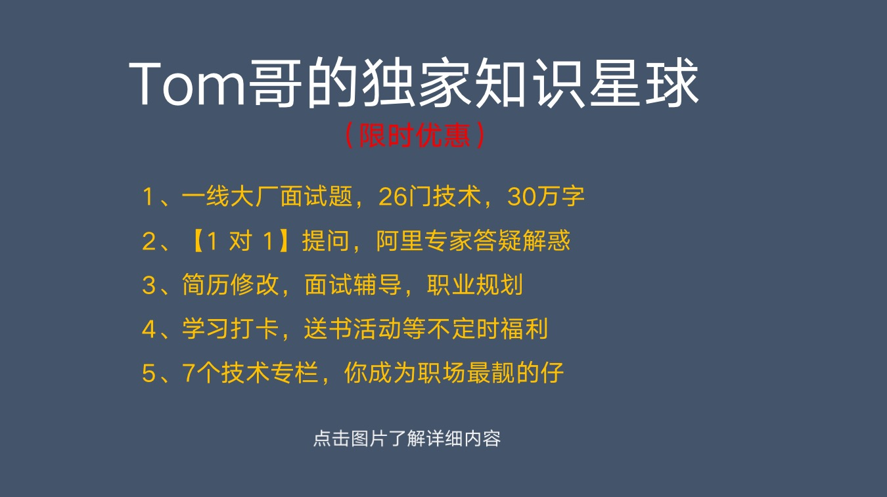

# 技术导航
---

推荐你通过网站在线阅读，体验更佳！网址：[https://offercome.cn/](https://offercome.cn/)

> 我是 **Tom哥**，**阿里 P7 技术专家**，拿过 百度、华为、腾讯 等6家大厂offer，出过**专利**，**CSDN博客专家**。
>
> 有着多年的大厂架构经验，在 `系统架构`、`微服务`、`高并发`、`高性能`、`领域驱动` 等有着丰富的项目实战经验。这里整理一些技术心得，希望能帮到你!
>
> **当然，如果想在职场走的快一点、顺一点，欢迎加入Tom哥的知识星球，大佬带你飞！**

 

Tom哥平时喜欢读一些书，给大家分享下我的 [**【Tom哥的读书单】**](https://offercome.cn/md/about/book/%E8%AF%BB%E4%B9%A6%E5%8D%95.html)

 

## ✈️ 一、大厂面试专栏

* [第一篇：JAVA 基础那点破事！反射、泛型、IO模型、重载、非阻塞](docs/md/interview/tech/JAVA基础那点破事.md)
* [第二篇：JAVA 集合那点破事！集合、扩容、数组、链表](docs/md/interview/tech/JAVA集合那点破事.md)
* [第三篇：JAVA 并发！JUC、死锁、CAS、线程池](docs/md/interview/tech/JAVA%20并发那点破事.md)
* [第四篇：JVM 那点破事！内存结构、垃圾收集、OOM、双亲委派](docs/md/interview/tech/JVM%20那点破事.md)
* [第五篇：项目亮点！DDD、系统架构、分库分表、高性能、吞吐量](https://offercome.cn/md/interview/tech/%E9%A1%B9%E7%9B%AE%E4%BA%AE%E7%82%B9.html)
* [第六篇：面试那点破事！面试技巧、职业规划、谈薪资](https://offercome.cn/md/interview/tech/%E9%9D%A2%E8%AF%95%E9%82%A3%E7%82%B9%E7%A0%B4%E4%BA%8B.html)
* [第七篇：Redis 缓存那点破事 ！单线程、数据类型、淘汰机制、集群模式](docs/md/interview/tech/Redis%20缓存那点破事.md)
* [第八篇：MySQL 那点破事！索引、SQL调优、事务、B+树、分库分表](docs/md/interview/tech/MySQL%20那点破事.md)
* [第九篇：Mybatis 那点破事！ ORM，动态SQL、动态代理](docs/md/interview/tech/Mybatis%20那点破事.md)
* [第十篇：Spring 那点破事！IOC、AOP、生命周期、动态代理、设计模式](docs/md/interview/tech/Spring%20那点破事.md)
* [第十一篇：Spring Boot ！starter组件、JPA、定时任务、全局异常](docs/md/interview/tech/Spring%20Boot%20那点破事.md)
* [第十二篇：Spring Cloud ！Gateway、注册发现、Hystrix、Ribbon](docs/md/interview/tech/Spring%20Cloud%20那点破事.md)
* [第十三篇：MQ 消息队列 ！消息丢失、重复消费、有序、堆积、事务、高可用](docs/md/interview/tech/MQ%20那点破事.md)
* [第十四篇：Kafka ！分区、副本、消费组、高可靠性](docs/md/interview/tech/Kafka%20那点破事.md)
* [第十五篇：RocketMQ ！顺序消费、堆积、事务、死信队列](docs/md/interview/tech/RocketMQ%20那点破事.md)
* [第十六篇：TCP 网络！三次握手、四次挥手、TIME-WAIT、HTTP 2.0](docs/md/interview/tech/TCP%20网络那点破事.md)
* [第十七篇：操作系统！内核态、虚拟内存、分页、IO模型](docs/md/interview/tech/操作系统那点破事.md)
* [第十八篇：Docker ！容器、虚拟机、镜像、分层](docs/md/interview/tech/Docker%20那点破事.md)
* [第十九篇：Kubernetes ！容器编排、Pod、自动扩容、资源调度](docs/md/interview/tech/Kubernetes%20那点破事.md)
* [第二十篇：Nginx ！反向代理、正向代理、高并发、负载均衡](docs/md/interview/tech/Nginx%20那点破事.md)

## 🚀 二、面试通关技巧（付费）

* [开篇：了解面试规则，人人都是 offer 收割机](https://offercome.cn/md/pay/interview/introductory.html)
* [第 1 讲：找工作有哪些渠道？](https://offercome.cn/md/pay/interview/%E7%AC%AC%201%20%E8%AE%B2%EF%BC%9A%E6%89%BE%E5%B7%A5%E4%BD%9C%E6%9C%89%E5%93%AA%E4%BA%9B%E6%B8%A0%E9%81%93.html)
* [第 2 讲：如何挑选心仪公司？](https://offercome.cn/md/pay/interview/%E7%AC%AC%202%20%E8%AE%B2%EF%BC%9A%E5%A6%82%E4%BD%95%E6%8C%91%E9%80%89%E5%BF%83%E4%BB%AA%E5%85%AC%E5%8F%B8%EF%BC%9F.html)
* [第 3 讲：JD 不是摆设，教你看懂岗位](https://offercome.cn/md/pay/interview/%E7%AC%AC%203%20%E8%AE%B2%EF%BC%9AJD%20%E4%B8%8D%E6%98%AF%E6%91%86%E8%AE%BE%EF%BC%8C%E6%95%99%E4%BD%A0%E7%9C%8B%E6%87%82%E5%B2%97%E4%BD%8D.html)
* [第 4 讲：什么时候跳槽最合适？](https://offercome.cn/md/pay/interview/%E7%AC%AC%204%20%E8%AE%B2%EF%BC%9A%E4%BB%80%E4%B9%88%E6%97%B6%E5%80%99%E8%B7%B3%E6%A7%BD%E6%9C%80%E5%90%88%E9%80%82%EF%BC%9F.html)
* [第 5 讲：设计让面试官眼前一亮的简历？](https://offercome.cn/md/pay/interview/%E7%AC%AC%205%20%E8%AE%B2%EF%BC%9A%E8%AE%BE%E8%AE%A1%E8%AE%A9%E9%9D%A2%E8%AF%95%E5%AE%98%E7%9C%BC%E5%89%8D%E4%B8%80%E4%BA%AE%E7%9A%84%E7%AE%80%E5%8E%86%EF%BC%9F.html)
* [第 6 讲：怎么让面试官喜欢你？](https://offercome.cn/md/pay/interview/%E7%AC%AC%206%20%E8%AE%B2%EF%BC%9A%E6%80%8E%E4%B9%88%E8%AE%A9%E9%9D%A2%E8%AF%95%E5%AE%98%E5%96%9C%E6%AC%A2%E4%BD%A0%EF%BC%9F.html)
* [第 7 讲：面试中遇到不会的问题怎么办？](https://offercome.cn/md/pay/interview/%E7%AC%AC%207%20%E8%AE%B2%EF%BC%9A%E9%9D%A2%E8%AF%95%E4%B8%AD%E9%81%87%E5%88%B0%E4%B8%8D%E4%BC%9A%E7%9A%84%E9%97%AE%E9%A2%98%E6%80%8E%E4%B9%88%E5%8A%9E%EF%BC%9F.html)
* [第 8 讲：HR环节一般喜欢问哪些问题？](https://offercome.cn/md/pay/interview/%E7%AC%AC%208%20%E8%AE%B2%EF%BC%9AHR%E7%8E%AF%E8%8A%82%E4%B8%80%E8%88%AC%E5%96%9C%E6%AC%A2%E9%97%AE%E5%93%AA%E4%BA%9B%E9%97%AE%E9%A2%98%EF%BC%9F.html)
* [第 9 讲：如何挑选最适合自己的 offer？](https://offercome.cn/md/pay/interview/%E7%AC%AC%209%20%E8%AE%B2%EF%BC%9A%E5%A6%82%E4%BD%95%E6%8C%91%E9%80%89%E6%9C%80%E9%80%82%E5%90%88%E8%87%AA%E5%B7%B1%E7%9A%84%20offer%EF%BC%9F.html)
* [第 10 讲：如何争取更高薪资？](https://offercome.cn/md/pay/interview/%E7%AC%AC%2010%20%E8%AE%B2%EF%BC%9A%E5%A6%82%E4%BD%95%E4%BA%89%E5%8F%96%E6%9B%B4%E9%AB%98%E8%96%AA%E8%B5%84%EF%BC%9F.html)

## 🏡 三、中间件

### Redis

* [亿级系统的Redis缓存如何设计](docs/md/middleware/redis/亿级系统的Redis缓存如何设计.md)
* [什么是布隆过滤器？如何解决高并发缓存穿透问题？](docs/md/middleware/redis/什么是布隆过滤器？如何解决高并发缓存穿透问题？.md)
* [为什么 Redis Cluster 是16384个槽位?](docs/md/middleware/redis/为什么Redis%20Cluster是16384个槽位.md)
* [Redis主节点的Key已过期，但Client访问从节点依然可以读到过期数据， 为什么？](docs/md/middleware/redis/Redis主节点的Key已过期，但Client访问从节点依然可以读到过期数据.md)
* [Redis 宕机，数据丢了，老板要辞退我](docs/md/middleware/redis/Redis%20宕机，数据丢了，老板要辞退我.md)
* [Redis 大长图一文打尽 Redis 核心技术，并配有每个知识点的详解...](docs/md/middleware/redis/2米的大长图一文打尽%20Redis%20核心技术.md)
* [Redis主节点宕机，要如何处理？](docs/md/middleware/redis/Redis主节点宕机，要如何处理？.md)
* [秒杀活动技术方案，Redis申请32个G，被技术总监挑战了](docs/md/middleware/redis/秒杀活动技术方案，Redis申请32个G，被技术总监挑战了.md)
* [一下说出了 Redis 16 个常见使用场景，惊呆面试官](docs/md/middleware/redis/一下说出了%20Redis%2016%20个常见使用场景，惊呆面试官.md)
* [Redis Cluster集群，当master宕机，主从切换，客户端报错 timed out](docs/md/middleware/redis/Redis%20Cluster集群，当master宕机，主从切换，客户端报错%20timed%20out.md)
* [如何解决 Redis 数据倾斜、热点等问题](docs/md/middleware/redis/如何解决%20Redis%20数据倾斜、热点等问题.md)

### MySQL

* [mysql 一棵 B+ 树能存多少条数据？](docs/md/middleware/mysql/mysql%20一棵%20B+%20树能存多少条数据？.md)
* [一张千万级的数据表，删除了一半的数据，你觉得B+树索引文件会不会变小？](docs/md/middleware/mysql/一张千万级的数据表，删除了一半的数据，你觉得B+树索引文件会不会变小？.md)
* [SQL 语句明明命中了索引，为什么执行很慢？](docs/md/middleware/mysql/SQL%20语句明明命中了索引，为什么执行很慢？.md)
* [跑了4个实验，实战讲解 MySQL的行锁、间隙锁...​](docs/md/middleware/mysql/跑了4个实验，实战讲解%20MySQL的行锁、间隙锁.md)
* [讲一讲 MySQL 数据备份杀手锏 binlog](docs/md/middleware/mysql/讲一讲%20MySQL%20数据备份杀手锏%20binlog.md)
* [拉取 binlog，自动同步数据](docs/md/middleware/mysql/拉取%20binlog，自动同步数据.md)
* [MySQL 主备延迟有哪些坑？主备切换策略](docs/md/middleware/mysql/MySQL%20主备延迟有哪些坑？主备切换策略.md)
* [MySQL 主从延迟 7 种解决方案](docs/md/middleware/mysql/%20MySQL%20主从延迟%207%20种解决方案.md)
* [SQL 优化有哪些技巧？](docs/md/middleware/mysql/SQL%20优化有哪些技巧.md)

### MQ 消息队列

* [聊聊 Kafka 那点破事](docs/md/middleware/mq/聊聊%20Kafka%20那点破事.md)
* [Kafka 如何解决消息不丢失？](docs/md/middleware/mq/Kafka%20如何解决消息不丢失？.md)
* [如何保证 MQ消息是有序的？](md/middleware/mq/如何保证%20MQ消息是有序的？.md)
* [关于消息队列，面试官喜欢考察哪些问题？](docs/md/middleware/mq/关于消息队列，面试官一般都会问哪些.md)

## 🏡 四、Spring 家族系列

### Spring

* [如何实现注解 RPC Consumer属性动态注入](docs/md/spring/spring/如何实现注解RPC%20Consumer属性动态注入.md)
* [如何借助Proxy代理，提升架构扩展性](docs/md/spring/spring/借助Proxy代理提升架构扩展性.md)
* [统计代码块耗时的小工具](docs/md/spring/spring/统计代码块耗时的小工具.md)

### Spring Boot

* [Spring Boot 集成 Mybatis](docs/md/spring/springboot/Mybatis.md)
* [数据库连接池为什么首选 Druid](docs/md/spring/springboot/Druid.md)
* [开箱即用，一键集成 Redis 缓存](docs/md/spring/springboot/Redis.md)
* [Redis 实现分布式锁真的安全吗](docs/md/spring/springboot/Redis-safety.md)
* [ShardingSphere 解决海量数据分库分表](docs/md/spring/springboot/ShardingSphere.md)
* [Spring Boot 集成 Guava](docs/md/spring/springboot/Guava.md)
* [高性能本地缓存组件 Caffeine Cache](docs/md/spring/springboot/Caffeine.md)
* [Spring Boot 集成 ElasticSearch](docs/md/spring/springboot/ElasticSearch.md)
* [Spring Boot 集成 Kafka](docs/md/spring/springboot/Kafka.md)
* [为什么放弃 Kafka，选择 Pulsar](docs/md/spring/springboot/Pulsar.md)
* [分布式配置中心选型，为什么选择 Apollo？](docs/md/spring/springboot/Apollo.md)
* [Spring Boot 集成 RabbitMQ](docs/md/spring/springboot/RabbitMQ.md)
* [Spring Boot 集成 Elastic-Job](docs/md/spring/springboot/Elastic-Job.md)
* [Spring Boot 集成 EhCache](docs/md/spring/springboot/EhCache.md)
* [Spring Boot 集成 RocketMQ](docs/md/spring/springboot/RocketMQ.md)
* [Spring Boot 集成 Nacos](docs/md/spring/springboot/Nacos.md)
* [Spring Boot 集成 MongoDB](docs/md/spring/springboot/MongoDB.md)
* [Spring Data JPA 让你的开发效率提升数倍！](docs/md/spring/springboot/Spring-Data-JPA.md)
* [Spring Boot 集成 OkHttp](docs/md/spring/springboot/OkHttp.md)
* [Spring Boot 集成 HttpClient](docs/md/spring/springboot/HttpClient.md)
* [Spring Boot 集成 gRPC](docs/md/spring/springboot/gRPC.md)
* [Spring Boot 集成 Dubbo](docs/md/spring/springboot/Dubbo.md)
* [业务无侵入框架 Seata， 解决分布式事务](docs/md/spring/springboot/Seata.md)

### Spring Cloud

* [【万字长文】创业公司就应该技术选型 Spring Cloud Alibaba ， 开箱即用](docs/md/spring/springcloud/spring-cloud-alibaba.md)
* [讲一讲 Spring、SpringMVC、SpringBoot、SpringCloud 之间的关系？](docs/md/spring/springcloud/spring-frame-compare.md)

## 🏡 五、分布式架构

### 系统架构

* [量数据业务有哪些优化手段？](docs/md/arch/system/海量数据业务有哪些优化手段？.md)
* [人人都是架构师？！谈何容易！](docs/md/arch/system/人人都是架构师？！谈何容易！.md)
* [中台也不是万能的...](docs/md/arch/system/中台不是万能药！.md)
* [【高并发、高性能、高可用】系统设计经验](docs/md/arch/system/【高并发、高性能、高可用】系统设计经验.md)
* [网关技术选型，为什么选择 Openresty ？事件驱动、协程...](docs/md/arch/system/网关技术选型，为什么选择%20Openresty.md)
* [gRPC 网关，针对 HTTP 2.0 长连接性能优化，提升吞吐量](docs/md/arch/system/gRPC%20网关，针对%20HTTP%202.0%20长连接性能优化，提升吞吐量.md)
* [外部接口大量超时，把整个系统拖垮，引发雪崩！如何解决？熔断...](docs/md/arch/system/外部接口大量超时，把整个系统拖垮，引发雪崩！如何解决？熔断.md)
* [OpenResty 如何实现限流？](docs/md/arch/system/OpenResty%20实现限流.md)
* [如何设计一个高并发系统？](docs/md/arch/system/如何设计一个高并发系统？.md)
* [为什么是 HTTP/2 ，而不是HTTP/2.0 ？](docs/md/arch/system/为什么是%20HTTP2%20，而不是HTTP2.0%20？.md)

### 电商技术

* [拆解零售商品架构的底层逻辑！](docs/md/arch/business/拆解零售商品架构的底层逻辑.md)
* [电商系统架构， 常见的 9 个大坑 | 库存超卖、重复下单、物流单ABA...](docs/md/arch/business/电商系统架构，%20常见的%209%20个大坑.md)
* [万级并发电商库存扣减如何设计？不超卖！](docs/md/arch/business/万级并发电商库存扣减如何设计？不超卖！.md)
* [电商订单自动确认收货的N种实现](docs/md/arch/business/电商订单自动确认收货的N种实现.md)
* [深入剖析优惠券核心架构设计](docs/md/arch/business/深入剖析优惠券核心架构设计.md)
* [如何玩好优惠券这把营销利剑？](docs/md/arch/business/如何玩好优惠券这把营销利剑？.md)
* [如何设计一个高性能的秒杀系统](docs/md/arch/business/如何设计一个高性能的秒杀系统.md)
* [聊聊电商促销业务](docs/md/arch/business/聊聊电商促销业务.md)

### 案例实战

* [借助流程引擎降低系统的复杂度！](docs/md/arch/case/借助流程引擎优化系统的复杂度.md)
* [如何设计一个 Redis 分布式锁？](docs/md/arch/case/Redis分布式锁.md)
* [Redis + Lua 组合实现分布式限流](docs/md/arch/case/Redis%20+%20Lua%20组合实现分布式限流.md)
* [电商大促，「网站实时成交额」仪表大盘技术方案？](docs/md/arch/case/电商大促，「网站实时成交额」仪表大盘技术方案？.md)
* [电商平台的热点商品架构方案](docs/md/arch/case/电商平台的热点商品架构方案.md)
* [搞了个线上故障，被老板骂了....](docs/md/arch/case/搞了个线上故障，被老板骂了.md)

### 设计模式

* [软件设计模式系列（第一期）](docs/md/arch/designmodel/软件设计模式系列（第一期）.md)
* [软件设计模式系列（第二期）](docs/md/arch/designmodel/软件设计模式系列（第二期）.md)
* [软件设计模式系列（第三期）](docs/md/arch/designmodel/软件设计模式系列（第三期）.md)
* [学会这10个设计原则，离架构师又进了一步！！！](docs/md/arch/designmodel/学会这10个设计原则，离架构师又进了一步.md)

## 🚀 六、系统架构与优化（付费）

* [开篇：关于系统架构与优化](https://offercome.cn/md/pay/arch/optimize.html)
* [基础篇：为什么流量入口要部署网关？](https://offercome.cn/md/pay/arch/%E5%9F%BA%E7%A1%80%E7%AF%87%EF%BC%9A%E4%B8%BA%E4%BB%80%E4%B9%88%E6%B5%81%E9%87%8F%E5%85%A5%E5%8F%A3%E8%A6%81%E9%83%A8%E7%BD%B2%E7%BD%91%E5%85%B3%EF%BC%9F.html)
* [基础篇：负载均衡常用的 7 种算法](https://offercome.cn/md/pay/arch/%E5%9F%BA%E7%A1%80%E7%AF%87%EF%BC%9A%E8%B4%9F%E8%BD%BD%E5%9D%87%E8%A1%A1%E5%B8%B8%E7%94%A8%E7%9A%84%207%20%E7%A7%8D%E7%AE%97%E6%B3%95.html)
* [架构篇：10 个架构原则，离架构师又进了一步](https://offercome.cn/md/pay/arch/%E6%9E%B6%E6%9E%84%E7%AF%87%EF%BC%9A10%20%E4%B8%AA%E6%9E%B6%E6%9E%84%E5%8E%9F%E5%88%99%EF%BC%8C%E7%A6%BB%E6%9E%B6%E6%9E%84%E5%B8%88%E5%8F%88%E8%BF%9B%E4%BA%86%E4%B8%80%E6%AD%A5.html)
* [架构篇：DDD如何指导微服务落地](https://offercome.cn/md/pay/arch/%E6%9E%B6%E6%9E%84%E7%AF%87%EF%BC%9ADDD%E5%A6%82%E4%BD%95%E6%8C%87%E5%AF%BC%E5%BE%AE%E6%9C%8D%E5%8A%A1%E8%90%BD%E5%9C%B0.html)
* [中间件：4 种主流 RPC 框架](https://offercome.cn/md/pay/arch/%E4%B8%AD%E9%97%B4%E4%BB%B6%EF%BC%9A4%20%E7%A7%8D%E4%B8%BB%E6%B5%81%20RPC%20%E6%A1%86%E6%9E%B6.html)
* [中间件：注册中心的 5 种技术选型](https://offercome.cn/md/pay/arch/%E4%B8%AD%E9%97%B4%E4%BB%B6%EF%BC%9A%E6%B3%A8%E5%86%8C%E4%B8%AD%E5%BF%83%E7%9A%84%205%20%E7%A7%8D%E6%8A%80%E6%9C%AF%E9%80%89%E5%9E%8B.html)
* [中间件：缓存是性能优化的首选利器](https://offercome.cn/md/pay/arch/%E4%B8%AD%E9%97%B4%E4%BB%B6%EF%BC%9A%E7%BC%93%E5%AD%98%E6%98%AF%E6%80%A7%E8%83%BD%E4%BC%98%E5%8C%96%E7%9A%84%E9%A6%96%E9%80%89%E5%88%A9%E5%99%A8.html)
* [中间件：缓存的 7 大经典问题](https://offercome.cn/md/pay/arch/%E4%B8%AD%E9%97%B4%E4%BB%B6%EF%BC%9A%E7%BC%93%E5%AD%98%E7%9A%84%207%20%E5%A4%A7%E7%BB%8F%E5%85%B8%E9%97%AE%E9%A2%98.html)
* [中间件：通过消息队列分担系统压力](https://offercome.cn/md/pay/arch/%E4%B8%AD%E9%97%B4%E4%BB%B6%EF%BC%9A%E9%80%9A%E8%BF%87%E6%B6%88%E6%81%AF%E9%98%9F%E5%88%97%E5%88%86%E6%8B%85%E7%B3%BB%E7%BB%9F%E5%8E%8B%E5%8A%9B.html)
* [中间件：消息队列必问的 6 个经典问题](https://offercome.cn/md/pay/arch/%E4%B8%AD%E9%97%B4%E4%BB%B6%EF%BC%9A%E6%B6%88%E6%81%AF%E9%98%9F%E5%88%97%E5%BF%85%E9%97%AE%E7%9A%84%206%20%E4%B8%AA%E7%BB%8F%E5%85%B8%E9%97%AE%E9%A2%98.html)
* [中间件：ElasticSearch 解决复杂条件查询](https://offercome.cn/md/pay/arch/%E4%B8%AD%E9%97%B4%E4%BB%B6%EF%BC%9AElasticSearch%20%E8%A7%A3%E5%86%B3%E5%A4%8D%E6%9D%82%E6%9D%A1%E4%BB%B6%E6%9F%A5%E8%AF%A2.html)
* [数据库：海量数据业务有哪些方案](https://offercome.cn/md/pay/arch/%E6%95%B0%E6%8D%AE%E5%BA%93%EF%BC%9A%E6%B5%B7%E9%87%8F%E6%95%B0%E6%8D%AE%E4%B8%9A%E5%8A%A1%E6%9C%89%E5%93%AA%E4%BA%9B%E6%96%B9%E6%A1%88.html)
* [数据库：分布式主键 id 的 7 种生成策略](https://offercome.cn/md/pay/arch/%E6%95%B0%E6%8D%AE%E5%BA%93%EF%BC%9A%E5%88%86%E5%B8%83%E5%BC%8F%E4%B8%BB%E9%94%AE%20id%20%E7%9A%84%207%20%E7%A7%8D%E7%94%9F%E6%88%90%E7%AD%96%E7%95%A5.html)
* [数据库：分布式事务的 7 种技术方案](https://offercome.cn/md/pay/arch/%E6%95%B0%E6%8D%AE%E5%BA%93%EF%BC%9A%E5%88%86%E5%B8%83%E5%BC%8F%E4%BA%8B%E5%8A%A1%E7%9A%84%207%20%E7%A7%8D%E6%8A%80%E6%9C%AF%E6%96%B9%E6%A1%88.html)
* [数据库：SQL 优化 7 条经验总结](https://offercome.cn/md/pay/arch/%E6%95%B0%E6%8D%AE%E5%BA%93%EF%BC%9ASQL%20%E4%BC%98%E5%8C%96%207%20%E6%9D%A1%E7%BB%8F%E9%AA%8C%E6%80%BB%E7%BB%93.html)
* [代码篇：接口性能优化的 15 个技巧](https://offercome.cn/md/pay/arch/%E4%BB%A3%E7%A0%81%E7%AF%87%EF%BC%9A%E6%8E%A5%E5%8F%A3%E6%80%A7%E8%83%BD%E4%BC%98%E5%8C%96%E7%9A%84%2015%20%E4%B8%AA%E6%8A%80%E5%B7%A7.html)
* [代码篇：接口幂等性的 8 种解决方案](https://offercome.cn/md/pay/arch/%E4%BB%A3%E7%A0%81%E7%AF%87%EF%BC%9A%E6%8E%A5%E5%8F%A3%E5%B9%82%E7%AD%89%E6%80%A7%E7%9A%84%208%20%E7%A7%8D%E8%A7%A3%E5%86%B3%E6%96%B9%E6%A1%88.html)
* [代码篇：学会13 种锁，从此不再为“锁”心烦](https://offercome.cn/md/pay/arch/%E4%BB%A3%E7%A0%81%E7%AF%87%EF%BC%9A%E5%AD%A6%E4%BC%9A13%20%E7%A7%8D%E9%94%81%EF%BC%8C%E4%BB%8E%E6%AD%A4%E4%B8%8D%E5%86%8D%E4%B8%BA%E2%80%9C%E9%94%81%E2%80%9D%E5%BF%83%E7%83%A6.html)
* [代码篇：异步编程的 7 种实现方式](https://offercome.cn/md/pay/arch/%E4%BB%A3%E7%A0%81%E7%AF%87%EF%BC%9A%E5%BC%82%E6%AD%A5%E7%BC%96%E7%A8%8B%E7%9A%84%207%20%E7%A7%8D%E5%AE%9E%E7%8E%B0%E6%96%B9%E5%BC%8F.html)
* [提升篇：通过链路追踪优化慢请求](https://offercome.cn/md/pay/arch/%E6%8F%90%E5%8D%87%E7%AF%87%EF%BC%9A%E9%80%9A%E8%BF%87%E9%93%BE%E8%B7%AF%E8%BF%BD%E8%B8%AA%E4%BC%98%E5%8C%96%E6%85%A2%E8%AF%B7%E6%B1%82.html)
* [提升篇：通过Arthas快速定位线上问题](https://offercome.cn/md/pay/arch/%E6%8F%90%E5%8D%87%E7%AF%87%EF%BC%9A%E9%80%9A%E8%BF%87Arthas%E5%BF%AB%E9%80%9F%E5%AE%9A%E4%BD%8D%E7%BA%BF%E4%B8%8A%E9%97%AE%E9%A2%98.html)
* [稳定性：限流的 4 种策略方案](https://offercome.cn/md/pay/arch/%E7%A8%B3%E5%AE%9A%E6%80%A7%EF%BC%9A%E9%99%90%E6%B5%81%E7%9A%84%204%20%E7%A7%8D%E7%AD%96%E7%95%A5%E6%96%B9%E6%A1%88.html)
* [稳定性：系统高可用的 11 个方案技巧](https://offercome.cn/md/pay/arch/%E7%A8%B3%E5%AE%9A%E6%80%A7%EF%BC%9A%E7%B3%BB%E7%BB%9F%E9%AB%98%E5%8F%AF%E7%94%A8%E7%9A%84%2011%20%E4%B8%AA%E6%96%B9%E6%A1%88%E6%8A%80%E5%B7%A7.html)

## 🎡 七、团队管理

* [团队管理那点破事！OKR绩效、核心人才、面试、技术分享、研发流程....](docs/md/team/manage/团队管理那点破事.md)
* [第一次带团队，感觉很慌怎么办？](docs/md/team/manage/第一次带团队感觉很慌.md)
* [管理者一定会遇到的那些事](docs/md/team/manage/管理者一定会遇到的那些事.md)
* [如何打造一个高效的研发团队](docs/md/team/manage/如何打造一个高效的研发团队.md)
* [作为技术团队TL，如何运用OKR提高团队产出](docs/md/team/manage/作为技术团队TL，如何运用OKR提高团队产出.md)
* [教你几招，如何快速把一个团队搞垮？](docs/md/team/manage/教你几招，如何快速把一个团队搞垮.md)

## 🚅 八、职场锦囊

* [001 | 职场遭遇老板 PUA，怎么办？](https://offercome.cn/md/pay/job/001%20%7C%20%20%E8%81%8C%E5%9C%BA%E9%81%AD%E9%81%87%E8%80%81%E6%9D%BF%20PUA%EF%BC%8C%E6%80%8E%E4%B9%88%E5%8A%9E%EF%BC%9F.html)
* [002 | 与同事发生冲突怎么办？](https://offercome.cn/md/pay/job/002%20%7C%20%20%E4%B8%8E%E5%90%8C%E4%BA%8B%E5%8F%91%E7%94%9F%E5%86%B2%E7%AA%81%E6%80%8E%E4%B9%88%E5%8A%9E%EF%BC%9F.html)
* [003 | 职场不相信眼泪，千万不要玻璃心 ？](https://offercome.cn/md/pay/job/003%20%7C%20%20%E8%81%8C%E5%9C%BA%E4%B8%8D%E7%9B%B8%E4%BF%A1%E7%9C%BC%E6%B3%AA%EF%BC%8C%E5%8D%83%E4%B8%87%E4%B8%8D%E8%A6%81%E7%8E%BB%E7%92%83%E5%BF%83%20%EF%BC%9F.html)
* [04 | 入职一家新公司，如何快速熟悉代码](https://offercome.cn/md/pay/job/004%20%7C%20%20%E5%85%A5%E8%81%8C%E4%B8%80%E5%AE%B6%E6%96%B0%E5%85%AC%E5%8F%B8%EF%BC%8C%E5%A6%82%E4%BD%95%E5%BF%AB%E9%80%9F%E7%86%9F%E6%82%89%E4%BB%A3%E7%A0%81.html)
* [005 | 工作中，同事不配合怎么办？](https://offercome.cn/md/pay/job/005%20%7C%20%20%E5%B7%A5%E4%BD%9C%E4%B8%AD%EF%BC%8C%E5%90%8C%E4%BA%8B%E4%B8%8D%E9%85%8D%E5%90%88%E6%80%8E%E4%B9%88%E5%8A%9E%EF%BC%9F.html)
* [06 | 要想职场混的好，向上管理很重要](https://offercome.cn/md/pay/job/006%20%7C%20%20%E8%A6%81%E6%83%B3%E8%81%8C%E5%9C%BA%E6%B7%B7%E7%9A%84%E5%A5%BD%EF%BC%8C%E5%90%91%E4%B8%8A%E7%AE%A1%E7%90%86%E5%BE%88%E9%87%8D%E8%A6%81.html)
* [007 | 离职后，一定要立刻找到新工作吗？](https://offercome.cn/md/pay/job/007%20%7C%20%20%E7%A6%BB%E8%81%8C%E5%90%8E%EF%BC%8C%E4%B8%80%E5%AE%9A%E8%A6%81%E7%AB%8B%E5%88%BB%E6%89%BE%E5%88%B0%E6%96%B0%E5%B7%A5%E4%BD%9C%E5%90%97%EF%BC%9F.html)
* [008 | 空降领导如何做，才能平稳着陆?](https://offercome.cn/md/pay/job/008%20%7C%20%20%E7%A9%BA%E9%99%8D%E9%A2%86%E5%AF%BC%E5%A6%82%E4%BD%95%E5%81%9A%EF%BC%8C%E6%89%8D%E8%83%BD%E5%B9%B3%E7%A8%B3%E7%9D%80%E9%99%86%EF%BC%9F.html)
* [009 | 修炼心态，避免职场内耗！](https://offercome.cn/md/pay/job/009%20%7C%20%20%E4%BF%AE%E7%82%BC%E5%BF%83%E6%80%81%EF%BC%8C%E9%81%BF%E5%85%8D%E8%81%8C%E5%9C%BA%E5%86%85%E8%80%97%EF%BC%81.html)
* [010 | 为什么程序员要修炼自己对外「沟通」能力？](https://offercome.cn/md/pay/job/010%20%7C%20%E4%B8%BA%E4%BB%80%E4%B9%88%E7%A8%8B%E5%BA%8F%E5%91%98%E8%A6%81%E4%BF%AE%E7%82%BC%E8%87%AA%E5%B7%B1%E5%AF%B9%E5%A4%96%E3%80%8C%E6%B2%9F%E9%80%9A%E3%80%8D%E8%83%BD%E5%8A%9B%EF%BC%9F.html)

## ✈️ 九、个人成长

* [Tom哥的读书单](docs/md/about/book/读书单.md)
* [我是这么用 Google 搜索引擎的....](docs/md/about/grow_up/google_search.md)
* [知识改变命运，读书改变生活](docs/md/about/grow_up/知识改变命运，读书改变生活.md)
* [提高「程序员」的思维方式](docs/md/about/grow_up/提高「程序员」的思维方式.md)
* [入职一家新公司，如何快速熟悉代码？](docs/md/about/grow_up/入职一家新公司，如何快速熟悉代码？.md)

## ⚓ 写在最后

Tom哥 多次参加**淘宝双11**大促活动，架构经验丰富。作为团队负责人，面试过 **500多**位候选人，如果你想去**一线大厂**，关注下方公众号回复「 **大厂** 」，领取大厂面试资料，成为offer收割机

