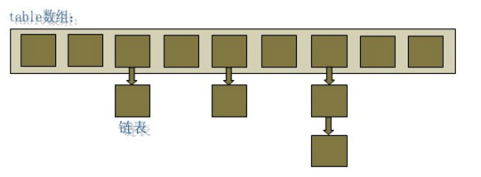

## HashMap的扩容机制

---

######简介

单纯的kv键值对结构，可以接受null键和null值，速度比较快，非线程安全。

#####HashMap的数据结构

HashMap实际上是一个“链表的数组”的数据结构，每个元素存放链表头结点的数组，即数组和链表的结合体。

Entry就是数组中的元素，每个 Map.Entry 其实就是一个key-value对，它持有指向下一个元素的引用，这就构成了链表。

#####工作原理：

1.put

当我们往HashMap中put元素的时候，先根据key的hashCode重新计算hash值，根据hash值得到这个元素在数组中的位置（即下标），如果数组该位置上已经存放有其他元素了，那么在这个位置上的元素将以链表的形式存放，新加入的放在链头，最先加入的放在链尾。如果数组该位置上没有元素，就直接将该元素放到此数组中的该位置上。

HashMap基于hashing原理，我们通过put()方法储存，当我们将键值对传递给put()方法时，它调用键对象的hashCode()方法来计算hashcode，然后找到bucket位置来储存值对象。

当获取对象时，同上找到对应的bucket，通过键对象的equals()方法找到正确的键值对，然后返回值对象。HashMap使用链表来解决碰撞问题，当发生碰撞了，对象将会储存在链表的下一个节点中。 HashMap在每个链表节点中储存键值对对象。
