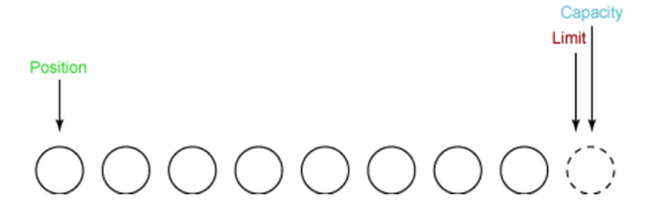
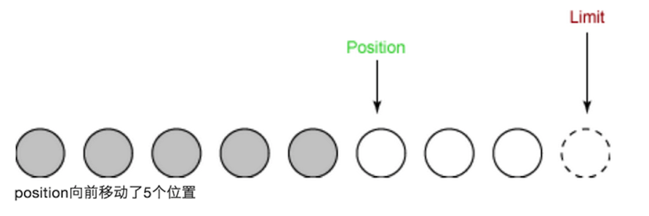
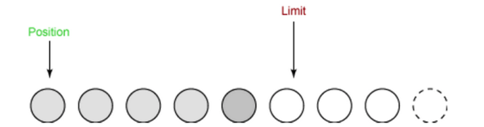
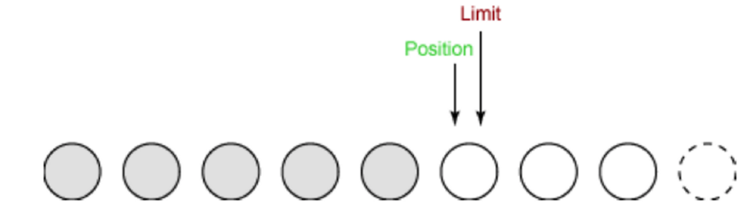
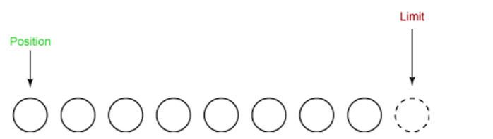

## NIO

---

#### 简介：
NIO 是java 1.4引入的新特性。是对原来的standard IO的扩展。

Standard IO是对字节流的读写，在进行IO之前，首先创建一个流对象，流对象进行读写操作都是按字节
，一个字节一个字节的来读或写。而NIO把IO抽象成块，类似磁盘的读写，每次IO操作的单位都是一个块，块被读入内存之后就是一个byte[]，NIO一次可以读或写多个字节。


#####NIO的几大组件：

#####1.Selector
多路复用选择器，基于“事件驱动”

* 创建多路复用器并启动线程

```
 Selector selector=Selector.open();
 new Thread(new ReactorTask()).start();
 
```

* 创建Channel

```
// 打开ServerSocketChannel，用于监听客户端的连接
ServerSocketChannel ssc=ServerSocketChannel.open();
//设置连接为非阻塞模式
ssc.configureBlocking(false);
//绑定监听端口
ServerSocket ss=ssc.socket();
ss.bind(new InetSocketAddress(InetAdderss.getByName("ip"),port));
//将ServerSocketChannel注册到多路复用器Selector上，监听ACCEPT事件
ssc.register(selector,SelectionKey.OP_ACCEPT);

```
* 等待客户端的连接

```
 while (true) {
            // selector.select是阻塞的，一直等到有客户端连接过来才返回，然后会检查发生的是哪一种事件，然后根据不同的事件做不同的操作
            selector.select();
            Set<SelectionKey> selectionKeys = selector.selectedKeys();
            Iterator<SelectionKey> it = selectionKeys.iterator();
            while (it.hasNext()) {
                SelectionKey key = it.next();
                if (key.isAcceptable()) {
                    // 处理新接入的请求消息
                    ServerSocketChannel ssc = (ServerSocketChannel) key.channel();
                    SocketChannel sc = ssc.accept();
                    sc.configureBlocking(false);
                    // 注册读事件
                    sc.register(selector, SelectionKey.OP_READ);
                }
                if (key.isReadable()) {
                    // 处理读请求
                    SocketChannel sc = (SocketChannel) key.channel();
                    ByteBuffer readBuffer = ByteBuffer.allocate(1024);
                    int readBytes = sc.read(readBuffer);
                    if (readBytes > 0) {
                        readBuffer.flip();
                        byte[] bytes = new byte[readBuffer.remaining()];
                        readBuffer.get(bytes);
                        System.out.println(new String(bytes, "UTF-8"));
                    }
                }

            }
        }

```


#####2.Channel
Channel是NIO对IO抽象的一个新概念，NIO在进行IO时需要创建一个Channel对象，是双向的，不象Standard IO分为输入流和输出流

#####3.Buffer

Buffer和Channel都是一起使用的，每次都是从一个Channel中读出一个Buffer或者把一个Buffer写入到一个Channel中

```
                    // 处理读请求
                    SocketChannel sc = (SocketChannel) key.channel();
                    ByteBuffer readBuffer = ByteBuffer.allocate(1024);
                    int readBytes = sc.read(readBuffer);
                    if (readBytes > 0) {
                        readBuffer.flip();
                        byte[] bytes = new byte[readBuffer.remaining()];
                        readBuffer.get(bytes);
                        System.out.println(new String(bytes, "UTF-8"));
                    }
                    
```

Buffer有3个重要的属性

* position 正整数，指向Buffer中下一个要读取或写入的字节位置
* limit 正整数，指向Buffer中的某个位置，在IO时只读写下标小于limit的字节内容
* capacity  正整数，Buffer所能容纳的最大字节数

0 <= position <= limit <= capacity

初始状态：


从Channel中读入5个字到ByteBuffer


flip()，准备写入或输出

```
public final Buffer flip() {
        limit = position;
        position = 0;
        mark = -1;
        return this;
    }
```


输出内容后，position就移动到跟limit相同的位置上


ByteBuffer如果要重复利用，需要清理，position和limit回到初始状态时的位置，然后可以接着用这个Buffer来读写数据，不需要再New 新的Buffer

```
    public final Buffer clear() {
        position = 0;
        limit = capacity;
        mark = -1;
        return this;
    }
```



