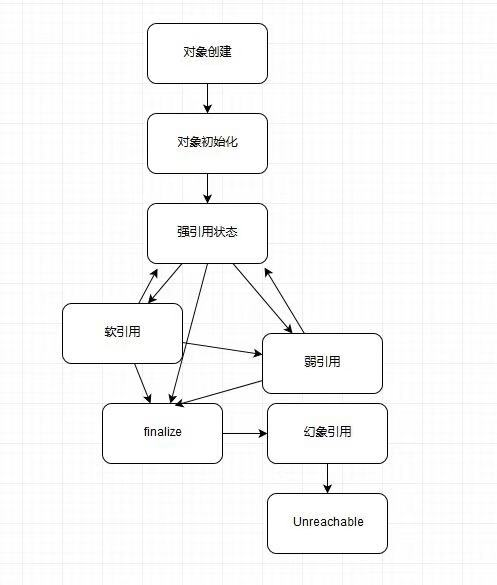

## 强引用、软引用、弱引用、幻象引用
---

* 强引用

常见的普通对象引用，只要还有强引用指向一个对象，就表示这个对象还“活着”，垃圾回收不会回收这种对象。对于一个普通对象，如果没有其他引用关系，只要超过了引用的作用域或者显式地将相应（强）引用赋值为null，就可以被垃圾收集了。

* 软引用

SoftReference，相对强引用弱一些，可以让对象豁免一些垃圾收集，只有当JVM 认为内存不足时，才会去试图回收软引用指向的对象。

JVM会确保在抛出OutofMemoryError之前，清理软引用指向的对象。这样保证了使用缓存的同时，不会耗尽内存。

* 弱引用

并不能使对象豁免垃圾收集，仅仅是提供一种访问在弱引用状态下对象的途经。

如果试图获取时对象还在，就使用它，否则重新实例化，它同样是很多缓存实现的选择。

* 幻象引用

也叫虚引用，你不能通过它访问对象。仅仅提供了对象被finalize以后，做某些事情的机制，比如 Post-Mortem清理机制

对象可达性状态流转图：

所有引用类型，都是抽象类 java.lang.ref.Reference的子类，提供了get（）方法。

**除了幻象引用（get返回null），如果对象没有被销毁，都可以通过get（）方法获取原有对象，我们可以将访问到的对象，重新指向强引用，也就是人为的改变对象的可达性状态。**

