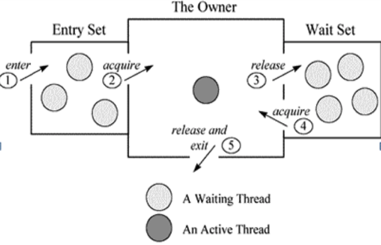

## java的线程状态

---

** 线程有5种状态**

1. new，创建线程，尚未启动
2. Runable，此状态的线程有可能正在执行，也有可能正在等待cpu为它分配时间片
3. waiting，处于此状态的线程不会被分配时间片，必须要等待被其他线程显式的唤醒，notify或notify all
4. timed waiting ，处于此状态的线程不会被分配时间片，不过无须等待其它线程显式的唤醒，在一定时间后会由系统自动唤醒
5. blocked，线程被阻塞了，必须要等待获取锁
6. terminated，线程已执行结束，如一个线程的run()函数执行完毕后线程就进入死亡状态

**影响的命令：**

*	run、start

	需要并行处理的代码放在run()方法中，start()方法启动线程将自动调用 run()方法，这是由Java的内存机制规定的。并且run()方法必须是public访问权限，返回值类型为void。
	
* 	wait

	当前线程暂停执行并释放对象锁标志，让其他线程可以进入Synchronized数据块，当前线程被放入对象等待池中
	
*	notify

	唤醒一个线程
	
* 	notifyAll

	唤醒所有线程
	
* 	sleep

	休眠一段时间后，会自动唤醒。但它并不释放对象锁。也就是如果有Synchronized同步块，其他线程仍然不能访问共享数据。注意该方法要捕获异常
	
* 	join

	当前线程停下来等待，直至另一个调用join方法的线程终止，线程在被激活后不一定马上就运行，而是进入到可运行线程的队列中
	
*	yield

	停止当前线程，让同等优先权的线程运行。如果没有同等优先权的线程，那么yield()方法将不会起作用

*	daemon

操会作系统维护一个ready queue（就绪线程队列），某一时刻cpu只为ready queue中位于队列头部的线程服务。 

**参考资料：**

http://www.jianshu.com/p/c9f847101fae
