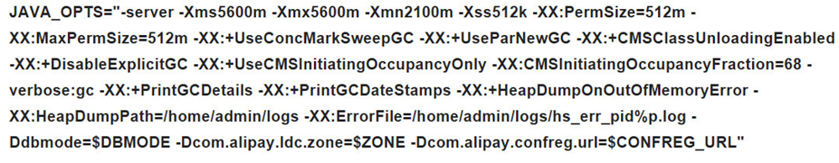
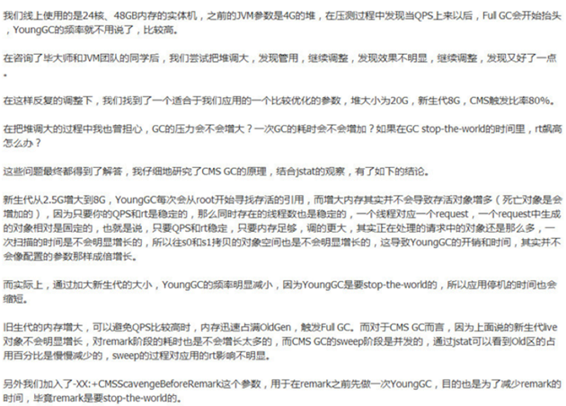

## jvm参数---性能调优

---

#### 一、jvm参数

*	-Xms 

堆最小值

*	-Xmx

堆最大堆值。-Xms与-Xmx 的单位默认字节都是以k、m做单位的。

通常这两个配置参数相等，避免每次空间不足，动态扩容带来的影响。

*	-Xmn 

新生代大小

*	-Xss 

每个线程池的堆栈大小。在jdk5以上的版本，每个线程堆栈大小为1m，jdk5以前的版本是每个线程池大小为256k。一般在相同物理内存下，如果减少－xss值会产生更大的线程数，但不同的操作系统对进程内线程数是有限制的，是不能无限生成。

*	-XX:NewRatio 

设置新生代与老年代比值，-XX:NewRatio=4 表示新生代与老年代所占比例为1:4 ，新生代占比整个堆的五分之一。如果设置了-Xmn的情况下，该参数是不需要在设置的。

*	-XX:PermSize

设置持久代初始值，默认是物理内存的六十四分之一

*	-XX:MaxPermSize 

设置持久代最大值，默认是物理内存的四分之一

*	-XX:MaxTenuringThreshold

新生代中对象存活次数，默认15。（若对象在eden区，经历一次MinorGC后还活着，则被移动到Survior区，年龄加1。以后，对象每次经历MinorGC，年龄都加1。达到阀值，则移入老年代）

*	-XX:SurvivorRatio 

Eden区与Subrvivor区大小的比值，如果设置为8，两个Subrvivor区与一个Eden区的比值为2:8，一个Survivor区占整个新生代的十分之一

*	-XX:+UseFastAccessorMethods 

原始类型快速优化

*	-XX:+AggressiveOpts

编译速度加快

*	-XX:PretenureSizeThreshold

对象超过多大值时直接在老年代中分配



```
说明：
整个堆大小的计算公式：JVM 堆大小 ＝ 年轻代大小＋年老代大小＋持久代大小。
增大新生代大小就会减少对应的年老代大小，设置-Xmn值对系统性能影响较大，所以如果设置新生代大小的调整，则需要严格的测试调整。而新生代是用来存放新创建的对象，大小是随着堆大小增大和减少而有相应的变化，默认值是保持堆大小的十五分之一，-Xmn参数就是设置新生代的大小，也可以通过-XX:NewRatio来设置新生代与年老代的比例，java 官方推荐配置为3:8。

新生代的特点就是内存中的对象更新速度快，在短时间内容易产生大量的无用对象，如果在这个参数时就需要考虑垃圾回收器设置参数也需要调整。推荐使用：复制清除算法和并行收集器进行垃圾回收，而新生代的垃圾回收叫做初级回收。

```


```
StackOverflowError和OutOfMemoryException。当线程中的请求的栈的深度大于最大可用深度，就会抛出前者；若内存空间不够，无法创建新的线程，则会抛出后者。栈的大小直接决定了函数的调用最大深度，栈越大，函数嵌套可调用次数就越多。

```

**经验：**

1. Xmn用于设置新生代的大小。过小会增加Minor GC频率，过大会减小老年代的大小。一般设为整个堆空间的1/4或1/3.

2. XX:SurvivorRatio用于设置新生代中survivor空间（from/to）和eden空间的大小比例；
XX:TargetSurvivorRatio表示，当经历Minor GC后，survivor空间占有量（百分比）超过它的时候，就会压缩进入老年代（当然，如果survivor空间不够，则直接进入老年代）。默认值为50%。

3. 为了性能考虑，一开始尽量将新生代对象留在新生代，避免新生的大对象直接进入老年代。因为新生对象大部分都是短期的，这就造成了老年代的内存浪费，并且回收代价也高（Full GC发生在老年代和方法区Perm）.

4. 当Xms=Xmx，可以使得堆相对稳定，避免不停震荡

5. 一般来说，MaxPermSize设为64MB可以满足绝大多数的应用了。若依然出现方法区溢出，则可以设为128MB。若128MB还不能满足需求，那么就应该考虑程序优化了，减少**动态类**的产生。


#### 二、垃圾回收


**垃圾回收算法：**

*	引用计数法：会有循环引用的问题，古老的方法；
*	Mark-Sweep：标记清除。根可达判断，最大的问题是空间碎片（清除垃圾之后剩下不连续的内存空间）；
*	Copying：复制算法。对于短命对象来说有用，否则需要复制大量的对象，效率低。**如Java的新生代堆空间中就是使用了它（survivor空间的from和to区）；**
*	Mark-Compact：标记整理。对于老年对象来说有用，无需复制，不会产生内存碎片

**GC考虑的指标**

*	吞吐量：应用耗时和实际耗时的比值；
*	停顿时间：垃圾回收的时候，由于Stop the World，应用程序的所有线程会挂起，造成应用停顿。

```
吞吐量和停顿时间是互斥的。
对于后端服务(比如后台计算任务)，吞吐量优先考虑（并行垃圾回收）；
对于前端应用，RT响应时间优先考虑，减少垃圾收集时的停顿时间，适用场景是Web系统（并发垃圾回收）
```

**回收器的JVM参数**

*	-XX:+UseSerialGC

串行垃圾回收，现在基本很少使用。

*	-XX:+UseParNewGC

新生代使用并行，老年代使用串行；

*	-XX:+UseConcMarkSweepGC

新生代使用并行，老年代使用CMS（一般都是使用这种方式），CMS是Concurrent Mark Sweep的缩写，并发标记清除，一看就是老年代的算法，所以，它可以作为老年代的垃圾回收器。CMS不是独占式的，它关注停顿时间

*	-XX:ParallelGCThreads

指定并行的垃圾回收线程的数量，最好等于CPU数量

*	-XX:+DisableExplicitGC

禁用System.gc()，因为它会触发Full GC，这是很浪费性能的，JVM会在需要GC的时候自己触发GC。

*	-XX:CMSFullGCsBeforeCompaction 

在多少次GC后进行内存压缩，这个是因为并行收集器不对内存空间进行压缩的，所以运行一段时间后会产生很多碎片，使得运行效率降低。

*	-XX:+CMSParallelRemarkEnabled

降低标记停顿

*	-XX:+UseCMSCompactAtFullCollection 

在每一次Full GC时对老年代区域碎片整理，因为CMS是不会移动内存的，因此会非常容易出现碎片导致内存不够用的

*	-XX:+UseCmsInitiatingOccupancyOnly 

使用手动触发或者自定义触发cms 收集，同时也会禁止hostspot 自行触发CMS GC

*	-XX:CMSInitiatingOccupancyFraction 

使用CMS作为垃圾回收，使用70%后开始CMS收集

*	-XX:CMSInitiatingPermOccupancyFraction 

设置perm gen使用达到多少％比时触发垃圾回收，默认是92%

*	-XX:+CMSIncrementalMode 

设置为增量模式

*	-XX:+CmsClassUnloadingEnabled 

CMS是不会默认对永久代进行垃圾回收的，设置此参数则是开启

*	-XX:+PrintGCDetails

开启详细GC日志模式，日志的格式是和所使用的算法有关

*	-XX:+PrintGCDateStamps

将时间和日期也加入到GC日志中


**配置参考：**



**前同事分享的一个不错案例：**

