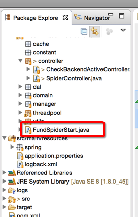
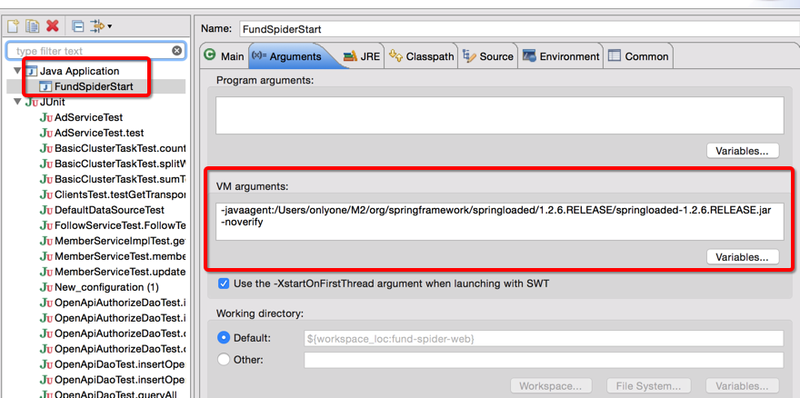
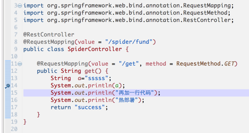

## spring boot 热部署
---





右键---》Run As---》Run Configurations---》在Arguments的tab里面设置VM参数如下

```
-javaagent:/Users/onlyone/M2/org/springframework/springloaded/1.2.6.RELEASE/springloaded-1.2.6.RELEASE.jar  -noverify
```




** 即可支持在编码过程中代码热部署！！！ **



** 另外支持 debug 模式！！！ Dubug As --》Java Application  **

其它方式可参考：

http://blog.csdn.net/l1028386804/article/details/69940574