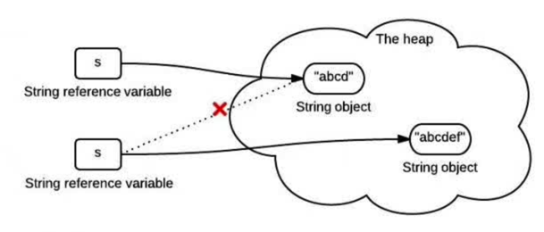

## 各种坑

---

#### 1. SimpleDateFormat 不是线程安全的

使用过程不要定义为静态全局变量。

**正确使用：**

```
    /**
     * 时间是否是今天
     */
    public static boolean isToday(Long second) {
        if (second == null) {
            return false;
        }
        SimpleDateFormat sf = new SimpleDateFormat("yyyy-MM-dd");
        String today = sf.format(System.currentTimeMillis());
        String compare = sf.format(new Date(second * 1000L));
        return StringUtils.equals(today, compare);
    }
    
```


#### 2.cache模型里面字段数据范围
通常预发环境和线上环境会共用一套cache，如何避免两套环境间的数据干扰。

```
写入：DO --> cacheModel
读出：cacheModel --> DO
查询接口：DO --> ServiceModel
```
#### 3.字符串不变性

下面这张图展示了这段代码做了什么

```
String s = "abcd";
s = s.concat("ef");
```



#### 4.HashCode被设计用来提高性能。

equals()方法与hashCode()方法的区别在于：

如果两个对象相等(equal)，那么他们一定有相同的哈希值。
如果两个对象的哈希值相同，但他们未必相等(equal)。

注：== 表示两对象内存地址相同

#### 5.