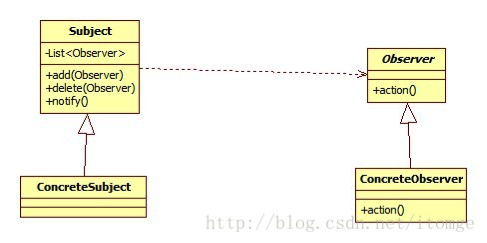

## 常用的设计模式
---

###	单例模式

保证一个类仅有一个实例，并提供一个访问它的全局访问点

```
public class SingletonClass{
    private static SingletonClass instance=null;
    public static SingletonClass getInstance(){
        if(instance==null){
            synchronized(SingletonClass.class){
                if(instance==null){
                    instance=new SingletonClass();
                }
            }
        }
        return instance;
    }
}
```
[如何实现一个正确的单例模式](https://mp.weixin.qq.com/s/2ARZEkUZWKN0fxHfkayYHA)

[漫画：什么是单例模式？（整合版）](https://mp.weixin.qq.com/s/1fQkkdtzYh_OikbYJnmZWg)

### 工厂模式

**类图：**



###  装饰模式
装饰者模式，在保持原有功能不变的情况下将一个类重新装饰，使其具有更强大的功能，用一句成语形容“锦上添花”。

**类结构：**



 
Component：抽象组件，定义了一组抽象的接口，指定了被装饰的组件都有哪些功能。


ComponentImpl：抽象组件实现类，完成了基本的功能实现。

Decorator：装饰器角色，持有Component的实例引用，有点递归的感觉。

伪代码：

```
Component c=new ComponentImpl();
Decorator d1=new Decorator();
d1.setComponent(c);
Decorator d2=new Decorator();
d2.setComponent(d1);
Decorator d3=new Decorator();
d3.setComponent(d2);
Decorator d4=new Decorator();
d4.setComponent(d3);
d4.methodA();

```
装饰者模式和适配器模式有点类似，都是包装（wrapper）了一个类，但目地却不相同。适配器模式是将一个接口转换成另一个接口，从而达成匹配。而装饰者模式并没有改变原来的接口，而是改变原有对象的处理方法，借助递归提升性能。
### 适配器模式


适配器模式就是一个类的接口不能被客户端接受，需要转换为另一种接口，从而使两个不匹配的接口能在一起工作。

**类结构**


 
Adaptee：源接口，需要适配的接口

Target：目标接口，暴露出去的接口

Adapter：适配器，将源接口适配成目标接口

举个现实例子：

Adaptee就是相机中的内存卡片，Target就是电脑，而Adapter则是USB读卡器。

**适用场景：**

比如查物流信息，由于物流公司的系统都是各自独立，在编程语言和交互方式上有很大差异，需要针对不同的物流公司做单独适配，同时结合不同公司的系统性能，配置不同的响应超时时间



 
### 观察者模式


观察者模式通常也叫发布—订阅模式，或者事件监听模式，定义一对多的依赖关系，让多个观察者对象同时监听一个主题对象，如果这个主题对象的状态发生变化时，会通知所有的观察者对象。
异步消息（MQ、activeMQ）都是基于这种模式

**类结构图：**


 
* Subject：主题类，将所有的观察者对象保存在一个List集合中，并提供增、删的方法，以及状态变化后的通知方法。
* Observer：观察者的抽象接口，提供了一个抽象的动作方法，具体的业务由子类来实现
* ConcreteObserver：具体的观察者，负责实现自己的业务动作
* ConcreteSubject：具体的主题类，在内部状态发生变化时，给所有登记过的观察者发出通知。

**优点：**

* 解耦，将耦合的双方都依赖于抽象类，而不是依赖于具体。从而使得各自的变化不会影响另一边的变化。
* Observer采用的是抽象类，这样的好处是可以将多个子类相同的代码逻辑抽取出来，放到抽象类中

### 责任链模式

责任链模式就是很多对象由每个对象对其下家的引用串连起来形成一条链，请求在这条链上传递，直到最终处理完。就象一根水管一样，水从一端流入，会经过一系列的阀门，最终从另一端流出。如果有一个阀门关着，水都流不出来。

**链上的节点可以控制，根据是否执行分为两种情况：**

* 找到对应的点，执行，跳出。如：for循环的break
* 所有的节点都执行一遍，上个节点的返回结果作为下个节点的入参

http://blog.csdn.net/itomge/article/details/20792567


###	策略模式

策略模式通常是指完成某个操作可能会有多种方法，适用于多种场合。我们需要把每个操作方法当做一个实现策略，调用者可根据需要（特定的规则）选择合适的策略


**结构类图：**


 
* Context：使用不同的策略环境，根据自身的条件选择不同的策略实现类来完成所需要的操作。他持有一个策略实例的引用
* Strategy:抽象策略，定义每个策略都要实现的方法
* Realize1，Realize2：负责实现抽象策略中定义的策略方法。

```
例子：
 @Override
    @Enhancement({ @Capability(type = CapabilityTypeEnum.INVOCATION_STATS) })
    public void sendGoods(SendGoodsParam param) throws ServiceException {
        if (null == param || null == param.getId()) {
            this.throwInvalidError(ErrorCodeEnum.NULL_PARAM, null, param);
        }
        TradeFlowService t = createTradeFlowServiceByOrderId(param.getId());
        t.sendGoods(param);
    }
```
createTradeFlowServiceByOrderId方法会根据”订单号的长短“选择具体的子策略

* 长订单号：tpTradeFlowService
* 短订单号：unifyTradeFlowService

彼此子策略实现互不干扰，有效达到隔离效果。

### 合成模式

可以控制某资源同时被访问的个数。例如连接池中通常要控制创建连接的个数。

tryAcquire方法，获得锁

release方法，释放锁

### 模板模式

应用场景很多，尤其是在框架设计中，提供了一个方便的开发程序的模板，你只要实现模板中的一些接口或方法就能完成一个复杂的任务。

**结构类图：**

 

* AbstractTemplate：定义一个完整的框架，方法的调用顺序已经确定，但会定义一些抽象的方法留给子类去实现
* SubTemplate：实现抽象模板中定义的抽象方法，从而形成一个完整的流程逻辑

```
public TradeFlowActionResult execute(TradeFlowActionParam param, Map context) throws ServiceException {
        try {    // 业务逻辑校验
            this.validateBusinessLogic(param, context);
        } catch (ServiceException ex) {
            sendGoodsLog.info("SendGoodsAction->validateBusinessLogic got exception. param is " + param, ex);
            throw ex;
        } catch (RuntimeException ex) {
            sendGoodsLog.info("SendGoodsAction->validateBusinessLogic got runtime exception. param is " + param, ex);
            throw ex;
        }
        try {
            // 卖家发货业务逻辑
            this.sendGoods(param, context);
        } catch (ServiceException ex) {
            sendGoodsLog.info("SendGoodsAction->sendGoods got exception. param is " + param, ex);
            throw ex;
        } catch (RuntimeException ex) {
            sendGoodsLog.info("SendGoodsAction->sendGoods got runtime exception. param is " + param, ex);
            throw ex;
        }
        try {
            // 补充业务（结果不影响核心业务）
            this.addition(param, context);
        } catch (ServiceException ex) {
            sendGoodsLog.info("SendGoodsAction->addition got exception. param is " + param, ex);
            throw ex;
        } catch (RuntimeException ex) {
            sendGoodsLog.info("SendGoodsAction->addition got runtime exception. param is " + param, ex);
            throw ex;
        }
        // 处理结果
        return null;
    }
```
上面提到的三个抽象方法（业务逻辑校验、卖家发货业务逻辑、补充业务）都是在子类中实现的

即控制了主流程结构，又不失灵活性，可以让使用者在其基础上定制开发。

#### 代理模式

代理模式，为其它对象提供一种代理以控制对这个对象的访问。

**类结构图：**


 
* Subject：接口类，定义了一些需要代理的接口方法
* RealSubject：具体的实现类
* ProxySubject：代理类，保存一个Subject引用，可以注入一个具体的子类比如RealSubject。

代理模式其实就是在操作对象时引入一定程度的间接性。这种间接性，可以增加很多附加操作。比如权限控制，参数校验等等

```
public class ProxyPersonManager implements PersonManager {
    // 接口引用
    PersonManager realPersonManager = new RealPersonManager();
    @Override
    public double getSalary(String name, String operateName) {
        // 1. 增加一些的权限判断。比如操作人是否有查询某人工资的权限
        // 2. 具体类的调用
        return realPersonManager.getSalary(name, operateName);
    }
}

```

#### RBAC

基于角色的权限访问控制。

用户---》用户的身份（店铺、达人）--》对应的权限集合

每个权限都拆分原子的，采用并集的形式。另外增加个性化权限表，专属用户有专门的权限。


#### 事件溯源Event Sourcing


几乎所有数据库都支持高可用性集群，大多数数据库对系统一致性模型提供一个易于理解的方式，保证强一致性模型的安全方式是维持数据库事务操作的有序日志，理论上理由非常简单，一个事务日志是一系列数据更新操作的动作有序记录集合，当其他节点从主节点获得这个事务日志时，能够按照这种有序动作集合重新播放这些操作，从而更新自己所在节点的数据库状态，当这个事务日志完成后，次节点的状态最终会和主节点状态一致，


Event sourcing事件溯源是借鉴数据库事务日志的一种数据持久方式，在事务日志中记录导致状态变化的一系列领域事件。通过持久化记录改变状态的事件，通过重新播放获得状态改变的历史。 事件回放可以返回系统到任何状态。

https://www.jdon.com/event.html

#### Sidecar模式


Sidecar主张以额外的容器来扩展或增强主容器，而这个额外的容器被称为Sidecar容器。也可以理解为插件。

主要是用来改造已有服务。我们知道，要在一个架构中实施一些架构变更时，需要业务方一起过来进行一些改造。然而业务方的事情比较多，像架构上的变更会低优先级处理，这就导致架构变更的 " 政治复杂度 " 太大。而通过 Sidecar 的方式，我们可以适配应用服务，成为应用服务进出请求的代理。这样，我们就可以干很多对于业务方完全透明的事情了。

https://blog.csdn.net/ZYQDuron/article/details/80757232

https://www.cnblogs.com/waterlufei/p/7145746.html


