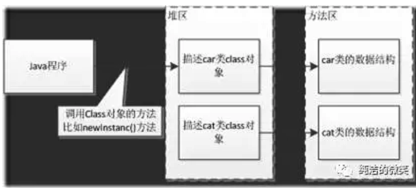
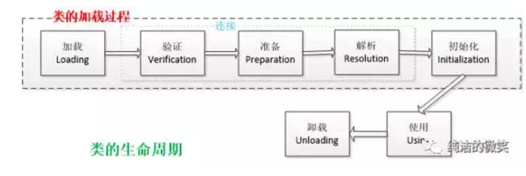
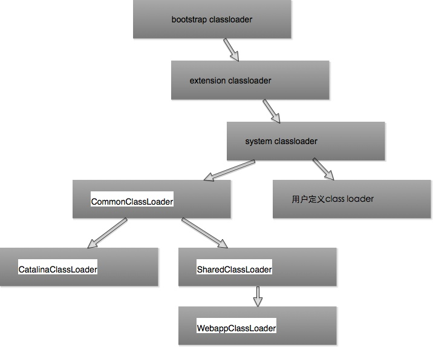

## 类加载器

---

#### 什么是类的加载

类的加载指的是将类的.class文件中的二进制数据读入到内存中，将其放入方法区，并在堆区创建一个 java.lang.Class对象，用来描述类在方法区内的数据结构（比如，类的name、全局变量、构造器和方法等）。类加载的最终产物是位于堆区中的 Class对象， Class对象封装了类在方法区内的数据结构，并且向Java程序员提供了访问方法区内的数据结构的接口。允许用户根据这些元信息对象间接调用Class对象的功能，即“反射”机制。




类加载器并不需要等到某个类被“首次主动使用”时再加载它，JVM规范允许类加载器在预料某个类将要被使用时就预先加载它，如果在预先加载的过程中遇到了.class文件缺失或存在错误，类加载器必须在程序首次主动使用该类时才报告错误（LinkageError错误）如果这个类一直没有被程序主动使用，那么类加载器就不会报告错误


#### 类的生命周期



其中类加载的过程包括了加载、验证、准备、解析、初始化五个阶段。在这五个阶段中，加载、验证、准备和初始化这四个阶段发生的顺序是确定的，而解析阶段则不一定，它在某些情况下可以在初始化阶段之后开始，这是为了支持Java语言的运行时绑定（也成为动态绑定或晚期绑定）。另外注意这里的几个阶段是按顺序开始，而不是按顺序进行或完成，因为这些阶段通常都是互相交叉地混合进行的，通常在一个阶段执行的过程中调用或激活另一个阶段。

##### 1、加载

在加载阶段，虚拟机需要完成以下三件事情：

* 通过一个类的全限定名来获取其定义的二进制字节流。
* 将这个字节流所代表的静态存储结构转化为方法区的运行时数据结构。
* 在Java堆中生成一个代表这个类的 java.lang.Class对象，作为对方法区中这些数据的访问入口。

相对于类加载的其他阶段而言，加载阶段（准确地说，是加载阶段获取类的二进制字节流的动作）是可控性最强的阶段，因为开发人员既可以使用系统提供的类加载器来完成加载，也可以自定义自己的类加载器来完成加载。

加载阶段完成后，虚拟机外部的二进制字节流就按照虚拟机所需的格式存储在方法区之中，而且在Java堆中也创建一个 java.lang.Class类的对象，这样便可以通过该对象访问方法区中的数据。

##### 2、连接

##### 2.1 验证 

**确保被加载的类的正确性。**

验证是连接阶段的第一步，这一阶段的目的是为了确保Class文件的字节流中包含的信息符合当前虚拟机的要求，并且不会危害虚拟机自身的安全。验证阶段大致会完成4个阶段的检验动作：

* 文件格式验证：验证字节流是否符合Class文件格式的规范；例如：是否以 0xCAFEBABE开头、主次版本号是否在当前虚拟机的处理范围之内、常量池中的常量是否有不被支持的类型。
* 元数据验证：对字节码描述的信息进行语义分析（注意：对比javac编译阶段的语义分析），以保证其描述的信息符合Java语言规范的要求；例如：这个类是否有父类，除了 java.lang.Object之外。
* 字节码验证：通过数据流和控制流分析，确定程序语义是合法的、符合逻辑的。
* 符号引用验证：确保解析动作能正确执行。

验证阶段是非常重要的，但不是必须的，它对程序运行期没有影响，如果所引用的类经过反复验证，那么可以考虑采用 -Xverifynone参数来关闭大部分的类验证措施，以缩短虚拟机类加载的时间。

##### 2.2 准备

**为类的 静态变量分配内存，并将其初始化为默认值。**

准备阶段是正式为类变量分配内存并设置类变量初始值的阶段，这些内存都将在方法区中分配。对于该阶段有以下几点需要注意：

* 这时候进行内存分配的仅包括类变量（static），而不包括实例变量，实例变量会在对象实例化时随着对象一块分配在Java堆中。
* 这里所设置的初始值通常情况下是数据类型默认的零值（如0、0L、null、false等），而不是被在Java代码中被显式地赋予的值。

假设一个类变量的定义为：` public static int value=3；`

那么变量value在准备阶段过后的初始值为0，而不是3，因为这时候尚未开始执行任何Java方法，而把value赋值为3的 public static 指令是在程序编译后，存放于类构造器 \<clinit>（）方法中，所以把value赋值为3的动作将在`初始化阶段`才会执行。


* 如果类字段的字段属性表中存在 ConstantValue属性，即同时被final和static修饰，那么在准备阶段变量value就会被初始化为ConstValue属性所指定的值。

假设上面的类变量value被定义为： `public static final int value=3；`

编译时Javac将会为value生成ConstantValue属性，在准备阶段虚拟机就会根据 ConstantValue的设置将value赋值为3。我们可以理解为static final常量在编译期就将其结果放入了调用它的类的常量池中

##### 2.3 解析

**把类中的符号引用转换为直接引用**

解析阶段是虚拟机将常量池内的符号引用替换为直接引用的过程，解析动作主要针对类或接口、字段、类方法、接口方法、方法类型、方法句柄和调用点限定符7类符号引用进行。符号引用就是一组符号来描述目标，可以是任何字面量。

直接引用就是直接指向目标的指针、相对偏移量或一个间接定位到目标的句柄。

##### 3、初始化

初始化，为类的静态变量赋予正确的初始值，有两种方式：

* 声明类变量是指定初始值
* 使用静态代码块为类变量指定初始值


JVM初始化步骤

* 假如这个类还没有被加载和连接，则程序先加载并连接该类
* 假如该类的直接父类还没有被初始化，则先初始化其直接父类
* 假如类中有初始化语句，则系统依次执行这些初始化语句

类初始化时机：只有当对类的主动使用的时候才会导致类的初始化，类的主动使用包括以下六种：

* 创建类的实例，也就是new的方式
* 访问某个类或接口的静态变量，或者对该静态变量赋值
* 调用类的静态方法
* 反射（如 Class.forName(“com.shengsiyuan.Test”)）
* 初始化某个类的子类，则其父类也会被初始化
* Java虚拟机启动时被标明为启动类的类（ Java Test），直接使用 java.exe命令来运行某个主类

##### 4、使用阶段


##### 5、结束生命周期

在如下几种情况下，Java虚拟机将结束生命周期

* 执行了 System.exit()方法
* 程序正常执行结束
* 程序在执行过程中遇到了异常或错误而异常终止
* 由于操作系统出现错误而导致Java虚拟机进程终止

#### 类加载器

类的装载器有三个：根装载器（用C++编写），负责装载JRE的核心类库。ExtClassLoader扩展类加载器，负责加载ext目录下的jar包。AppClassLoader系统类装载器，负责装载Classpath路径下的类包。这三个类装载器存在父子层级关系，根装载器是ExtClassLoader的父装载器，ExtClassLoader是AppClassLoader的父装载器。一般来说，Java 应用的类都是由AppClassLoader来完成加载的。可以通过 ClassLoader.getSystemClassLoader() 来获取它。一般来说，开发人员编写的类加载器的父类加载器是 应用类加载器  Application ClassLoader  

除了系统提供的类加载器以外，开发人员可以通过继承 java.lang.ClassLoader 类的方式实现自己的类加载器，以满足一些特殊的需求。

除了根类加载器之外，所有的类加载器都有一个父类加载器。可以通过 getParent()方法得到。**不同的类加载器为相同名字的类创建了额外的名称空间，所以相同名称的类才可以并存在 Java 虚拟机中，只需要用不同的类加载器来加载它们即可。**不同类加载器加载的类之间是不兼容的（相当于两个不同的类型），这就相当于在 Java 虚拟机内部创建了一个个相互隔离的 Java 类空间。这种技术在许多框架中都被用到，如OSGI等。

jvm启动时，会启动jre/rt.jar里的类加载器：bootstrap classloader，用来加载java核心api；然后启动扩展类加载器ExtClassLoader加载扩展类，并加载用户程序加载器AppClassLoader，并指定ExtClassLoader为他的父类；




CommonClassLoader、CatalinaClassLoader和SharedClassLoader与具体部署的Web应用无关，而WebappClassLoader则对应Web应用，每个Web应用都会有独立的类加载器，从而实现类的隔离。当类被加载时，会先检查在内存中是否已经被加载，如果是，则不再加载，如果没有，再由AppClassLoader来加载，先从jar包里找，没有再从classpath里找；如果自定义loader类，就会存在命名空间的情况，不同的加载器加载同一个类时，产生的实例其实是不同的。

#### JVM类加载机制

* **全盘负责**，当一个类加载器负责加载某个Class时，该Class所依赖的和引用的其他Class也将由该类加载器负责载入，除非显示使用另外一个类加载器来载入
* **父类委托**，先让父类加载器试图加载该类，只有在父类加载器无法加载该类时才尝试从自己的类路径中加载该类
* **缓存机制**，缓存机制将会保证所有加载过的Class都会被缓存，当程序中需要使用某个Class时，类加载器先从缓存区寻找该Class，只有缓存区不存在，系统才会读取该类对应的二进制数据，并将其转换成Class对象，存入缓存区。这就是为什么修改了Class后，必须重启JVM，程序的修改才会生效

#### 双亲委派模式

双亲委派模型的工作流程是：如果一个类加载器收到了类加载的请求，它首先不会自己去尝试加载这个类，而是把请求委托给父加载器去完成，依次向上，因此，所有的类加载请求最终都应该被传递到顶层的启动类加载器中，只有当父加载器在它的搜索范围中没有找到所需的类时，即无法完成该加载，子加载器才会尝试自己去加载该类。这也就可以解释为什么无法加载一个自定义的java.lang.String类！！！

双亲委派机制:

```
1、当 AppClassLoader加载一个class时，它首先不会自己去尝试加载这个类，而是把类加载请求委派给父类加载器ExtClassLoader去完成。
2、当 ExtClassLoader加载一个class时，它首先也不会自己去尝试加载这个类，而是把类加载请求委派给BootStrapClassLoader去完成。
3、如果 BootStrapClassLoader加载失败（例如在 $JAVA_HOME/jre/lib里未查找到该class），会使用 ExtClassLoader来尝试加载；
4、若ExtClassLoader也加载失败，则会使用 AppClassLoader来加载，如果 AppClassLoader也加载失败，则会报出异常 ClassNotFoundException。
```

ClassLoader源码分析：

```
protected synchronized Class<?> loadClass(String name, boolean resolve)
 throws ClassNotFoundException{
 // 首先判断该类型是否已经被加载
 Class c = findLoadedClass(name);
 if (c == null) {
 	//如果没有被加载，就委托给父类加载或者委派给启动类加载器加载
     try {
  		if (parent != null) {
     	 	 //如果存在父类加载器，就委派给父类加载器加载，false表示加载的类不会初始化
     		 c = parent.loadClass(name, false);
  		} else {
     		//如果不存在父类加载器，就检查是否是由启动类加载器加载的类，通过调用本地方法native 			// Class findBootstrapClass(String name)
      		c = findBootstrapClass0(name);
  		}
     } catch (ClassNotFoundException e) {
         // 如果父类加载器和启动类加载器都不能完成加载任务，才调用自身的加载功能
         c = findClass(name);
     }
 }
 if (resolve) {
     resolveClass(c);
 }
 return c;
}
```

双亲委派模型意义：

* 系统类防止内存中出现多份同样的字节码
* 保证Java程序安全稳定运行


#### 类的完整标识是（classLoader，package，className）

#### Class.forName()和ClassLoader.loadClass()区别

类加载有三种方式：

* java命令行启动应用时候由JVM初始化加载
* 通过Class.forName()方法动态加载
* 通过ClassLoader.loadClass()方法动态加载
 
```
Class<?> loadClass(String name) 

Class<?> loadClass(String name, boolean resolve) 
```

我们看到上面两个方法声明，第二个方法的第二个参数用于设置加载类的时候是否链接该类（上文中装载类文件的第二步），true链接，否则就不链接。Class类的forName方法则相反，使用forName加载时会将Class进行解析和初始化。

例如：JDBC DRIVER的加载，我们在加载JDBC驱动的时候都是使用的forName而非是ClassLoader的loadClass方法呢？我们知道，JDBC驱动是通过DriverManager，必须在DriverManager中注册，如果驱动类没有被初始化，则不能注册到DriverManager中，因此必须使用forName而不是用LoadClass。 

#### 自定义类加载器

通常情况下，我们都是直接使用系统类加载器。但是，有的时候，我们也需要自定义类加载器。比如应用是通过网络来传输 Java类的字节码，为保证安全性，这些字节码经过了加密处理，这时系统类加载器就无法对其进行加载，这样则需要自定义类加载器来实现。自定义类加载器一般都是继承 ClassLoader类，并重写 findClass 方法

#### 参考资料：

https://mp.weixin.qq.com/s/rLooaTOU_NQTJdn28KAUFw


