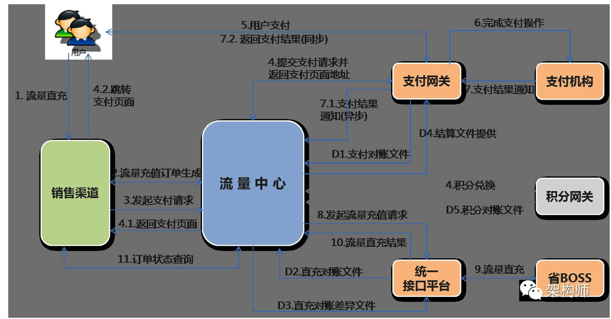
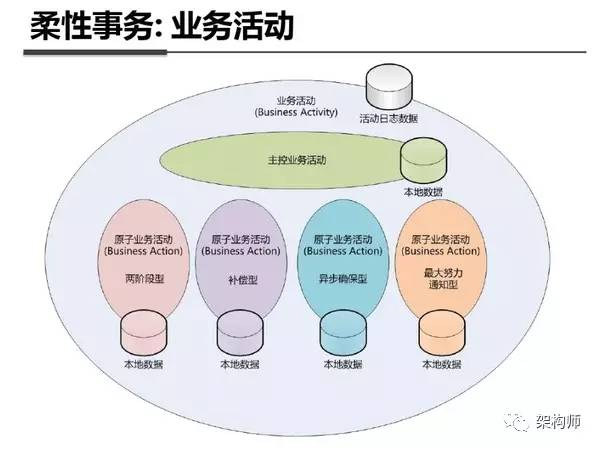
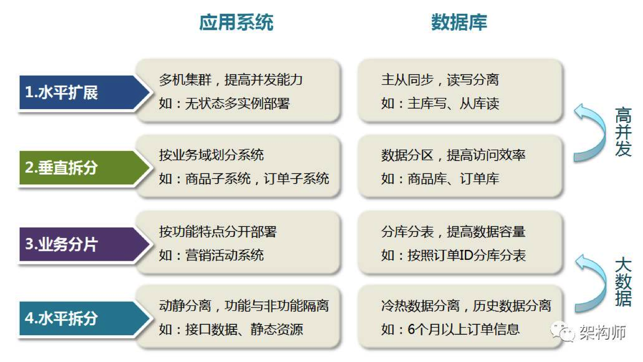

## 分布式事务

---


分布式事务场景如何设计系统架构及解决数据一致性问题，个人理解最终方案把握以下原则就可以了，那就是：大事务=小事务（原子事务）+异步（消息通知），**解决分布式事务的最好办法其实就是不考虑分布式事务，将一个大的业务进行拆分，整个大的业务流程，转化成若干个小的业务流程，然后通过设计补偿流程从而考虑最终一致性。**


#### What’s 事务

事务（Transaction）及其ACID属性

事务是由一组SQL语句组成的逻辑处理单元，事务具有以下4个属性，通常简称为事务的ACID属性：

  * 原子性（Atomicity）：事务是一个原子操作单元，其对数据的修改，要么全都执行，要么全都不执行。
  * 一致性（Consistent）：在事务开始和完成时，数据都必须保持一致状态。这意味着所有相关的数据规则都必须应用于事务的修改，以保持数据的完整性；事务结束时，所有的内部数据结构（如B树索引或双向链表）也都必须是正确的。
  * 隔离性（Isoation）：数据库系统提供一定的隔离机制，保证事务在不受外部并发操作影响的“独立”环境执行。这意味着事务处理过程中的中间状态对外部是不可见的，反之亦然。
  * 持久性（Durabe）：事务完成之后，它对于数据的修改是永久性的，即使出现系统故障也能够保持。

#### 典型场景：银行转账业务
例如：李雷账户中有500块钱，韩梅梅账户有200块钱，李雷要从自己的账户中转100块钱给韩梅梅，转账（事务）成功执行完成后应该是李雷账户减100变为400，韩梅梅账户加100变为300，不能出现其他情况，即在事务开始和结束时数据都必须保持一致状态（一致性），事务结束时所有的数据及结构都必须是正确的。并且同样的转账操作（同一流水，即一次转账操作）无论执行多少次结果都相同（幂等性）。

#### 电商场景：流量充值业务
再说我们做的一个项目：中国移动-流量充值能力中心，核心业务流程为：

```
  1. 用户进入流量充值商品购买页面，选择流量商品；
  2. 购买流量充值商品，有库存限制则判断库存，生成流量购买订单；
  3. 选择对应的支付方式（和包、银联、支付宝、微信）进行支付操作；
  4. 支付成功后，近实时流量到账即可使用流量商品；
```
此业务流程看似不是很复杂对吧，不涉及到类似电商业务的实物购买，但是我认为其中的区别并不是很大，只是缺少电商中的物流发货流程，其他流程几乎是一样的，也有库存以及优惠折扣等业务存在。

整个系统交互如下图：




#### 分布式事务
上述两个场景的业务需求已经说完了，接着谈谈分布式事务，要说分布式事务那就先聊聊本地事务与分布式事务：

Ps：相同点：首先都是要保证数据正确（即ACID），本地事务与分布式事务还可以对应为：刚性事务与柔性事务，在我个人理解刚性事务与柔性事务的最大区别就是：一个完整的事务操作是否可以在同一物理介质（例如：内存）上同时完成；柔性事务就是一个完整事务需要跨物理介质或跨物理节点（网络通讯），那么排它锁、共享锁等等就没有用武之地了（这里并不是指大事务拆小事务【本地事务】后），无法保证原子性（Atomicity）完成事务。个人理解分布式（柔性）事务本质意义上就是-伪事务，柔性事务其实就是根据不同的业务场景使用不同的方法实现最终一致性，因为可以根据业务的特性做部分取舍，在业务过程中可以容忍一定时间内的数据不一致。

在知乎上面看过一篇文章，支付宝的柔性事务实现方式有四种分别针对不同的业务场景，如下图：



  1. 两阶段型
  2. 补偿型
  3. 异步确保型
  4. 最大努力通知型

回到我们流量交易中心的业务场景：

通过Dubbo实现了微服务化，大致拆分如下：

  1. 商品服务
  2. 订单服务
  3. 库存服务
  4. 支付服务
  5. 直充服务
  6. 消息服务
  7. 等其他服务

#### 场景一：

库存数量与订单数量一致性，采用补偿型+最大努力通知型，采用原因为不涉及跨机房和长事务（正常情况下库存与订单服务处理很快）：

  1. 用户下单先减库存，库存减成功后；
  2. 调用下单服务：
  3. 2-1. 下单成功，两事务均提交完成；
  4. 2-2. 下单失败，库存回滚，两事务均失败，此处还有一个保障机制（最大努力通知型），就是如果调用库存服务异常，确定库存回滚失败了，则放入消息服务（延时消息队列）分阶段定时重试，努力重试保证库存服务正常后成功回滚。

#### 场景二：

订单信息、支付信息、充值信息三者之间的一致性，采用异步确保型的原因是，整个业务链路太长且跨不同的机房系统，网络延迟较高，业务方面恰好不需要非常高的实时性，所以采用小事务+异步通知，目前正常情况下用户从下单到完成支付到流量到账平均为1-5分钟左右：

  1. 下单成功即订单服务创建订单成功并发送支付请求到支付网关系统（订单状态-待支付，超过1小时未支付则流转为超时未付撤销，此处用到了RocketMQ的延时消费恰好实现定时器业务场景）。
  2. 返回支付页面，用户在支付交易系统完成支付业务流程，支付网关异步通知流量中心，流量中心接收到支付成功状态后修改订单状态-支付成功，并给支付网关返回成功结果（此处并发压力目前不大，暂时没有再进行异步解耦）。
  3. 流量中心修改完订单状态后，调用消息服务将直充业务放入消息队列，对直充业务进行解耦（原因是直充需要调用31省移动CRM系统，此链路过长，且部分省CRM系统耗时非常大，每个省的处理能力不同，经常出现20秒以上的超时，因此要考虑部分超时较高的省份拖垮系统，进行业务的削峰填谷）；
  4. 3-1. 当直充成功时，修改订单状态-已完成；
  5. 3-2. 当直充失败时（移动特性，例如：直充时正好用户销户或者停机了），修改订单状态为待退款，并调用支付网关系统的退款接口，退款成功后支付网关异步通知流量中心，流量中心修改订单状态为-退款成功；
  6. 3-3. 当直充超时时，调用定时任务服务进行超时重试机制（第一次重试在10分钟后执行、第二次在30分钟后、第三次…..），直到最大超时重试次数后还得不到直充结果，订单状态会卡在支付成功状态，依赖T+1对账稽核流程保证最终一致性，订单状态根据对账结果流转为：已完成或待退款–>退款成功。

#### 场景三：
直充到账后的消息通知（APP消息推送或短信通知），采用最大努力通知型，这个业务场景比较简单，在直充成功后，订单状态流转为已完成，此时通过消息服务进行到账通知业务的解耦，调用消息服务失败的情况下，使用定时任务努力通知。

#### 场景四：

**对账稽核：**

按照支付账期每日进行T+1对账，对账原则：以支付交易记录为准，对流量中心订单记录+支付网关交易记录+省CRM充值记录三方比对，将某些中间状态的订单（例如：支付成功、待退款）核对后将订单状态流转完结（已完成、退款成功）。

**结算稽核：**

对账成功后的数据定期进入结算流程，对支付网关周期内的支付金额与结算数据的金额进行核对，稽核成功后进行财务结算流程，将钱结算给省公司，并提供结算明细给省公司，供省公司与直充成本记录进行复核。
Ps：以下是流量中心的部分架构设计，总体原则方向：微服务化

**流量中心-架构设计**


架构设计思想：在系统初期设计时以及部分硬性环境约束下，我们根据业务拆分为多个子系统（微服务）：商品服务、订单服务、库存服务、支付网关、统一接口平台、对账服务、结算服务、网关对接服务等，后续还会增加：账户服务、虚拟货币服务、卡券服务等等…。按照微服务的核心设计思想，所有服务完全独立、隔离，因此所有服务从上至下：请求接入（连接管理）、请求处理（计算服务）、数据存储（存储服务）进行拆分，接入与计算尽最大可能实现无状态，数据存储进行垂直+水平拆分，垂直拆分：商品库-mysql（读多写少，主从架构+读写分离）+redis（读多写少，集群方式）、订单库-mysql（读写均衡，多主多从+水平拆分）、库存专用库-redis（分布式+主备容灾）、外部交易系统-支付网关、外部办理系统-统一接口平台。

Ps：此架构目前已支撑总交易额3.6亿，总订单4680万，日均交易额500万，日订单量50万，后续业务量持续增加的情况下按照微服务思想继续拆分，例如将订单服务再拆分为：下单服务、查单服务，直到根据业务需求与系统关系耦合性拆分到最细粒度为止。

  1. 性能扩展：应用层计算服务（无状态应用）通过增加服务节点同比提升运算性能，配套质量（性能）监控服务dubbo monitor及整合Netflix的Hystrix熔断器对业务质量进行管理实现应用层的动态扩缩容。
  2. 容量扩展：数据层存储服务（有状态应用）通过对数据水平拆分实现容量的无限扩容，Nosql类方案：Codis中间件；关系型数据库：Mycat数据库分库分表中间件。目前项目中采用twitter的snowflake唯一ID生成器（根据业务场景优化后）自己实现数据的水平拆分和路由规则。
  3. 存储性能：Nosql：针对读多写少场景-使用淘宝的Tedis（多写随机读的特性提高性能），读写均衡使用-Codis；Mysql：读多写少场景使用一主多从架构（例如商品信息），读写均衡场景使用多主多从架构（例如订单信息）。


**整体拆分原则如下图：**



