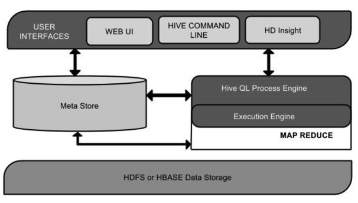
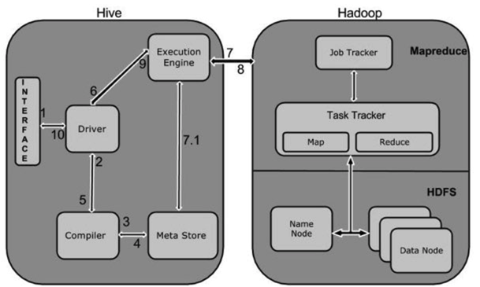

## Hive

---

Hive是Facebook于2008年开源的一个数据仓库框架。Hive定义了一个类似于SQL的查询语言：HQL，能够将用户编写的QL转化为相应的MapReduce程序基于Hadoop执行。

Hive 适合用来对一段时间内的数据进行分析查询，例如，用来计算趋势或者网站的日志。**Hive 不应该用来进行实时的查询（Hive 的设计目的，也不是支持实时的查询）**。因为它需要很长时间才可以返回结果。

Hive 一般只要有 Hadoop 便可以工作。而 HBase 则还需要 Zookeeper 的帮助（Zookeeper，是一个用来进行分布式协调的服务，这些服务包括配置服务，维护元信息和命名空间服务）

Hive的操作可以通过UI界面、命令终端、JDBC（java程序）等方式来操作。

* 创建数据库

```
CREATE DATABASE [IF NOT EXISTS] userdb;
```
* 删除数据库

```
DROP DATABASE IF EXISTS userdb;
```

* 创建表

```
CREATE TABLE IF NOT EXISTS employee ( eid int, name String,
  salary String, destination String)
  COMMENT ‘Employee details’
  ROW FORMAT DELIMITED
  FIELDS TERMINATED BY ‘\t’
  LINES TERMINATED BY ‘\n’
  STORED AS TEXTFILE;
```

* 插入数据 

```
我们将插入下列数据到表中。在/home/user目录中名为sample.txt的文件。

1201  Gopal       45000    Technical manager
1202  Manisha     45000    Proof reader
1203  Masthanvali 40000    Technical writer
1204  Kiran       40000    Hr Admin
1205  Kranthi     30000    Op Admin


hive> LOAD DATA LOCAL INPATH '/home/user/sample.txt'
     OVERWRITE INTO TABLE employee;
```
* 修改表，包括表结构

http://www.yiibai.com/hive/hive_alter_table.html

```
重命名表，把 employee 修改为 emp。

hive> ALTER TABLE employee RENAME TO emp;

```
* 删除表

```
hive> DROP TABLE IF EXISTS employee;
```
* 各种视图操作（创建、删除、创建索引、删除索引）


#### Hive架构



|单元名称|操作|
|----|-----|
|用户接口/界面|	Hive是一个数据仓库基础工具软件，可以创建用户和HDFS之间互动。用户界面，Hive支持是Hive的Web UI，Hive命令行，HiveHD洞察（在Windows服务器）。|
|元存储	|Hive选择各自的数据库服务器，用以储存表，数据库，列模式或元数据表，它们的数据类型和HDFS映射。|
|HiveQL处理引擎	|HiveQL类似于SQL的查询上Metastore模式信息。这是传统的方式进行MapReduce程序的替代品之一。相反，使用Java编写的MapReduce程序，可以编写为MapReduce工作，并处理它的查询。|
|执行引擎|	HiveQL处理引擎和MapReduce的结合部分是由Hive执行引擎。执行引擎处理查询并产生结果和MapReduce的结果一样。它采用MapReduce方法。|
|HDFS 或 HBASE	|Hadoop的分布式文件系统或者HBASE数据存储技术是用于将数据存储到文件系统。|

#### Hive工作原理




|Step No|	操作
|----|---
|1|Execute Query， Hive接口，如命令行或Web UI发送查询驱动程序（任何数据库驱动程序，如JDBC，ODBC等）来执行。
|2|Get Plan ，在驱动程序帮助下查询编译器，分析查询检查语法和查询计划或查询的要求。
|3|Get Metadata ，编译器发送元数据请求到Metastore（任何数据库）。
|4|Send Metadata ，Metastore发送元数据，以编译器的响应。
|5	|Send Plan，编译器检查要求，并重新发送计划给驱动程序。到此为止，查询解析和编译完成。
|6|	Execute Plan，驱动程序发送的执行计划到执行引擎。
|7|	Execute Job，在内部，执行作业的过程是一个MapReduce工作。执行引擎发送作业给JobTracker，在名称节点并把它分配作业到TaskTracker，这是在数据节点。在这里，查询执行MapReduce工作。
|7.1|Metadata Ops，与此同时，在执行时，执行引擎可以通过Metastore执行元数据操作。
|8	|Fetch Result，执行引擎接收来自数据节点的结果。
|9|	Send Results，执行引擎发送这些结果值给驱动程序。
|10|Send Results，驱动程序将结果发送给Hive接口。

Hive 的安装手册：http://www.yiibai.com/hive/hive_installation.html


#### 参考资料：

* http://www.yiibai.com/hive/hive_alter_table.html