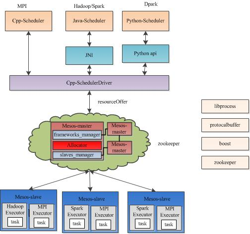

##  集群管理员
---

集群管理员管理着整个计算机集群，如cpu、内存、存储空间、端口、以及集群中节点的其他可用资源。

在Hadoop2.0中，集群管理员与计算引擎分离开了，变成一个独立组件。可以与任意计算引擎（如：MapReduce、Spark、Tez）一起使用。

Spark支持的三种集群管理员：mesos、yarn、独立集群管理员。Spark提供了脚本供它支持的这些集群管理员来部署Spark应用。

### 一、独立集群管理员

Spark默认提供的一种方式。由两个组件：master和work。

worker进程管理单个集群节点上的资源。master进程将所有work计算资源聚合起来并将这些资源分配给应用程序。

启动集群：

1.首先启动master进程，默认是7077端口，其中绑定的ip地址和端口都是可配置的。

```
./sbin/start-master.sh
```
2，然后在每个集群节点上启动worker进程

```
./sbin/start-slave.sh  <master-url>
```

停止集群：

```
./sbin/stop-slave.sh  //所有worker节点全部关闭
./sbin/stop-master.sh
```
由于worker数量较多，采用人工方式启停会越来越麻烦，spark还提供了一个批量脚本

```
批量启动：

1.在spark/conf目录下创建一个名为slaves的文件。这个文件包含了所有worker的ip地址，每行一个
2./sbin/start-all.sh

批量停止：
./sbin/stop-all.sh
```

在独立集群上运行Spark应用，可以使用spark-submit脚本。支持两种模式：

* 客户端模式（默认）。

当客户端设备和Spark集群处于同一个网络中，推荐使用该模式。另外输入和输出都是启动它时所处的控制台。

```
./bin/spark-submit  --deploy-mode client  --master <master-url> <jar包路径> [参数]
```
* 集群模式。

当部署Spark应用的设备与Spark集群不在同一个网络时，推荐使用集群模式。它是将输出存储成文件或数据库中。

```
./bin/spark-submit  --deploy-mode cluster  --master <master-url> <jar包路径> [参数]
```

### 二、Mesos

Mesos是一个开源的集群管理员，可以把它当成一个集群计算机的操作系统内核。它将集群设备的计算资源汇总到一起，并且让这些资源能被多种应用程序共享。

特性：

* 支持扩展至数万个节点
* 可容错的master和slave
* 多种资源（CPU、内存、磁盘、端口）调度
* 支持Docker容器
* 任务之间相到独立



Mesos由四个组件组成，分别是Mesos-master，mesos-slave，framework和executor。
Mesos-master是整个系统的核心，负责管理接入mesos的各个framework（由frameworks_manager管理）和slave（由slaves_manager管理），并将slave上的资源按照某种策略分配给framework（由独立插拔模块Allocator管理）。

Mesos-slave负责接收并执行来自mesos-master的命令、管理节点上的mesos-task，并为各个task分配资源。mesos-slave将自己的资源量发送给mesos-master，由mesos-master中的Allocator模块决定将资源分配给哪个framework，当前考虑的资源有CPU和内存两种，也就是说，mesos-slave会将CPU个数和内存量发送给mesos-master，而用户提交作业时，需要指定每个任务需要的CPU个数和内存量，这样，当任务运行时，mesos-slave会将任务放到包含固定资源的linux container中运行，以达到资源隔离的效果。很明显，master存在单点故障问题，为此，mesos采用了zookeeper解决该问题。

Framework是指外部的计算框架，如Hadoop，Spark等，这些计算框架可通过注册的方式接入mesos，以便mesos进行统一管理和资源分配。Mesos要求可接入的框架必须有一个调度器模块，该调度器负责框架内部的任务调度。当一个framework想要接入mesos时，需要修改自己的调度器，以便向mesos注册，并获取mesos分配给自己的资源， 这样再由自己的调度器将这些资源分配给框架中的任务，也就是说，整个mesos系统采用了双层调度框架：第一层，由mesos将资源分配给框架；第二层，框架自己的调度器将资源分配给自己内部的任务。当前Mesos支持三种语言编写的调度器，分别是C++，java和python，为了向各种调度器提供统一的接入方式，Mesos内部采用C++实现了一个MesosSchedulerDriver（调度器驱动器），framework的调度器可调用该driver中的接口与Mesos-master交互，完成一系列功能（如注册，资源分配等）。

Executor主要用于启动框架内部的task。由于不同的框架，启动task的接口或者方式不同，当一个新的框架要接入mesos时，需要编写一个executor，告诉mesos如何启动该框架中的task。为了向各种框架提供统一的执行器编写方式，Mesos内部采用C++实现了一个MesosExecutorDiver（执行器驱动器），framework可通过该驱动器的相关接口告诉mesos启动task的方法。

在Mesos集群上运行Spark应用：

```
./bin/spark-submit  --master mesos://zk://ip1:2181,ip2:2181,ip3:2181  <jar包地址> [参数]
```

* [Mesos简介与安装](http://www.jianshu.com/p/257f44167c45)

### 三、YARN

YARN 集群管理员由两个关键组件构成：ResourceManager（相当于mesos的master）和NodeManager（相当于mesos的slave）。NodeManager管理单个节点上可以使用的资源。它将资源使用情况报告给ResourceManager。ResourceManager管理集群中所有节点上的可使用资源，并分配给不同的应用。

客户端应用向ResourceManager提交作业。如：spark-submit脚本就是一个客户端应用。

使用YARN的一个好处就在于Spark应用和MapReduce应用可以共享同一个集群。如果你已有一个Hadoop集群可以轻松地使用YARN来部署Spark应用。

spark-submit脚本也可以用来在YARN集群上部署spark应用。然而，在YARN集群上启动spark应用时，master url的值要么是yarn-cluster要么是yarn-client。Spark将从Hadoop的配置文件中获取ResourceManager的地址。