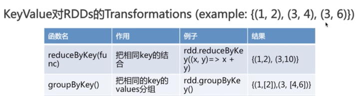

##  Spark Core 笔记

---


Spark允许应用程序利用内存缓存数据。这能减少磁盘IO。一个基于MR的数据处理流水线可能包含多个作业，每个作业都需要从磁盘载入数据，处理它，然后再写入磁盘中。

Spark不会自动将输入的数据缓存在内存中，一个普遍的误解是，一旦无法把输入的数据载入内存，那么spark将无法使用，这不正确，spark可以在集群上处理太字节级的数据，哪怕集群总内存只有100G，在数据处理流水线上何时缓存数据及缓存哪部分数据完全由应用程序决定。

Spark和Hadoop一样都可以将一个作业转化为由若干阶段构成的有向无环图（DAG）。MR对任意一个作业都会创建由map和reduce两个阶段构成的有向无环图。如果是一个复杂的数据处理由MR实现，则需要划分多个作业，而后顺序执行，这样导致Hadoop无法做任何的优化。相反Spark不会迫使开发者实现数据处理算法时将其划分为多个作业，Spark中的DAG可以包含任意个阶段，一次执行包含多阶段的复杂作业，从而减少磁盘IO和数据shuffle操作时间。因为shuffle操作涉及网络数据传输。

Spark是可容错的，能自动处理集群中的节点故障。

Spark本质是一个使用集群节点进行大数据集处理的计算框架。与数据库不同，它并没有存储系统，但可以搭配外部存储系统，如HDFS、Hbase、Cassandra、Amazon S3等。


#### 架构及生态


* RDD(Resilient Distributed Datasets)，弹性分布式数据集。生成只有两种途径：一种来自内存集合或外部存储系统；另一种是通过转换操作来自于其他RDD，比如map、filter、join等。

	Spark中，所有的计算都是通过RDDs的创建、转换，操作完成的。一个RDD内部由许多partitions(分片)组成。

* Spark Core：包含任务调度、内存管理、容错机制等，内部定义了RDD,提供了很多API来创建和操作这些RDD，使的Spark能够更加灵活的处理类似MapReduce的批处理作业
* Spark SQL/ Shark：兼容Hive的接口HQL，提供比Hive高出数10~100倍的查询速度的分布式SQL引擎
* Spark Streaming：提供了API来操作实时流数据，将流式计算分解成一系列的短小的批处理作业。应用场景，企业中接收kafka消息来做实时统计。
* MLlib：迭代式运算，MLlib是构建在Spark上的机器学习算法库，目前支持常用的分类算法、聚类算法、推荐算法，模型评估和数据导入。并支持集群上的横向扩展。
* GraphX：基于Spark的图计算框架

Spark架构的组成


* Cluster Manager：在standalone模式中即为Master主节点，控制整个集群，监控worker。在YARN模式中为资源管理器
* Worker节点：从节点，负责控制计算节点，启动Executor或者Driver。
* Driver： 运行Application 的main()函数
* Executor：执行器是一个JVM进程，是为某个Application运行在worker node上的一个进程，可以多线程并发执行应用代码。执行器的生命周期和创建它的应用一样，一旦Spark应用结束，那么为它创建的执行者也将回收。
* Task：任务，一个任务对应一个数据分区，由Executor并发调用执行，一个执行者可以执行一个或多个任务。任务的数量由分区的数量决定。更多的分区意味着有更多的任务并发处理数据。

#### 运行流程


* 构建Spark Application的运行环境，启动SparkContext
* SparkContext向资源管理器（可以是Standalone，Mesos，Yarn）申请运行Executor资源，并启动StandaloneExecutorbackend，
* Executor向SparkContext申请Task
* SparkContext将应用程序分发给Executor
* SparkContext构建成DAG图，将DAG图分解成Stage、将Taskset发送给Task Scheduler，最后由Task Scheduler将Task发送给Executor运行
* Task在Executor上运行，运行完释放所有资源

特点：

* 每个Application获取专属的executor进程，该进程在Application期间一直驻留，并以多线程方式运行Task。这种Application隔离机制是有优势的，无论是从调度角度看（每个Driver调度他自己的任务），还是从运行角度看（来自不同Application的Task运行在不同JVM中），当然这样意味着Spark Application不能跨应用程序共享数据，除非将数据写入外部存储系统
* Spark与资源管理器无关，只要能够获取executor进程，并能保持相互通信就可以了
* 提交SparkContext的Client应该靠近Worker节点（运行Executor的节点），最好是在同一个Rack里，因为Spark Application运行过程中SparkContext和Executor之间有大量的信息交换
* Task采用了数据本地性和推测执行的优化机制


#### 大数据处理分为三种情况
* 复杂的批量数据处理，时间跨度为数十分钟到数小时
* 基于历史数据的交互式查询，时间跨度为数十秒到数分钟
* 基于实时数据流的数据处理，通常时间跨度为数百毫秒到数秒

#### Spark与Hadoop的区别：

1）hadoop：离线处理；对时效性要求不高。

2）spark：对时效性要求很高的场景，由于基于内存操作，大大加快计算速度。另外可应用机器学习领域。但Spark不具有HDFS的存储能力，要借助HDFS等持久化数据。

下载地址：

http://spark.apache.org/downloads.html

spark支持多种方式连接，可以从上面的官网下载，解压，进行bin目录，启动对应的客户端脚本（比如scala或者python），然后就可以在终端敲入代码，执行相应的命令。


通过SparkContext对象访问Spark，SparkContext对象代表和一个集群的连接。


#### RDD 常用的转换函数

* map  数据转换，输入1个，输出1个。

* filter   过滤，满足条件的保留

* flatMap

	对每个输入元素，输出多个输出元素。flat压扁的意思，将RDD中元素压扁后返回一个新的RDD。比如对一行文本按空格分割得到多个单词。
	
* distinct  去重
* union 两个RDD合并，不会去重
* intersection  两个RDD交集
* subtract   （返回一个只存在于第一个RDD而不存在于第二个RDD中的所有元素组成的RDD）

* reduce

	接收一个函数，作用在RDD两个类型相同的元素上，返回新元素。可以实现，RDD中元素的累加、计数和其它类型的聚集操作。

* 结果返回


#### Key Value对 RDDs

* 使用map（）函数，返回key---value 对

*  reduceByKey 等函数用法




* combineByKey  
	
	最常用的基于key的聚合函数，返回类型可以与输入类型不一样。
	
#### RDD 缓存

* cache：将RDD存储在集群中执行者的内存中
* persist：通用版的cache方法 ，将RDD存储在硬盘上或者内存中。persist支持多种选项：MEMORTY_ONLY、Disk_ONLY、MEMORY_AND_DISK等


#### 传递给spark的master url可以有如下几种：

```
local 本地单线程
local[K] 本地多线程（指定K个内核）
local[*] 本地多线程（指定所有可用内核）
spark://HOST:PORT 连接到指定的 Spark standalone cluster master，需要指定端口。
mesos://HOST:PORT 连接到指定的 Mesos 集群，需要指定端口。
yarn-client客户端模式 连接到 YARN 集群。需要配置 HADOOP_CONF_DIR。
yarn-cluster集群模式 连接到 YARN 集群。需要配置 HADOOP_CONF_DIR。
```

#### 参考资料

* http://www.cnblogs.com/zhoudayang/p/5008010.html
* http://www.cnblogs.com/tovin/p/3832405.html
* [超实用的Spark数据倾斜解决姿势](https://mp.weixin.qq.com/s/QCtiRWZhy9xlTqUFUAx3EQ)