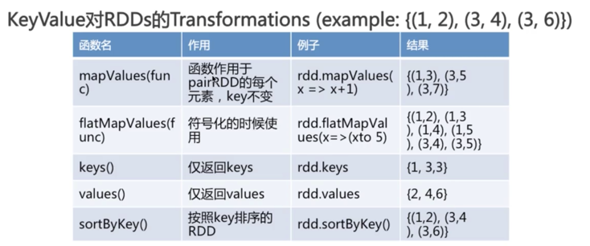

## Spark

---

##### 附录

* [Spark Streaming中流式计算的困境与解决之道](http://mp.weixin.qq.com/s/URJg23Pz0rkFFAjWCdYB1w)
* [Spark常用案例](http://blog.csdn.net/T1DMzks/article/category/7062215)
* [Spark的一些调试程序](https://github.com/aalansehaiyang/spark-example)
* [Spark入门实战系列](http://www.cnblogs.com/shishanyuan/p/4699644.html)

Spark Stream

* [Spark 安装、启动](Spark-stream.md)
* [Spark Streaming笔记——技术点汇总](https://mp.weixin.qq.com/s/_pZ5U-UlZvhPeXuOepO9_w)

---

#### 专业名词

* RDD(Resilient Distributed Datasets)，弹性分布式数据集。生成只有两种途径：一种来自内存集合和外部存储系统；另一种是通过转换操作来自于其他RDD，比如map、filter、join等。

	Spark中，所有的计算都是通过RDDs的创建、转换，操作完成的。一个RDD内部由许多partitions(分片)组成。

* Spark Core：包含任务调度、内存管理、容错机制等，内部定义了RDD,提供了很多API来创建和操作这些RDD，使的Spark能够更加灵活的处理类似MapReduce的批处理作业
* Spark SQL/ Shark：兼容Hive的接口HQL，提供比Hive高出数10~100倍的查询速度的分布式SQL引擎
* Spark Streaming：提供了API来操作实时流数据，将流式计算分解成一系列的短小的批处理作业。应用场景，企业中接收kafka消息来做实时统计。
* MLlib：迭代式运算，MLlib是构建在Spark上的机器学习算法库，目前支持常用的分类算法、聚类算法、推荐算法，模型评估和数据导入。并支持集群上的横向扩展。
* GraphX：基于Spark的图计算框架

#### 大数据处理分为三种情况
* 复杂的批量数据处理，时间跨度为数十分钟到数小时
* 基于历史数据的交互式查询，时间跨度为数十秒到数分钟
* 基于实时数据流的数据处理，通常时间跨度为数百毫秒到数秒

#### Spark与Hadoop的区别：

1）hadoop：离线处理；对时效性要求不高。

2）spark：对时效性要求很高的场景，由于基于内存操作，大大加快计算速度。另外可应用机器学习领域。但Spark不具有HDFS的存储能力，要借助HDFS等持久化数据。

下载地址：

http://spark.apache.org/downloads.html

spark支持多种方式连接，可以从上面的官网下载，解压，进行bin目录，启动对应的客户端脚本（比如scala或者python），然后就可以在终端敲入代码，执行相应的命令。


通过SparkContext对象访问Spark，SparkContext对象代表和一个集群的连接。


#### RDD 常用的转换函数

* map  数据转换，输入1个，输出1个。

* filter   过滤，满足条件的保留

* flatMap

	对每个输入元素，输出多个输出元素。flat压扁的意思，将RDD中元素压扁后返回一个新的RDD。比如对一行文本按空格分割得到多个单词。
	
* distinct  去重
* union 两个RDD合并，不会去重
* intersection  两个RDD交集
* subtract   （返回一个只存在于第一个RDD而不存在于第二个RDD中的所有元素组成的RDD）

* reduce

	接收一个函数，作用在RDD两个类型相同的元素上，返回新元素。可以实现，RDD中元素的累加、计数和其它类型的聚集操作。

* 结果返回


#### Key Value对 RDDs

* 使用map（）函数，返回key---value 对

*  reduceByKey 等函数用法




* combineByKey  
	
	最常用的基于key的聚合函数，返回类型可以与输入类型不一样。
	
#### 传递给spark的master url可以有如下几种：

```
local 本地单线程
local[K] 本地多线程（指定K个内核）
local[*] 本地多线程（指定所有可用内核）
spark://HOST:PORT 连接到指定的 Spark standalone cluster master，需要指定端口。
mesos://HOST:PORT 连接到指定的 Mesos 集群，需要指定端口。
yarn-client客户端模式 连接到 YARN 集群。需要配置 HADOOP_CONF_DIR。
yarn-cluster集群模式 连接到 YARN 集群。需要配置 HADOOP_CONF_DIR。
```

#### 参考资料

* http://www.cnblogs.com/zhoudayang/p/5008010.html
* http://www.cnblogs.com/tovin/p/3832405.html