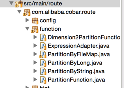
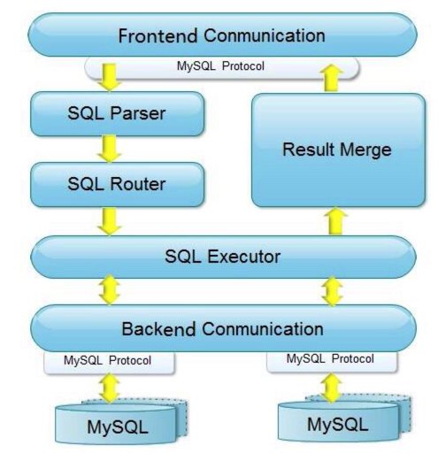
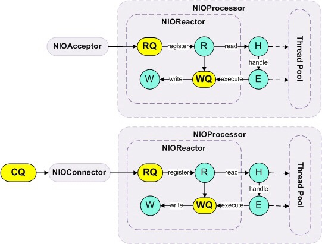

## cobar源码阅读笔记

---


* 启动入口

com.alibaba.cobar.CobarStartup

* CobarServer初始化

com.alibaba.cobar.CobarServer.CobarServer()

* CobarConfig初始化

	* 借助xml解析器，加载schema.xml配置文件转换为XMLSchemaLoader类实例对象
	* 借助xml解析器，加载server.xml配置文件转换为XMLServerLoader类实例对象
	* 将XMLSchemaLoader和XMLServerLoader的全局变量赋值到XMLConfigLoader
	
	```
    public XMLConfigLoader(SchemaLoader schemaLoader) {
        this.functions = Collections.unmodifiableMap(schemaLoader.getFunctions());
        this.dataSources = schemaLoader.getDataSources();
        this.dataNodes = schemaLoader.getDataNodes();
        this.schemas = schemaLoader.getSchemas();
        this.rules = schemaLoader.listRuleConfig();
        schemaLoader = null;
        XMLServerLoader serverLoader = new XMLServerLoader();
        this.system = serverLoader.getSystem();
        this.users = serverLoader.getUsers();
        this.quarantine = serverLoader.getQuarantine();
        this.cluster = serverLoader.getCluster();
    }
	```
	* 构造ConfigInitializer对象
	
	```
	public ConfigInitializer() {
        SchemaLoader schemaLoader = new XMLSchemaLoader();
        XMLConfigLoader configLoader = new XMLConfigLoader(schemaLoader);
        try {
            RouteRuleInitializer.initRouteRule(schemaLoader);
            schemaLoader = null;
        } catch (SQLSyntaxErrorException e) {
            throw new ConfigException(e);
        }
        this.system = configLoader.getSystemConfig();
        this.users = configLoader.getUserConfigs();
        this.schemas = configLoader.getSchemaConfigs();
        this.dataSources = configLoader.getDataSources();
        this.dataNodes = initDataNodes(configLoader);
        this.quarantine = configLoader.getQuarantineConfig();
        this.cluster = initCobarCluster(configLoader);

        this.checkConfig();
   }
	```
	* 构造CobarConfig对象，最终赋值给CobarServer

* cobar服务启动。com.alibaba.cobar.CobarServer.startup()
	
	```
	// 初始化数据节点
	.....省略
	//数据节点连接空闲超时定时检查
	.....省略
	// 数据节点心跳任务定时检查
	...省略
	// cobar最核心的服务进程启动
	ServerConnectionFactory sf = new ServerConnectionFactory();
	sf.setCharset(system.getCharset());
	sf.setIdleTimeout(system.getIdleTimeout());
	server = new NIOAcceptor(NAME + "Server", system.getServerPort(), sf);
	server.setProcessors(processors);
	server.start();
	// 集群节点定时心跳任务
	timer.schedule(clusterHeartbeat(), 0L, system.getClusterHeartbeatPeriod());

	```
	
* com.alibaba.cobar.net.NIOAcceptor.run()，监听端口的线程任务启动，无限循环

	* 如果 ServerSocketChannel接收到连接，封装到FrontendConnection，再借助NIOProcessor，注册到NIOReactor.R.BlockingQueue<NIOConnection> 
	* NIOReactor(网络事件反应器)，将NIOConnection的数据读取

* com.alibaba.cobar.server.ServerConnection.execute(String, int)

	* 状态检查
	* 检查当前使用的DB
	* 路由计算
	* session执行

路由算法：


	

整体流程图：



从上图中可以看到，Cobar的前、后端模块都实现了MySQL协议；当接受到SQL请求时，会依次进行解释（SQL Parser）和路由（SQL Router）工作，然后使用SQL Executor去后端模块获取数据集（后端模块还负责心跳检测功能）；如果数据集来自多个数据源，Cobar则需要把数据集进行组合（Result Merge），最后返回响应。




从上图中可以看出，Cobar采用了主流的Reactor设计模式来处理请求，并使用NIO进行底层的数据交换，这大大提升系统的负载能力。其中，NIOAcceptor用于处理前端请求，NIOConnector则用于管理后端的连接，NIOProcessor用于管理多线程事件处理，NIOReactor则用于完成底层的事件驱动机制，就是看起来和Mina和Netty的网络模型比较相似。