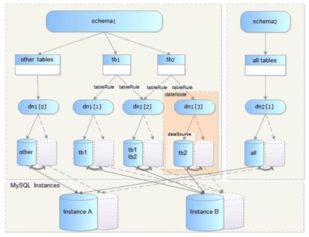

## cobar相关

---

####  附录


* [源代码](https://github.com/alibaba/cobar)

* [源码阅读笔记](cobar-sourcecode.md)

* [常见问题](https://github.com/alibaba/cobar/wiki/%E5%B8%B8%E8%A7%81%E9%97%AE%E7%AD%94)

---

#### 简介

Cobar是关系型数据的分布式处理系统，它可以在分布式的环境下看上去像传统数据库一样为您提供海量数据服务。

Cobar遵循MySQL协议，访问Cobar的方式与访问MySQL数据库完全相同。

#### Cobar解决的问题

* 分布式:Cobar的分布式主要是通过将表放入不同的库来实现:
	* Cobar支持将一张表水平拆分成多份分别放入不同的库来实现表的水平拆分
	* Cobar也支持将不同的表放入不同的库
	* 多数情况下,用户会将以上两种方式混合使用 这里需要强调的是,Cobar不支持将一张表,例如test表拆分成test_1, test_2, test_3.....放在同一个库中, 必须将拆分后的表分别放入不同的库来实现分布式。

* HA: 在用户配置了MySQL心跳的情况下,Cobar可以自动向后端连接的MySQL发送心跳,判断MySQL运行状 况,一旦运行出现异常,Cobar可以自动切换到备机工作。但需要强调的是:
	* Cobar的主备切换有两种触发方式,一种是用户手动触发,一种是Cobar的心跳语句检测到异常后自动触 发。那么,当心跳检测到主机异常,切换到备机,如果主机恢复了,需要用户手动切回主机工作,Cobar不 会在主机恢复时自动切换回主机,除非备机的心跳也返回异常。
	* Cobar只检查MySQL主备异常,不关心主备之间的数据同步,因此用户需要在使用Cobar之前在MySQL主 备上配置双向同步,详情可以参阅MySQL参考手册。

**注意事项 **

1.请注意表的拆分方式,一张表水平拆分多份到不同的库中,而不是放入同一个库中。

2.如果使用HA功能,请在MySQL主备之间配置双向同步

#### 逻辑层次图



* dataSource:数据源,表示一个具体的数据库连接,与一个物理存在的schema一一对应。 
* dataNode:数据节点,由主、备数据源,数据源的HA以及连接池共同组成,可以将一个dataNode理解为一 个分库。
* table:表,包括拆分表(如tb1,tb2)和非拆分表。 
* tableRule:路由规则,用于判断SQL语句被路由到具体哪些 datanode执行。 
* schema:cobar可以定义包含拆分表的schema(如schema1),也可以定义无拆分表的schema(如 schema2)。
* 以上层次关系具有较强的灵活性,用户可以将表自由放置不同的datanode,也可将不同的datasource放置在 同一MySQL实例上。
#### 使用手册

Cobar的主要目录如下:

```
bin #包含Cobar的启动、重启、停止等脚本文件 
conf #包含Cobar所有配置文件
lib #包含Cobar及其依赖的jar文件
logs #包含Cobar所有日志文件
```
Cobar的所有配置文件全部放在conf目录中,进入conf目录,可以看到:

```
server.xml #Cobar系统、用户、集群等相关配置 
schema.xml #schema,dataNode,dataSource相关配置 
rule.xml #分布式规则定义
log4j.xml #日志相关配置
```

* dataSource

数据源是一个具体的后端数据连接的表示

```
<dataSource name="ds_shard_master"  type="mysql"> 
	<property name="location">
		<location>192.168.0.4:3306/shard</location>
		<!--shard$1-3是shard1、shard2、shard3的缩写,在后续介绍的Cobar配 置中,我们也会经常看到类似的缩写形式-->
		<location>192.168.0.4:3306/shard$1-3</location> 
	</property>
	<property name="user">test</property> 
	<property name="password"></property> 		   
	<property name="sqlMode">STRICT_TRANS_TABLES</property>
</dataSource>
```

上例中配置了4个数据源,数据源名称分别为ds_shard_master[0]、ds_shard_master[1]、 ds_shard_master[2]、ds_shard_master[3],按照用户location中配置的顺序,对应关系如下:

| 数据源名称| 数据源地址| 
| ------------ | ------------- | 
| ds_shard_master[0]| 192.168.0.4:3306/shard  | 
| ds_shard_master[1]| 192.168.0.4:3306/shard1 | 
| ds_shard_master[2]| 192.168.0.4:3306/shard2 | 
| ds_shard_master[3]| 192.168.0.4:3306/shard3  | 

* dataNode

数据节点由主、备数据源,心跳,连接池等配置组成

```
<dataNode name="dn_shard"> 
	<property name="dataSource">
		<!--三个数据节点的主数据源,可用逗号分隔,支持$1-3的缩写形式, 表示ds_shard_master[1],ds_shard_master[2],ds_shard_master[3]-->
		<dataSourceRef>ds_shard_master[0],ds_shard_master$1-3</dataSourceRef>
		<!--三个数据节点的备数据源,必须与主数据源一一对应(个数,顺序都要 对应)-->
		<dataSourceRef>ds_shard_slave$0-3</dataSourceRef> 
	</property>
	<property name="poolSize">256</property>
	<property name="heartbeatSQL">update xdual setx=now() where
id=${(1,10)}</property> 
</dataNode>

```
数据节点的主备对应关系如下:

|节点名称 |主数据源|备数据源
| -------- | ------ | ---|
|dn_shard[0] |ds_shard_master[0]|ds_shard_slave[0]
|dn_shard[1]|ds_shard_master[1]|ds_shard_slave[1]
|dn_shard[2]|ds_shard_master[2]|ds_shard_slave[2]
|dn_shard[3]|ds_shard_master[3]|ds_shard_slave[3]

* schema

schema定义了Cobar展示给用户的schema，schema由dataNode以及rule.xml中定义的路由规则共同组成。


```
// 所有除tb1,tb2,tb3,tb4之外表的访问都路由到dn_shard[0]去执行
<schema name="db_shard" dataNode="dn_shard[0]">
	// 对tb1的访问会根据规则tb1Rule路由到dn_shard$0-3的某一个或某几个datanode执行
	<table name="tb1" dataNode="dn_shard$0-3" rule="tb1Rule"/>
	// 对tb2的访问会根据规则tb2Rule路由到dn_shard[0],dn_shard[3]的某一个或两个datanode执行
	<table name="tb2" dataNode="dn_shard[0],dn_shard[3]" rule="tb2Rule" />
	// 对tb3的访问会根据规则tb3Rule路由到dn_shard$0-3的某一个或某几个datanode执行
	<table name="tb3" dataNode="dn_shard$0-3" rule="tb3Rule"/>
	// 对tb4的访问会直接路由到dn_shard[2]执行,如果datanode中只有一个node,可以不用配置rule
	<table name="tb4" dataNode="dn_shard[2]" ruleRequired="false"/> 
</schema>
```

* rule.xml 

tableRule主要作用是用来判断SQL语句路由到哪些datanode执行,Cobar是通过在SQL中提取一个或 多个字段的值,并根据这些字段的值来决定路由到哪个库执行。

因此，tableRule定义两个要素: 

1）按表中的哪个字段路由?------下文中我们称此字段为路由字段 

2）有了字段值，如何路由?------即路由函数

```
// tableRule名称
<tableRule name="tb1Rule">
	<rule>
		//id为路由字段, id是int型字段
		<columns>id</columns> 	
		//int_4是路由函数，参数为id，int_4在function中定义
		<algorithm><![CDATA[int_4(${id})]]></algorithm>
	</rule> 
</tableRule>

<tableRule name="tb2Rule"> 
	<rule>
		//val为路由字段，val是varchar型字段
		<columns>val</columns> 
		//string_2是路由函数,参数为val
		<algorithm><![CDATA[string_2(${val})]]></algorithm>
	</rule> 
</tableRule>

<tableRulename="tb3Rule"> 
	<rule>
		//id和val共同组成路由字段，id是int型字段，val是varchar型字段
		<columns>id,val</columns>
		<algorithm><![CDATA[twoDimensionFunc(${id},${val})]]> </algorithm>
	</rule> 
	//按多个字段路由时需要考虑SQL中只有一个字段的情况 
	<rule>
		//当SQL语句中只有id,无val字段时,匹配此规则,val参数设置为 null
		<columns>id</columns>
		<algorithm><![CDATA[twoDimensionFunc(${pid},null)]]></algorithm> 
	</rule>
	//当SQL语句中只有val,无id字段时,匹配此规则,id参数设置为null
	<rule>
		<columns>val</columns>
		<algorithm><![CDATA[twoDimensionFunc(null,${uid})]]></algorithm>
	</rule>

	
</tableRule>
```
Cobar支持按1-2个字段做路由，因此路由算法分为单维路由和多维路由(2维)。

* server.xml

system主要是系统参数定义，包括服务端口、管理端口、处理器个数、线程池等

```
<system>
//Cobar服务端口,通过此端口执行SQL语句,默认值8066
<property name="serverPort">8066</property> 
//Cobar管理端口,通过此端口执行Cobar管理命令, 默认值9066 
<property name="managerPort">9066</property>
//initExecutor:处理初始化任务的线程 
<property name="initExecutor">16</property> 

//timerExecutor:处理定时任务的线程
<property name="timerExecutor">4</property> 

//managerExecutor:处理来自9066端口任务的线程
<property name="managerExecutor">4</property>

//processors:Cobar内部处理器个数,默认与系统cpu个数相同
<property name="processors">4</property>

//processorHandler:前端处理线程,负责处理所有8066端口前端连接
<property name="processorHandler">8</property> 

//processorExcutor:后端处理线程,负责处理Cobar与MySQL之间的连接,
可以适当设置大一些
<property name="processorExecutor">8</property>

//Cobar与Cobar间心跳的用户名和密码,默认值即是_HEARTBEAT_USER_和 _HEARTBEAT_PASS_
//如果两台Cobar之间需要心跳,这两项配置必须相同,一般不建议自行配 置,使用默认值即可
<property name="clusterHeartbeatUser">_HEARTBEAT_USER_</property>
<property name="clusterHeartbeatPass">_HEARTBEAT_PASS_</property> 

</system>

```


#### 参考资料

http://hualong.iteye.com/blog/2102798

http://www.cnblogs.com/super-d2/p/4276021.html