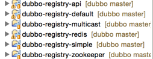

## dubbo 源代码笔记整理

---

#### 框架总体介绍

模块关系


模块说明

* dubbo-common 公共逻辑模块，包括Util类和通用模型。
* dubbo-remoting 远程通讯模块，相当于Dubbo协议的实现，如果RPC用RMI协议则不需要使用此包。
* dubbo-rpc 远程调用模块，抽象各种协议，以及动态代理，只包含一对一的调用，不关心集群的管理。
* dubbo-cluster 集群模块，将多个服务提供方伪装为一个提供方，包括：负载均衡, 容错，路由等，集群的地址列表可以是静态配置的，也可以是由注册中心下发。
* dubbo-registry 注册中心模块，基于注册中心下发地址的集群方式，以及对各种注册中心的抽象。
* dubbo-monitor 监控模块，统计服务调用次数，调用时间的，调用链跟踪的服务。
* dubbo-config 配置模块，是Dubbo对外的API，用户通过Config使用Dubbo，隐藏Dubbo所有细节。
* dubbo-container 容器模块，是一个Standlone的容器，以简单的Main加载Spring启动，因为服务通常不需要Tomcat/JBoss等Web容器的特性，没必要用Web容器去加载服务。

整体上按照分层结构进行分包，与分层的不同点在于：

* container为服务容器，用于部署运行服务，没有在层中画出。
* protocol层和proxy层都放在rpc模块中，这两层是rpc的核心，在不需要集群时(只有一个提供者)，可以只使用这两层完成rpc调用。
* transport层和exchange层都放在remoting模块中，为rpc调用的通讯基础。
* serialize层放在common模块中，以便更大程度复用。

各层说明

* config，配置层，对外配置接口，以ServiceConfig, ReferenceConfig为中心，可以直接new配置类，也可以通过spring解析配置生成配置类
* proxy，服务代理层，服务接口透明代理，生成服务的客户端Stub和服务器端Skeleton，以ServiceProxy为中心，扩展接口为ProxyFactory
* registry，注册中心层，封装服务地址的注册与发现，以服务URL为中心，扩展接口为RegistryFactory, Registry, RegistryService
* cluster，路由层，封装多个提供者的路由及负载均衡，并桥接注册中心，以Invoker为中心，扩展接口为Cluster, Directory, Router, LoadBalance
* monitor，监控层，RPC调用次数和调用时间监控，以Statistics为中心，扩展接口为MonitorFactory, Monitor, MonitorService
* protocol，远程调用层，封将RPC调用，以Invocation, Result为中心，扩展接口为Protocol, Invoker, Exporter
* exchange，信息交换层，封装请求响应模式，同步转异步，以Request, Response为中心，扩展接口为Exchanger, ExchangeChannel, ExchangeClient, ExchangeServer
* transport，网络传输层，抽象mina和netty为统一接口，以Message为中心，扩展接口为Channel, Transporter, Client, Server, Codec
* serialize，数据序列化层，可复用的一些工具，扩展接口为Serialization, ObjectInput, ObjectOutput, ThreadPool

关系说明：

* 在RPC中，Protocol是核心层，也就是只要有Protocol + Invoker + Exporter就可以完成非透明的RPC调用，然后在Invoker的主过程上Filter拦截点。
* 图中的Consumer和Provider是抽象概念，只是想让看图者更直观的了解哪些类分属于客户端与服务器端，不用Client和Server的原因是Dubbo在很多场景下都使用Provider, Consumer, Registry, Monitor划分逻辑拓普节点，保持统一概念。
* 而Cluster是外围概念，所以Cluster的目的是将多个Invoker伪装成一个Invoker，这样其它人只要关注Protocol层Invoker即可，加上Cluster或者去掉Cluster对其它层都不会造成影响，因为只有一个提供者时，是不需要Cluster的。
* Proxy层封装了所有接口的透明化代理，而在其它层都以Invoker为中心，只有到了暴露给用户使用时，才用Proxy将Invoker转成接口，或将接口实现转成Invoker，也就是去掉Proxy层RPC是可以Run的，只是不那么透明，不那么看起来像调本地服务一样调远程服务。
* 而Remoting实现是Dubbo协议的实现，如果你选择RMI协议，整个Remoting都不会用上，Remoting内部再划为Transport传输层和Exchange信息交换层，Transport层只负责单向消息传输，是对Mina,Netty,Grizzly的抽象，它也可以扩展UDP传输，而Exchange层是在传输层之上封装了Request-Response语义。
* Registry和Monitor实际上不算一层，而是一个独立的节点，只是为了全局概览，用层的方式画在一起。


依赖关系：


####  全局调用链


#### Spring识别并加载dubbo的xml配置

```
<?xml version="1.0" encoding="UTF-8"?>
<beans xmlns="http://www.springframework.org/schema/beans"
       xmlns:xsi="http://www.w3.org/2001/XMLSchema-instance"
       xmlns:dubbo="http://code.alibabatech.com/schema/dubbo"
       xsi:schemaLocation="http://www.springframework.org/schema/beans
        http://www.springframework.org/schema/beans/spring-beans.xsd
        http://code.alibabatech.com/schema/dubbo
        http://code.alibabatech.com/schema/dubbo/dubbo.xsd">

<dubbo:monitor address="${dubbo.monitor.address}"/>

<dubbo:application name="应用名" owner=""/>

<dubbo:registry protocol="zookeeper" address="${dubbo.zk.servers}" client="zkclient" group="${dubbo.zk.group}"   file="dubbo-reg-zk.cache"/>
 
<dubbo:protocol name="dubbo" port="${dubbo.service.provider.port}" threadpool="cached" threads="${dubbo.service.provider.threads:200}"/>

<dubbo:service interface="com.alibaba.dubbo.demo.DemoService" ref="demoService" />

<bean id="demoService" class="com.alibaba.dubbo.demo.provider.DemoServiceImpl" />
            
</beans>

```

Spring提供了可扩展Schema的支持，解析自定义的xml文件，然后转化为配置对象。主要步骤：

* 设计配置属性和JavaBean
* 编写xsd文件
* 编写NamespaceHandler和BeanDefinitionParser完成解析工作
* 编写spring.handlers和spring.schemas串联起所有部件
* 开始使用bean实例对象

dubbo框架实现的子类分别是
com.alibaba.dubbo.config.spring.schema.DubboNamespaceHandler和com.alibaba.dubbo.config.spring.schema.DubboBeanDefinitionParser将xml配置转换为类实例对象。

参考例子：http://blog.csdn.net/cutesource/article/details/5864562

dubbo的xml配置与对应业务类的映射关系：

```
com.alibaba.dubbo.config.spring.schema.DubboNamespaceHandler

registerBeanDefinitionParser("application", new DubboBeanDefinitionParser(ApplicationConfig.class, true));
registerBeanDefinitionParser("module", new DubboBeanDefinitionParser(ModuleConfig.class, true));
registerBeanDefinitionParser("registry", new DubboBeanDefinitionParser(RegistryConfig.class, true));
registerBeanDefinitionParser("monitor", new DubboBeanDefinitionParser(MonitorConfig.class, true));
registerBeanDefinitionParser("provider", new DubboBeanDefinitionParser(ProviderConfig.class, true));
registerBeanDefinitionParser("consumer", new DubboBeanDefinitionParser(ConsumerConfig.class, true));
registerBeanDefinitionParser("protocol", new DubboBeanDefinitionParser(ProtocolConfig.class, true));
registerBeanDefinitionParser("service", new DubboBeanDefinitionParser(ServiceBean.class, true));
registerBeanDefinitionParser("reference", new DubboBeanDefinitionParser(ReferenceBean.class, false));
registerBeanDefinitionParser("annotation", new DubboBeanDefinitionParser(AnnotationBean.class, true));
}
```
说明：

org.springframework.beans.factory.xml.NamespaceHandlerSupport.registerBeanDefinitionParser(String, BeanDefinitionParser)

a）第一个参数，表示子节点名，比如“<dubbo:service/>” 中的service

b) 第二个参数，表示节点的解析器

#### 核心配置组件

schema格式 | 类模板 | 内部属性|描述| 
------------ | ------------- | ------------| ------------
<dubbo:service/>| com.alibaba.dubbo.config.ServiceConfig|[链接](https://github.com/alibaba/dubbo/wiki/user-guide-configuration-ref) | 服务配置，用于暴露一个服务，定义服务的元信息，一个服务可以用多个协议暴露，一个服务也可以注册到多个注册中心
<dubbo:reference/>|com.alibaba.dubbo.config.ReferenceConfig|同上|引用配置，用于创建一个远程服务代理，一个引用可以指向多个注册中心。
<dubbo:protocol/>|com.alibaba.dubbo.config.ProtocolConfig|同上|协议配置，用于配置提供服务的协议信息，协议由提供方指定，消费方被动接受
<dubbo:application/>|com.alibaba.dubbo.config.ApplicationConfig|同上|应用配置，用于配置当前应用信息，不管该应用是提供者还是消费者
<dubbo:module/> |com.alibaba.dubbo.config.ModuleConfig|同上|模块配置，用于配置当前模块信息，可选。
<dubbo:registry/>|com.alibaba.dubbo.config.RegistryConfig|同上|注册中心配置，用于配置连接注册中心相关信息
<dubbo:monitor/>|com.alibaba.dubbo.config.MonitorConfig|同上|监控中心配置，用于配置连接监控中心相关信息，可选。
<dubbo:provider/> |com.alibaba.dubbo.config.ProviderConfig|同上|提供方的缺省值，当ProtocolConfig和ServiceConfig某属性没有配置时，采用此缺省值，可选。
<dubbo:consumer/>|com.alibaba.dubbo.config.ConsumerConfig|同上|消费方缺省配置，当ReferenceConfig某属性没有配置时，采用此缺省值，可选。
<dubbo:method/>|com.alibaba.dubbo.config.MethodConfig|同上|方法配置，用于ServiceConfig和ReferenceConfig指定方法级的配置信息
<dubbo:argument/>|com.alibaba.dubbo.config.ArgumentConfig|同上|用于指定方法参数配置。


类依赖关系：


注意：只有group，interface，version是服务的匹配条件，三者决定是不是同一个服务，其它配置项均为调优和治理参数。

所有配置最终都将转换为URL表示，并由服务提供方生成，经注册中心传递给消费方，各属性对应URL的参数，参见配置项一览表中的"对应URL参数"列。

URL格式：

```
dubbo://192.168.21.58:20130/com.alibaba.dubbo.demo.DemoService?anyhost=true&application=bbs-service&dubbo=2.5.3&interface=com.alibaba.dubbo.demo.DemoService&methods=getSimpleMemberByUids,getMasterMemberInfo,getUidsByWcuids,getUserInfoListByWcuids,getForumModeratorByUidAndFid,getMemberInfoByUsernames,clearMemberCache,getMemberCountByUids,addDav,updateBio,updateMemberCount,getLastTidsByUids,batchGetMemberProfileModel,getWcuidsByUids,isDav,getUidByWcuid,updateLastTid,saveName,getMemberDetailModelListByUids,register&pid=4481&revision=0.0.1&side=provider&threadpool=cached&threads=200&timestamp=1490614869341	
```


#### \<dubbo:service/\> 内部实现

服务提供方暴露服务的初始化链，时序图如下：


```
1、Protocol是服务域，它是Invoker暴露和引用的主功能入口，它负责Invoker的生命周期管理。
2、Invoker是实体域，它是Dubbo的核心模型，其它模型都向它靠扰，或转换成它，它代表一个可执行体，可向它发起invoke调用，它有可能是一个本地的实现，也可能是一个远程的实现，也可能一个集群实现。
3、Invocation是会话域，它持有调用过程中的变量，比如方法名，参数等。
```
服务提供者暴露一个服务的详细过程


上图是服务提供者暴露服务的主过程：

首先ServiceConfig类拿到对外提供服务的实际类ref(如：HelloWorldImpl),然后通过ProxyFactory类的getInvoker方法使用ref生成一个AbstractProxyInvoker实例，到这一步就完成具体服务到Invoker的转化。接下来就是Invoker转换到Exporter的过程。

Dubbo处理服务暴露的关键就在Invoker转换到Exporter的过程(如上图中的红色部分)，下面我们以Dubbo和RMI这两种典型协议的实现来进行说明：

1、Dubbo的实现
Dubbo协议的Invoker转为Exporter发生在DubboProtocol类的export方法，它主要是打开socket侦听服务，并接收客户端发来的各种请求，通讯细节由Dubbo自己实现。

2、RMI的实现
RMI协议的Invoker转为Exporter发生在RmiProtocol类的export方法，
它通过Spring或Dubbo或JDK来实现RMI服务，通讯细节这一块由JDK底层来实现，这就省了不少工作量。

代码调用细节：

* public class ServiceBean<T> extends ServiceConfig<T> implements InitializingBean, DisposableBean, ApplicationContextAware, ApplicationListener, BeanNameAware {   
}

入口在afterPropertiesSet（）方法，从spring容器中查找这些bean（ProviderConfig、ApplicationConfig、ModuleConfig、List\<RegistryConfig>、MonitorConfig、 List\<ProtocolConfig>、），并set到ServiceBean

* com.alibaba.dubbo.config.ServiceConfig.export()。支持延时暴露服务（启动了一个Thread来实现）
* com.alibaba.dubbo.rpc.proxy.jdk.JdkProxyFactory.getInvoker(T, Class<T>, URL)，生成AbstractProxyInvoker代理类
* com.alibaba.dubbo.rpc.protocol.dubbo.DubboProtocol.export(Invoker<T>)，生成一个
Exporter实例。这样当网络通讯层收到一个请求后，会找到对应的Exporter实例，并调用它所对应的AbstractProxyInvoker实例，从而真正调用了服务提供者的代码。


#### \<dubbo:reference/\> 内部实现

服务消费方引用服务的初始化链，时序图如下：


服务消费者消费一个服务的详细过程


首先ReferenceConfig类的init方法调用Protocol的refer方法生成Invoker实例(如上图中的红色部分)，这是服务消费的关键，Invoker实现了真正的远程服务调用。接下来把Invoker转换为客户端需要的接口(如：HelloWorld)。

由于Invoker是Dubbo领域模型中非常重要的一个概念，很多设计思路都是向它靠拢。这就使得Invoker渗透在整个实现代码里，对于刚开始接触Dubbo的人，确实容易给搞混了。
下面我们用一个精简的图来说明最重要的两种Invoker：服务提供Invoker和服务消费Invoker：


#### 服务节点路由选择

位于【dubbo-cluster】模块

* com.alibaba.dubbo.rpc.cluster.loadbalance.RandomLoadBalance：随机（默认方式）
* com.alibaba.dubbo.rpc.cluster.loadbalance.RoundRobinLoadBalance：轮询
* com.alibaba.dubbo.rpc.cluster.loadbalance.LeastActiveLoadBalance：最少连接数
* com.alibaba.dubbo.rpc.cluster.loadbalance.ConsistentHashLoadBalance：一致性hash

核心思想：

protected <T> Invoker<T> doSelect(List<Invoker<T>> invokers, URL url, Invocation invocation)；从invokers列表中，根据算法选择一个合适Invoker来执行具体业务。

#### 注册中心

com.alibaba.dubbo.registry.RegistryService：注册服务。提供以下方法：

* void register(URL url);注册数据，比如：提供者地址，消费者地址，路由规则，覆盖规则，等数据。
* void unregister(URL url);取消注册
* void subscribe(URL url, NotifyListener listener);订阅符合条件的已注册数据，当有注册数据变更时自动推送
* void unsubscribe(URL url, NotifyListener listener);取消订阅
* List<URL> lookup(URL url);查询符合条件的已注册数据，与订阅的推模式相对应，这里为拉模式，只返回一次结果



实现子类：

* com.alibaba.dubbo.registry.redis.RedisRegistry，负责维护redis缓存存储的注册中心数据
* com.alibaba.dubbo.registry.zookeeper.ZookeeperRegistry，负责维护zk存储的注册中心数据
	* 提供了注册、取消注册、订阅等一系列功能的具体实现
	* ZookeeperRegistry.toUrlPath(URL)，通过“/”拼接的路径节点，与zk的树型结构非常匹配，每个接口服务下分别提供了providers和consumers两个中间节点，存储服务节点和消费节点的配置信息。

com.alibaba.dubbo.registry.NotifyListener。当收到服务变更通知时触发

```
通知需处理契约：
1. 总是以服务接口和数据类型为维度全量通知，即不会通知一个服务的同类型的部分数据，用户不需要对比上一次通知结果。
2. 订阅时的第一次通知，必须是一个服务的所有类型数据的全量通知。<br>
3. 中途变更时，允许不同类型的数据分开通知，比如：providers, consumers, routers, overrides，允许只通知其中一种类型，但该类型的数据必须是全量的，不是增量的。<br>
4. 如果一种类型的数据为空，需通知一个empty协议并带category参数的标识性URL数据。<br>
5. 通知者(即注册中心实现)需保证通知的顺序，比如：单线程推送，队列串行化，带版本对比。<br>
```
#### 心跳中心

com.alibaba.dubbo.monitor.simple.RegistryContainer，取到RegistryService，实现subscribe节点数据变更方法。

#### 网络数据传输

负责客户端与服务端、客户端与注册中心、服务端与注册中心等服务器间的数据通信。底层接口：

```
com.alibaba.dubbo.remoting.Transporter
com.alibaba.dubbo.remoting.Server
com.alibaba.dubbo.remoting.Client
```


支持多种通信框架：

* com.alibaba.dubbo.remoting.transport.transporter.netty.NettyTransporter
* com.alibaba.dubbo.remoting.transport.transporter.mina.MinaTransporter
* com.alibaba.dubbo.remoting.transport.transporter.grizzly.GrizzlyTransporter


#### 参考资料：

https://github.com/alibaba/dubbo/wiki/user-guide-sample#%E8%B4%9F%E8%BD%BD%E5%9D%87%E8%A1%A1

http://dubbo.io/Developer+Guide-zh.htm#DeveloperGuide-zh-%E5%88%9D%E5%A7%8B%E5%8C%96%E8%BF%87%E7%A8%8B%E7%BB%86%E8%8A%82

[Dubbo 源码解析 —— 简单原理、与spring融合](https://mp.weixin.qq.com/s/pN39RfZ4qKRLRScJ7LVfGQ)


