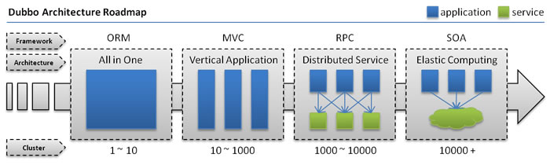

## dubbo相关

---

####  附录

* [源代码](https://github.com/alibaba/dubbo)

* [源码阅读笔记](dubbo-sourcecode.md)

---
#### 简介

随着互联网的发展，网站应用的规模不断扩大，常规的垂直应用架构已无法应对，分布式服务架构以及流动计算架构势在必行，亟需一个治理系统确保架构有条不紊的演进。




* 单一应用架构

	当网站流量很小时，只需一个应用，将所有功能都部署在一起，以减少部署节点和成本。
此时，用于简化增删改查工作量的 数据访问框架(ORM) 是关键。

* 垂直应用架构
	当访问量逐渐增大，单一应用增加机器带来的加速度越来越小，将应用拆成互不相干的几个应用，以提升效率。
此时，用于加速前端页面开发的 Web框架(MVC) 是关键。

* 分布式服务架构 

	当垂直应用越来越多，应用之间交互不可避免，将核心业务抽取出来，作为独立的服务，逐渐形成稳定的服务中心，使前端应用能更快速的响应多变的市场需求。
此时，用于提高业务复用及整合的 分布式服务框架(RPC) 是关键。
* 流动计算架构

	当服务越来越多，容量的评估，小服务资源的浪费等问题逐渐显现，此时需增加一个调度中心基于访问压力实时管理集群容量，提高集群利用率。
此时，用于提高机器利用率的 资源调度和治理中心(SOA) 是关键。


#### 核心功能

* 远程通讯: 提供对多种基于长连接的NIO框架抽象封装，包括多种线程模型，序列化，以及“请求-响应”模式的信息交换方式。
* 集群容错: 提供基于接口方法的透明远程过程调用，包括多协议支持，以及软负载均衡，失败容错，地址路由，动态配置等集群支持。
* 自动发现: 基于注册中心目录服务，使服务消费方能动态的查找服务提供方，使地址透明，使服务提供方可以平滑增加或减少机器。

#### 常见问题：

1、dubbo默认有重试机制（2次），结合自己的业务是否需要重试，不必要的重试可能会导致脏数据。
如果服务提供方响应速度慢，不断的重试，会额外加重系统负担。

```
<dubbo:reference id="privateMessageService" interface="com.onlyone.bbs.service.PrivateMessageService"  retries="0" />
```

2.启动时服务是否注册检查，这种情况一般在预发环境遇到，有些业务部门的服务没有布预发环境，会导致我们的应用在预发环境启动不了。启动时需要取消检查

```
//单个服务维度
 <dubbo:reference id="stockService" interface="com.onlyone.stock.service.StockService" check="false"  />
 
//全局维度
<dubbo:consumer check="false" />

```

3.调用远程接口，如果因为非正常原因而响应慢会阻塞业务线程，此时需要及早结束。
可以配置超时时间

```
 <dubbo:reference id="memberService" interface="com.onlyone.bbs.service.MemberService" timeout="5000"  />
```

4.dubbo默认是随机路由方式，如果消费方只有一台机器，服务提供方有多台，1对多关系，可能会产生负载不均衡，导致大量请求压到一台机器，把一台机器压死，进而引发雪崩效应。可以调整路由策略，改为轮询方式。

```
<dubbo:reference id="***" interface="******" loadbalance="roundrobin" /> 
```


####  参考资料

[http://www.oschina.net/search?q=dubbo&scope=project&fromerr=OSwWxF3l](http://www.oschina.net/search?q=dubbo&scope=project&fromerr=OSwWxF3l)


[http://dubbo.io/User+Guide-zh.htm](http://dubbo.io/User+Guide-zh.htm)