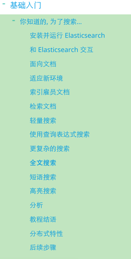

## 入门及安装


---
Elasticsearch 是用 Java 编写的，它的内部使用 Lucene 做索引与搜索，但是它的目的是使全文检索变得简单， 通过隐藏 Lucene 的复杂性，取而代之的提供一套简单一致的 RESTful API。

**一个 Elasticsearch 集群可以包含多个索引 ，相应的每个索引可以包含多个类型 。 这些不同的类型存储着多个文档 ，每个文档又有多个属性 。**

```
你也许已经注意到 索引 这个词在 Elasticsearch 语境中包含多重意思， 所以有必要做一点儿说明：

索引（名词）：

如前所述，一个 索引 类似于传统关系数据库中的一个 数据库 ，是一个存储关系型文档的地方。 索引 (index) 的复数词为 indices 或 indexes 。

索引（动词）：

索引一个文档 就是存储一个文档到一个 索引 （名词）中以便它可以被检索和查询到。这非常类似于 SQL 语句中的 INSERT 关键词，除了文档已存在时新文档会替换旧文档情况之外。

倒排索引：

关系型数据库通过增加一个 索引 比如一个 B树（B-tree）索引 到指定的列上，以便提升数据检索速度。Elasticsearch 和 Lucene 使用了一个叫做 倒排索引 的结构来达到相同的目的。

+ 默认的，一个文档中的每一个属性都是被索引的（有一个倒排索引）和可搜索的。一个没有倒排索引的属性是不能被搜索到的。
```


**特性**

* 分布式的实时文件存储，每个字段都被索引并可被搜索
* 分布式的实时分析搜索引擎
* 可以扩展到上百台服务器，处理PB级结构化或非结构化数据

#### 安装

安装非常简单，http://www.elasticsearch.org/download/ 下载最新版本的Elasticsearch，其中zip包可直接解压使用。


####  如何启动

```
./bin/elasticsearch

如果想在后台以守护进程模式运行，添加-d参数

curl 'http://localhost:9200/?pretty' 输出status为200表示启动成功。
```
	
查询索引结构：

```
curl 'http://192.168.3.216:9200/forum/user_member/_mapping'
```

```
{
  "forum": {
    "mappings": {
      "user_member": {
        "_all": {
          "analyzer": "ik_max_word",
          "search_analyzer": "ik_smart"
        },
        "properties": {
          "follower": {
            "type": "long"
          },
          "id": {
            "type": "string"
          },
          "threads": {
            "type": "long"
          },
          "uid": {
            "type": "long"
          },
          "username": {
            "type": "string",
            "index": "not_analyzed",
            "term_vector": "with_positions_offsets",
            "include_in_all": false
          },
          "verify": {
            "type": "long"
          },
          "wcuid": {
            "type": "long"
          }
        }
      }
    }
  }
}
```


#### 使用步骤


Elasticsearch 提供了官方客户端，支持市面上象java、javaScript、Groovy、Python等主流语言，下载地址：https://www.elastic.co/guide/en/elasticsearch/client/index.html

* 	创建索引结构
* 	源数据导入，build索引（可以采用api接口形式）
* 	多维度组合查询条件，搜索查询（可以采用api接口形式）


#### 入门级案例

https://www.elastic.co/guide/cn/elasticsearch/guide/current/running-elasticsearch.html



