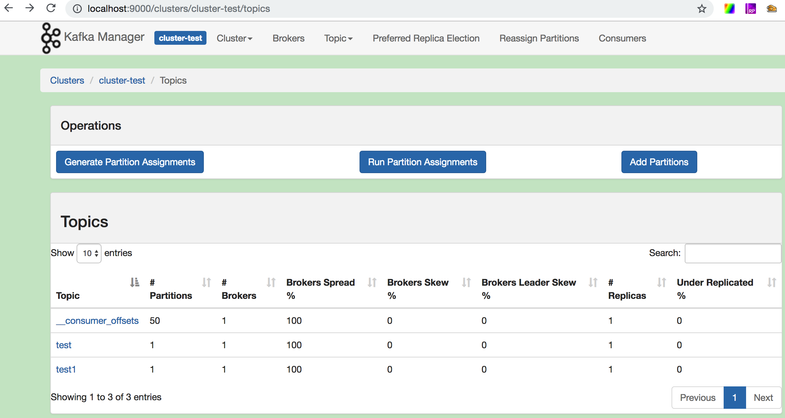

## kafka-manager 安装

---

* 源码

https://github.com/yahoo/kafka-manager

* 参考：

https://www.cnblogs.com/dadonggg/p/8205302.html

* 启动：

```
cd /Users/onlyone/software/kafka/kafka-manager-1.3.3.7

bin/kafka-manager -Dconfig.file=conf/application.conf -Dhttp.port=9000 &

注意：刚下载的可能没有执行权限

```

* 访问地址：

http://localhost:9000/

* 本机截图


