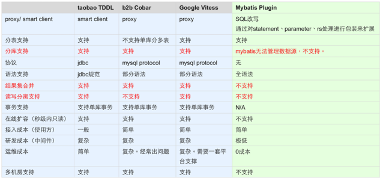

## tsharding相关

---

####  附录

* [源代码](https://github.com/baihui212/tsharding)

---

#### 简介

分库分表业界方案

TSharding组件目标：

  * 很少的资源投入即可开发完成
  * 支持交易订单表的Sharding需求，分库又分表
  * 支持数据源路由
  * 支持事务
  * 支持结果集合并
  * 支持读写分离

TSharding组件接入过程：

  * 引入TSharding JAR包
  * 配置所有分库的JDBC连接信息
  * Mybatis Mapper方法参数增加ShardingOrderPara/ShardingBuyerPara/ShardingSellerPara注解
  * 批量查询增加结果集合并逻辑


#### 参考资料

https://www.oschina.net/p/TSharding-Client