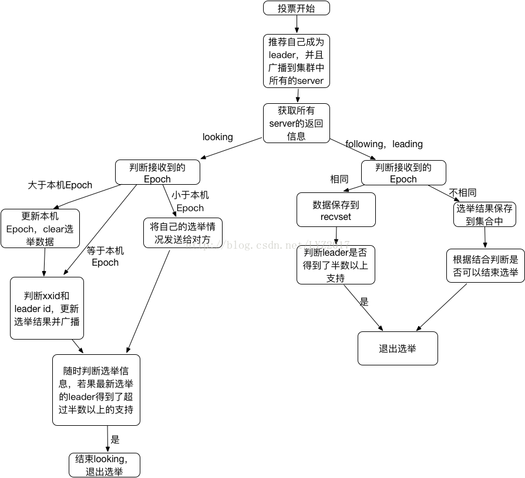
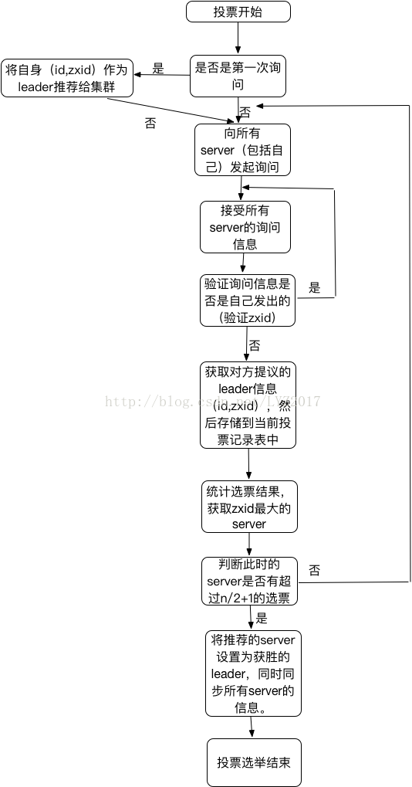

## leader选举、数据同步

---

zk的核心是原子广播，这个机制保证了各个Server之间的同步，实现这个机制的协议叫做Zab协议。Zab协议有两种模式，分别是恢复模式（选主）和广播模式（同步）。当服务启动或者leader崩溃后，Zab进入恢复模式，当leader被选举出来，然后进行同步模式，同步完成以后，恢复模式结束。

为了保证事务的顺序一致性。实现中zxid是一个64位的数字，它高32位是用epoch用来标志leader关系是否改变，每次一个新的leader选举出来，都会拥有一个新的epoch。低32位用来递增计数。

（1）Serverid：在配置server时，给定的服务器的标识id，也就是myid

（2）Zxid：事务id，用来唯一标识一次服务器状态的变更，在某一时刻，集群中的每台机器的zxid值不一定全都一致，zxid越大，表示数据越新。

（3）Epoch：选举的轮数，即逻辑时钟。随着选举的轮数++

什么场景触发选举？

* 服务器集群初始化启动
* 服务器运行期间无法和Leader保持连接
* leader挂了

### 一、选主流程

当leader崩溃或者leader失去大多数的follower，这时候zk进入恢复模式，然后需要重新选举出一个leader。让所有的Server都恢复到一个正确的状态。Zk选举算法有两种，一种是基于basic paxos实现，一种是基于fast paxos算法实现。系统默认的是fast paxos。

每个Server在工作过程中有三种状态：

LOOKING：当前Server不知道Leader是谁，正在投票、选举。

LEADING：领导者状态。

FOLLOWING：跟随者状态。

#### 首先介绍basic paxos

1、 选举线程由当前Server发起选举的线程担任，其主要功能是对投票结果进行统计，并选出推荐的Server。

2、 选举线程首先向所有Server发起一次询问（包括自己），投票信息（myid，zxid）

3、 收到所有Server回复以后，计算出zxid较大的那个Server，并将这个Server相关信息设置成下一次投票的Server。如果zxid相同，取myid较大那个。

4、 如果获胜的Server获得n/2+1的Server票数，设置当前推荐的leader为获胜的Server，将根据获胜的Server信息设置自己的状态（LEADING或FOLLOWING），否则，继续这个过程，直到leader被选举出来。

备注：要使Leader获得多数的Server支持，则Server总数必须是奇数2n+1，且存活的Server的数据不得少于n+1。

参考例子可参考《从Paxos到ZooKeeper》P325页

#### fast paxos：

1、 server启动、恢复准备加入集群，此时都会读取本身的zxid等信息。

2、 所有server加入集群时都会推荐自己成为leader，然后将（leader id,zxid,epoch）作为广播信息到集群中所有的server，等待集群中的server返回信息。

3、 收到集群中其他服务器返回的信息，分为两类，服务器处于looking状态，或者其他状态。

（1） 服务器处于looking状态

说先判断逻辑时钟Epoch：

（a） 如果接受到Epoch大于自己目前的逻辑时钟，那么更新本机的Epoch，同时clear其他服务器发送来的选举数据。然后判断是否需要更新当前自己的选举情况（开始选择的leader id是自己）。

判断规则：保存的zxid最大值和leader id来进行判断。先看数据zxid，zxid大的胜出；其次判断leader id，leader id大的胜出；然后再将自身最新的选举结果广播给其他server。

（b） 如果接受到的Epoch小于目前的逻辑时钟，说明对方处于一个比较低一轮的选举轮数，这时需要将自己的选举情况发送给它即可。

（c） 如果接收到的Epoch等于目前的逻辑时钟，再根据（a）中的判断规则，将自身的最新选举结果广播给其他server。

同时server还要处理两种情况：

（a） 如果server接收到了其他所有服务器的选举信息，那么则根据这些选举信息确定自己的状态（Following，Leading），结束Looking，退出选举。

（b） 即时没有收到所有服务器的选举信息，也可以判断一下根据以上过程之后最新的选举leader是不是得到了超过半数以上服务器的支持，如果是则尝试接受最新数据，如果没有最新数据，说明都接受了这个结果，同样也退出选举过程。

（2） 服务器处于其他状态（Following，Leading）

（a） 若果逻辑时钟Epoch相同，将该数据保存到recvset，若果所接受服务器宣称自己是leader，那么将判断是不是有半数以上的服务器选举他，若果是则设置选举状态退出选举过程。

（b） 若果Epoch不相同，那么说明另一个选举过程中已经有了选举结果，于是将选举结果加入到outofelection集合中，再根据outofelection来判断是否可以结束选举，保存逻辑时钟，设置选举状态，并退出选举过程。

### 二、同步流程

1、 leader等待server连接。

2、 follower连接到leader，将最大的zxid发送给leader。

3、 leader根据zxid确定同步点。

4、 同步完成之后，通知follower成为uptodate状态。

5、 follower收到uptodate消息后，开始接受client请求服务。

### 三、主要功能

1、 Leader主要功能

（a） 恢复数据。

（b） 维持与Learner的心跳，接受Learner请求并判断Learner的请求消息类型。

备注：Learner的消息类型主要是ping、request、ack、revalidate。

ping消息：是指Learner的心跳信息。

request消息：follower发送的提议信息，包括写请求和同步请求。

ack消息：是follower对提议的回复，超过半数follower通过，则commit提议。

revalidate消息：用来延长session有效时间。

2、 Follower主要功能

（a） 向Leader发送请求。

（b） 接受Leader消息并进行处理。

（c） 接受Client的请求，如果是写请求，发送给Leader进行投票。

（d） 返回结果给Client。

备注：follower处理Leader的如下几个消息：

ping：心跳信息。

proposal消息：leader发起提案，要求follower投票。

commit消息：服务器端最新一次提案的消息。

uptodate消息：表明同步完成。

revalidate消息：根据Leader的REVALIDATE结果，关闭待revalidate的session还是允许其接受消息；

 sync消息：返回sync信息到client客户端。
 
 