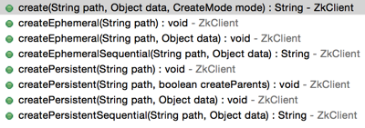
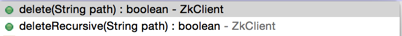
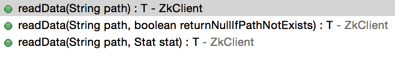
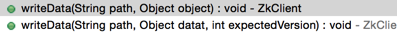

## zookeeper

---

### 附录

* [安装](zookeeper-setup.md)
* [适用场景](zookeeper-application-scene.md)
* [命令行操作](zookeeper-command-operation.md)
* [leader选举、数据同步](zookeeper-leader-election-and-data-synchronous.md)

---

#### 简介

zk为分布式应用提供了高效且可靠的分布式协调服务。用于解决数据同步、数据发布/订阅、集群管理、配置管理、分布式锁、命名服务、负载均衡等问题。最早由雅虎创建，具有以下特性：

*	顺序一致性

包括全局有序和偏序两种：全局有序是指如果再一台服务器上消息a在消息b前发布，则在所有Server上消息a都将在消息b前被发布；偏序是指如果一个消息b在消息a后被同一个发送者发布，a必将排在b前面。

*	原子性

更新只能成功或者失败，没有其他中间信息

*	单一视图

不管连接到zk集群的哪台机器，客户端看到的视图都是一致的

*	可靠性

消息message被到一台服务器接受，那么它到任何服务器都被接受。

*	实时性

zk保证在一个时间间隔范围内获得服务器的更新信息，或者服务器失效信息。但是由于网络延时等一些其他原因，zk不能保证两个客户端同事得到更新或者失效信息。

*	强一致性

分布式高并发情况下创建节点一定是全局唯一性，zk会保证客户端无法重复创建一个已经存在的数据节点。


zk采用树型结构的名字空间，类似于一个文件系统的目录结构，全量数据存储在内存中。当节点发生变化时（创建、删除、数据变更），可以通知各个客户端。

**zk的数据节点有两种：持久性节点、临时节点**。对于临时节点，一旦创建znode的客户端与服务器失去联系，这个znode就会自动删除，ZooKeeper的客户端与服务器通信采用长连接的方式（这种连接状态称为session），如果znode是临时节点，这个session失效，znode也就被删除了。

zk以集群形式对外提供服务，集群只要有一半的机器能正常工作，就可以正常运转。默认端口号2181。

zk支持单机、集群两种模式。

常用于一些大型的分布式系统的应用，比如：Hadoop、Kafka、Hbase、dubbo

**常用命令：**

* 	创建节点（create）
* 	读取（get）
* 	更新节点的数据内容（set）
* 	删除（delete）

**开源的客户端：**

*	ZkClient
*	[Curator](http://blog.csdn.net/dc_726/article/details/46475633)

**监控：**

*	[ZooInspector](https://blog.csdn.net/liubowin/article/details/77966868?locationNum=6&fps=1) 

#### ZkClient 介绍

ZkClient是github上一个开源的ZK客户端，在zookeeper原生API接口之上进行了包装，是一个更易用的ZK客户端。实现了如session超时重连、Watcher反复注册等功能，使得zookeeper客户端的繁琐细节工作对开发人员透明。

pom依赖
 
```
 <dependency>
     <groupId>org.apache.zookeeper</groupId>
     <artifactId>zookeeper</artifactId>
     <version>3.4.5</version>
     <exclusions>
        <exclusion>
        	<groupId>log4j</groupId>
            <artifactId>log4j</artifactId>
         </exclusion>
         <exclusion>
            <groupId>org.slf4j</groupId>
            <artifactId>slf4j-log4j12</artifactId>
         </exclusion>
         <exclusion>
             <groupId>org.slf4j</groupId>
             <artifactId>slf4j-api</artifactId>
          </exclusion>
          <exclusion>
             <groupId>jline</groupId>
             <artifactId>jline</artifactId>
          </exclusion>
      </exclusions>
</dependency>
<dependency>
    <groupId>com.github.sgroschupf</groupId>
    <artifactId>zkclient</artifactId>
    <version>0.1</version>
</dependency>
```

#### 代码示例：

##### 1.建立客户端连接

```
/**
 * 使用ZKClient来创建一个Zookeeper客户端
 * 
 * @author onlyone
 */
public class CreateSession {

    public static void main(String[] args) {
        // 建立连接
        ZkClient zkClient = new ZkClient("192.168.1.1:2188,192.168.1.2:2188;192.168.1.3:2188", 5000);

    }
}
```
ZkClient 构造方法参数说明：

|参数|描述|
|---|---|
|zkServers|用英文状态的逗号分开的host:port字符串组成，比如 192.168.1.1:2188,192.168.1.2:2188;192.168.1.3:2188|
|connectionTimeout|创建连接超时时间，单位毫秒，超时无法与ZooKeeper建立连接，抛出异常|
|sessionTimeout|会话超时时间，单位毫秒，默认 30000|
|ZkSerializer|自定义序列化器|
|zkConnection|IZkConnection接口实现类，包含了增、删、改、查等一系列方法|

	
##### 2.创建节点



|参数|描述|
|---|---|
|path|指定数据节点的节点路径|
|data|节点的初始数据内容，可以为null|
|mode|节点类型，可以为一个枚举类型，有4种|
|createParents|是否创建父节点|

```
// 创建provier子节点，如果父节点root不存在，会先创建父节点
zkClient.createPersistent("/root/provier", true);
```

##### 3.删除节点



|参数|描述|
|---|---|
|path|数据节点的完整节点路径|

```
// zk只允许叶子节点，如果下面还有子节点的话，无法直接删除，deleteRecursive方法自动逐层遍历删除节点
zkClient.deleteRecursive("/root/provier");
```

##### 4.读取数据

* getChildren

```
//获取指定节点的子节点列表，返回值为子节点的相对路径，结果 [provider,consumer]
List<String> subNode = zkClient.getChildren("/dubbo/interface_1.0.0");
```

* subscribeChildChanges

  与原生的Watcher不同的是，zkclient的Listener不是一次性的，客户端只需要注册一次就会一直生效。


```
// 订阅子节点列表变更的监听，一旦子节点列表发生变更，zk服务端会向客户端发出事件通知，由Listener来处理
zkClient.subscribeChildChanges("/root", new IZkChildListener() {

            @Override
            public void handleChildChange(String parentPath, List<String> currentChilds) throws Exception {
                System.out.println("parentPath=" + parentPath + ",currentChilds=" + currentChilds);

            }
});
```

* readData

  获取指定节点的数据内容。



|参数|描述|
|---|---|
|returnNullIfPathNotExists|如果节点不存在，返回null，而不是抛出异常|
|stat|指定数据节点的节点状态信息|

* subscribeDataChanges
   
  “节点内容变更”和“节点删除”事件监听。

```
zkClient.subscribeDataChanges("/root", new IZkDataListener() {

            @Override
            public void handleDataDeleted(String dataPath) throws Exception {
                // 指定节点被删除，dataPath为全路径
                System.out.println("Node: " + dataPath + " deleted!");

            }

            // 指定节点的数据内容或数据版本发生变更，会触发这个事件。
            // dataPath为全路径;data最新的数据节点内容
            @Override
            public void handleDataChange(String dataPath, Object data) throws Exception {
                System.out.println("Node:  " + dataPath + " changed!, new data:" + data);

            }
});

```


##### 5.更新数据



|参数|描述|
|---|---|
|path|数据节点的完整路径|
|object|数据内容，可以是null|
|expectedVersion|预期的数据版本，实现类似CAS的原子操作|

##### 6.检测节点是否存在

```
boolean isNodeExist = zkClient.exists("/root");
```

#### 资料

* https://github.com/apache/zookeeper
* https://github.com/llohellohe/zookeeper
* [zookeeper 入门系列 : 概述](http://mp.weixin.qq.com/s/pTXUAMgGpafhNNWfW2R_Cw)
* [paxos 协议](http://mp.weixin.qq.com/s/a17RBmGABt8j_mmxgBN94w)