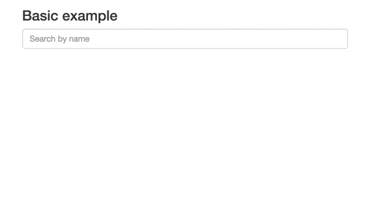

# Autocomplete.js


This JavaScript library adds a fast and fully-featured auto-completion menu to your search box displaying results "as you type". It can easily be combined with Algolia's realtime search engine. The library is available as a jQuery plugin, an Angular.js directive or a standalone library.

[](http://travis-ci.org/algolia/autocomplete.js)
[](http://badge.fury.io/js/autocomplete.js)
[](https://coveralls.io/r/algolia/autocomplete.js?branch=master)
[](https://www.jsdelivr.com/package/npm/autocomplete.js)


[](https://opensource.org/licenses/MIT)


[](https://saucelabs.com/u/opensauce-algolia)

## Table of Contents

<!-- START doctoc generated TOC please keep comment here to allow auto update -->
<!-- DON'T EDIT THIS SECTION, INSTEAD RE-RUN doctoc TO UPDATE -->


- [Features](#features)
- [Installation](#installation)
  - [jsDelivr](#jsdelivr)
  - [cdnjs](#cdnjs)
  - [npm](#npm)
  - [Bower](#bower)
  - [Source dist/](#source-dist)
  - [Browserify](#browserify)
- [Usage](#usage)
  - [Standalone](#standalone)
  - [jQuery](#jquery)
  - [Angular.JS](#angularjs)
- [Look and Feel](#look-and-feel)
- [Global Options](#global-options)
- [Datasets](#datasets)
- [Sources](#sources)
  - [Hits](#hits)
  - [PopularIn (aka "xxxxx in yyyyy")](#popularin-aka-xxxxx-in-yyyyy)
  - [Custom source](#custom-source)
- [Security](#security)
  - [User-generated data: protecting against XSS](#user-generated-data-protecting-against-xss)
- [FAQ](#faq)
  - [How can I `Control`-click on results and have them open in a new tab?](#how-can-i-control-click-on-results-and-have-them-open-in-a-new-tab)
- [Events](#events)
- [API](#api)
  - [jQuery](#jquery-1)
  - [Standalone](#standalone-1)
- [Contributing & releasing](#contributing--releasing)
- [Credits](#credits)

<!-- END doctoc generated TOC please keep comment here to allow auto update -->

## Features

* Displays suggestions to end-users as they type
* Shows top suggestion as a hint (i.e. background text)
* Supports custom templates to allow for UI flexibility
* Works well with RTL languages and input method editors
* Triggers custom events


## Installation

The `autocomplete.js` library must be included **after** jQuery, Zepto or Angular.js (with jQuery).

### jsDelivr

```html
<script src="https://cdn.jsdelivr.net/autocomplete.js/0/autocomplete.min.js"></script>
<!-- OR -->
<script src="https://cdn.jsdelivr.net/autocomplete.js/0/autocomplete.jquery.min.js"></script>
<!-- OR -->
<script src="https://cdn.jsdelivr.net/autocomplete.js/0/autocomplete.angular.min.js"></script>
```

### cdnjs

```html
<script src="https://cdnjs.cloudflare.com/ajax/libs/autocomplete.js/<VERSION>/autocomplete.min.js"></script>
<!-- OR -->
<script src="https://cdnjs.cloudflare.com/ajax/libs/autocomplete.js/<VERSION>/autocomplete.jquery.min.js"></script>
<!-- OR -->
<script src="https://cdnjs.cloudflare.com/ajax/libs/autocomplete.js/<VERSION>/autocomplete.angular.min.js"></script>
```

### npm

```sh
npm install --save autocomplete.js
```

### Bower

```sh
bower install algolia-autocomplete.js -S
```

### Source dist/

You can find the built version in [dist/](https://github.com/algolia/autocomplete.js/tree/master/dist).

### Browserify

You can require it and use [Browserify](http://browserify.org/):

```js
var autocomplete = require('autocomplete.js');
```

## Usage

### Standalone

 1. Include `autocomplete.min.js`
 1. Initialize the auto-completion menu calling the `autocomplete` function

```html
<input type="text" id="search-input" placeholder="Search unicorns..." />

<!-- [ ... ] -->
<script src="https://cdn.jsdelivr.net/algoliasearch/3/algoliasearch.min.js"></script>
<script src="https://cdn.jsdelivr.net/autocomplete.js/0/autocomplete.min.js"></script>
<script>
  var client = algoliasearch('YourApplicationID', 'YourSearchOnlyAPIKey');
  var index = client.initIndex('YourIndex');
  autocomplete('#search-input', { hint: false }, [
    {
      source: autocomplete.sources.hits(index, { hitsPerPage: 5 }),
      displayKey: 'my_attribute',
      templates: {
        suggestion: function(suggestion) {
          return suggestion._highlightResult.my_attribute.value;
        }
      }
    }
  ]).on('autocomplete:selected', function(event, suggestion, dataset, context) {
    console.log(event, suggestion, dataset, context);
  });
</script>
```

### jQuery

 1. Include `autocomplete.jquery.min.js` after including `jQuery`
 1. Initialize the auto-completion menu calling the `autocomplete` jQuery plugin

```html
<input type="text" id="search-input" />

<!-- [ ... ] -->
<script src="https://cdn.jsdelivr.net/algoliasearch/3/algoliasearch.min.js"></script>
<script src="https://cdn.jsdelivr.net/autocomplete.js/0/autocomplete.jquery.min.js"></script>
<script>
  var client = algoliasearch('YourApplicationID', 'YourSearchOnlyAPIKey')
  var index = client.initIndex('YourIndex');
  $('#search-input').autocomplete({ hint: false }, [
    {
      source: $.fn.autocomplete.sources.hits(index, { hitsPerPage: 5 }),
      displayKey: 'my_attribute',
      templates: {
        suggestion: function(suggestion) {
          return suggestion._highlightResult.my_attribute.value;
        }
      }
    }
  ]).on('autocomplete:selected', function(event, suggestion, dataset, context) {
    console.log(event, suggestion, dataset, context);
  });
</script>
```

### Angular.JS

 1. Include `autocomplete.angular.min.js` after including `jQuery` & `Angular.js`
 1. Inject the `algolia.autocomplete` module
 1. Add the `autocomplete`, `aa-datasets` and the optional `aa-options` attribute to your search bar

```html
<div ng-controller="yourController">
  <input type="text" id="search-input" autocomplete aa-datasets="getDatasets()" />
</div>

<!-- [ include jQuery + Angular.js ] -->
<script src="https://cdn.jsdelivr.net/algoliasearch/3/algoliasearch.angular.min.js"></script>
<script src="https://cdn.jsdelivr.net/autocomplete.js/0/autocomplete.angular.min.js"></script>
<script>
  angular.module('myApp', ['algoliasearch', 'algolia.autocomplete'])
    .controller('yourController', ['$scope', 'algolia', function($scope, algolia) {
      var client = algolia.Client('YourApplicationID', 'YourSearchOnlyAPIKey');
      var index = client.initIndex('YourIndex');

      $scope.getDatasets = function() {
        return {
          source: algolia.sources.hits(index, { hitsPerPage: 5 }),
          displayKey: 'my_attribute',
          templates: {
            suggestion: function(suggestion) {
              return suggestion._highlightResult.my_attribute.value;
            }
          }
        };
      };

      $scope.$on('autocomplete:selected', function(event, suggestion, dataset) {
        console.log(event, suggestion, dataset, context);
      });
    }]);
</script>
```

**Note:** You need to rely on `jQuery`, the lite version embedded in Angular.js won't work.

## Look and Feel

Below is a faux mustache template describing the DOM structure of an autocomplete
dropdown menu. Keep in mind that `header`, `footer`, `suggestion`, and `empty`
come from the provided templates detailed [here](#datasets).

```html
<span class="aa-dropdown-menu{{#datasets}} aa-{{'with' or 'without'}}-{{name}}{{/datasets}}">
  {{#datasets}}
    <div class="aa-dataset-{{name}}">
      {{{header}}}
      <span class="aa-suggestions">
        {{#suggestions}}
          <div class="aa-suggestion">{{{suggestion}}}</div>
        {{/suggestions}}
        {{^suggestions}}
          {{{empty}}}
        {{/suggestions}}
      </span>
      {{{footer}}}
    </div>
  {{/datasets}}
  {{empty}}
</span>
```

When an end-user mouses or keys over a `.aa-suggestion`, the class `aa-cursor` will be added to it. You can use this class as a hook for styling the "under cursor" state of suggestions.


Add the following CSS rules to add a default style:

```css
.algolia-autocomplete {
  width: 100%;
}
.algolia-autocomplete .aa-input, .algolia-autocomplete .aa-hint {
  width: 100%;
}
.algolia-autocomplete .aa-hint {
  color: #999;
}
.algolia-autocomplete .aa-dropdown-menu {
  width: 100%;
  background-color: #fff;
  border: 1px solid #999;
  border-top: none;
}
.algolia-autocomplete .aa-dropdown-menu .aa-suggestion {
  cursor: pointer;
  padding: 5px 4px;
}
.algolia-autocomplete .aa-dropdown-menu .aa-suggestion.aa-cursor {
  background-color: #B2D7FF;
}
.algolia-autocomplete .aa-dropdown-menu .aa-suggestion em {
  font-weight: bold;
  font-style: normal;
}
```

Here is what the [basic example](https://github.com/algolia/autocomplete.js/tree/master/examples) looks like:



## Global Options

When initializing an autocomplete, there are a number of global options you can configure.

* `autoselect` – If `true`, the first rendered suggestion in the dropdown will automatically have the `cursor` class, and pressing `<ENTER>` will select it.

* `autoselectOnBlur` – If `true`, when the input is blurred, the first rendered suggestion in the dropdown will automatically have the `cursor` class, and pressing `<ENTER>` will select it. This option should be used on mobile, see [#113](https://github.com/algolia/autocomplete.js/issues/113)

* `tabAutocomplete` – If `true`, pressing tab will select the first rendered suggestion in the dropdown. Defaults to `true`.

* `hint` – If `false`, the autocomplete will not show a hint. Defaults to `true`.

* `debug` – If `true`, the autocomplete will not close on `blur`. Defaults to `false`.

* `clearOnSelected` – If `true`, the autocomplete will empty the search box when a suggestion is selected. This is useful if you want to use this as a way to input tags using the `selected` event.

* `openOnFocus` – If `true`, the dropdown menu will open when the input is focused. Defaults to `false`.

* `appendTo` – If set with a DOM selector, doesn't wrap the input and appends the wrapper and dropdown menu to the first DOM element matching the selector. It automatically positions the wrapper under the input, and sets it to the same width as the input. Can't be used with `hint: true`, because `hint` requires the wrapper around the input.

* `dropdownMenuContainer` – If set with a DOM selector, it overrides the container of the dropdown menu.

* `templates` – An optional hash overriding the default templates.
  * `dropdownMenu` – the dropdown menu template. The template should include all *dataset* placeholders.
  * `header` – the header to prepend to the dropdown menu
  * `footer` – the footer to append to the dropdown menu
  * `empty` – the template to display when none of the datasets are returning results. The templating function
    is called with a context containing the underlying `query`.

* `cssClasses` – An optional hash overriding the default css classes.
  * `root` – the root classes. Defaults to `algolia-autocomplete`.
  * `prefix` – the CSS class prefix of all nested elements. Defaults to `aa`.
  * `noPrefix` - set this to true if you wish to not use any prefix. Without this option, all nested elements classes will have a leading dash. Defaults to `false`.
  * `dropdownMenu` – the dropdown menu CSS class. Defaults to `dropdown-menu`.
  * `input` – the input CSS class. Defaults to `input`.
  * `hint` – the hint CSS class. Defaults to `hint`.
  * `suggestions` – the suggestions list CSS class. Defaults to `suggestions`.
  * `suggestion` – the suggestion wrapper CSS class. Defaults to `suggestion`.
  * `cursor` – the cursor CSS class. Defaults to `cursor`.
  * `dataset` – the dataset CSS class. Defaults to `dataset`.
  * `empty` – the empty CSS class. Defaults to `empty`.

* `keyboardShortcuts` - Array of shortcut that will focus the input. For example if you want to bind `s` and `/`
 you can specify: `keyboardShortcuts: ['s', '/']`

* `ariaLabel` - An optional string that will populate the `aria-label` attribute.

```html
<script type="text/template" id="my-custom-menu-template">
  <div class="my-custom-menu">
    <div class="row">
      <div class="col-sm-6">
        <div class="aa-dataset-d1"></div>
      </div>
      <div class="col-sm-6">
        <div class="aa-dataset-d2"></div>
        <div class="aa-dataset-d3"></div>
      </div>
    </div>
  </div>
</script>
<style>
body {
	font-family: -apple-system, sans-serif;
}
.algolia-autocomplete {
  width: 100%;
}
.algolia-autocomplete .aa-input, .algolia-autocomplete .aa-hint {
  width: 100%;
}
.algolia-autocomplete .aa-hint {
  color: #999;
}
.algolia-autocomplete .aa-dropdown-menu {
  width: 100%;
  background-color: #fff;
  border: 1px solid #999;
  border-top: none;
}
.algolia-autocomplete .aa-dropdown-menu .aa-suggestion {
  cursor: pointer;
  padding: 5px 4px;
}
.algolia-autocomplete .aa-dropdown-menu .aa-suggestion.aa-cursor {
  background-color: #B2D7FF;
}
.algolia-autocomplete .aa-dropdown-menu .aa-suggestion em {
  font-weight: bold;
  font-style: normal;
}

.branding {
font-size: 1.3em;
margin: 0.5em 0.2em;
}

.branding img {
	height: 1.3em;
	margin-bottom: - 0.3em;
}
</style>
<script>
  $('#search-input').autocomplete(
    {
      templates: {
        dropdownMenu: '#my-custom-menu-template',
        footer: '<div class="branding">Powered by </div>'
      }
    },
    [
      {
        source: $.fn.autocomplete.sources.hits(index1, { hitsPerPage: 5 }),
        name: 'd1',
        templates: {
          header: '<h4>List 1</h4>',
          suggestion: function(suggestion) {
            // FIXME
          }
        }
      },
      {
        source: $.fn.autocomplete.sources.hits(index2, { hitsPerPage: 2 }),
        name: 'd2',
        templates: {
          header: '<h4>List 2</h4>',
          suggestion: function(suggestion) {
            // FIXME
          }
        }
      },
      {
        source: $.fn.autocomplete.sources.hits(index3, { hitsPerPage: 2 }),
        name: 'd3',
        templates: {
          header: '<h4>List 3</h4>',
          suggestion: function(suggestion, answer) {
            // FIXME
          }
        }
      }
    ]
  );
</script>
```

* `minLength` – The minimum character length needed before suggestions start
  getting rendered. Defaults to `1`.

* `autoWidth` – This option allow you to control the width of autocomplete wrapper. When `false` the autocomplete wrapper will not have the width style attribute and you are be able to put your specific width property in your css to control the wrapper. Default value is `true`.

One scenario for use this option. e.g. You have a `max-width` css attribute in your `autocomplete-dropdown-menu` and you need to width grows until fill the `max-width`. In this scenario you put a `width: auto` in your autocomplete wrapper css class and the `max-width` in your autocomplete dropdown class and all done.

## Datasets

An autocomplete is composed of one or more datasets. When an end-user modifies the
value of the underlying input, each dataset will attempt to render suggestions for the
new value.

Datasets can be configured using the following options.

* `source` – The backing data source for suggestions. Expected to be a function
  with the signature `(query, cb)`. It is expected that the function will
  compute the suggestion set (i.e. an array of JavaScript objects) for `query`
  and then invoke `cb` with said set. `cb` can be invoked synchronously or
  asynchronously.

* `name` – The name of the dataset. This will be appended to `tt-dataset-` to
  form the class name of the containing DOM element.  Must only consist of
  underscores, dashes, letters (`a-z`), and numbers. Defaults to a random
  number.

* `displayKey` – For a given suggestion object, determines the string
  representation of it. This will be used when setting the value of the input
  control after a suggestion is selected. Can be either a key string or a
  function that transforms a suggestion object into a string. Defaults to
  `value`.
  Example function usage: `displayKey: function(suggestion) { return suggestion.nickname || suggestion.firstName }`

* `templates` – A hash of templates to be used when rendering the dataset. Note
  a precompiled template is a function that takes a JavaScript object as its
  first argument and returns a HTML string.

  * `empty` – Rendered when `0` suggestions are available for the given query.
  Can be either a HTML string or a precompiled template. The templating function
  is called with a context containing `query`, `isEmpty`, and any optional
  arguments that may have been forwarded by the source:
  `function emptyTemplate({ query, isEmpty }, [forwarded args])`.

  * `footer` – Rendered at the bottom of the dataset. Can be either a HTML
  string or a precompiled template. The templating function
  is called with a context containing `query`, `isEmpty`, and any optional
  arguments that may have been forwarded by the source:
  `function footerTemplate({ query, isEmpty }, [forwarded args])`.

  * `header` – Rendered at the top of the dataset. Can be either a HTML string
  or a precompiled template. The templating function
  is called with a context containing `query`, `isEmpty`, and any optional
  arguments that may have been forwarded by the source:
  `function headerTemplate({ query, isEmpty }, [forwarded args])`.

  * `suggestion` – Used to render a single suggestion. The templating function
  is called with the `suggestion`, and any optional arguments that may have
  been forwarded by the source: `function suggestionTemplate(suggestion, [forwarded args])`.
  Defaults to the value of `displayKey` wrapped in a `p` tag i.e. `<p>{{value}}</p>`.

* `debounce` – If set, will postpone the source execution until after `debounce` milliseconds
have elapsed since the last time it was invoked.

* `cache` - If set to `false`, subsequent identical queries will always execute the source function for suggestions. Defaults to `true`.

## Sources

A few helpers are provided by default to ease the creation of Algolia-based sources.

### Hits

To build a source based on Algolia's `hits` array, just use:

```js
{
  source: autocomplete.sources.hits(indexObj, { hitsPerPage: 2 }),
  templates: {
    suggestion: function(suggestion, answer) {
      // FIXME
    }
  }
}
```

### PopularIn (aka "xxxxx in yyyyy")

To build an Amazon-like autocomplete menu, suggesting popular queries and for the most popular one displaying the associated categories, you can use the `popularIn` source:

```js
{
  source: autocomplete.sources.popularIn(popularQueriesIndexObj, { hitsPerPage: 3 }, {
    source: 'sourceAttribute',           // attribute of the `popularQueries` index use to query the `index` index
    index: productsIndexObj,             // targeted index
    facets: 'facetedCategoryAttribute',  // facet used to enrich the most popular query
    maxValuesPerFacet: 3                 // maximum number of facets returned
  }, {
    includeAll: true,                    // should it include an extra "All department" suggestion
    allTitle: 'All departments'          // the included category label
  }),
  templates: {
    suggestion: function(suggestion, answer) {
      var value = suggestion.sourceAttribute;
      if (suggestion.facet) {
        // this is the first suggestion
        // and it has been enriched with the matching facet
        value += ' in ' + suggestion.facet.value + ' (' + suggestion.facet.count + ')';
      }
      return value;
    }
  }
}
```

### Custom source

The `source` options can also take a function. It enables you to have more control of the results returned by Algolia search. The function `function(query, callback)` takes 2 parameters
  * `query: String`: the text typed in the autocomplete
  * `callback: Function`: the callback to call at the end of your processing with the array of suggestions

```js
source: function(query, callback) {
  var index = client.initIndex('myindex');
  index.search(query, { hitsPerPage: 1, facetFilters: 'category:mycat' }).then(function(answer) {
    callback(answer.hits);
  }, function() {
    callback([]);
  });
}
```

Or by reusing an existing source:

```js
var hitsSource = autocomplete.sources.hits(index, { hitsPerPage: 5 });

source: function(query, callback) {
  hitsSource(query, function(suggestions) {
    // FIXME: Do stuff with the array of returned suggestions
    callback(suggestions);
  });
}
```

## Security

### User-generated data: protecting against XSS

Malicious users may attempt to engineer XSS attacks by storing HTML/JS in their data. It is important that user-generated data be properly escaped before using it in an *autocomplete.js* template.

In order to easily do that, *autocomplete.js* provides you with a helper function escaping all HTML code but the highlighting tags:

```js
  templates: {
    suggestion: function(suggestion) {
      var val = suggestion._highlightResult.name.value;
      return autocomplete.escapeHighlightedString(val);
    }
  }
```

If you did specify custom highlighting pre/post tags, you can specify them as 2nd and 3rd parameter:

```js
  templates: {
    suggestion: function(suggestion) {
      var val = suggestion._highlightResult.name.value;
      return autocomplete.escapeHighlightedString(val, '<span class="highlighted">', '</span>');
    }
  }
```

## FAQ

### How can I `Control`-click on results and have them open in a new tab?

You'll need to update your suggestion templates to make them as `<a href>` links
and not simple divs. `Control`-clicking on them will trigger the default browser
behavior and open suggestions in a new tab.

To also support keyboard navigation, you'll need to listen to the
`autocomplete:selected` event and change `window.location` to the destination
URL.

Note that you might need to check the value of `context.selectionMethod` in
`autocomplete:selected` first. If it's equal to `click`, you should `return`
early, otherwise your main window will **also** follow the link.

Here is an example of how it would look like:

```javascript
autocomplete(…).on('autocomplete:selected', function(event, suggestion, dataset, context) {
  // Do nothing on click, as the browser will already do it
  if (context.selectionMethod === 'click') {
    return;
  }
  // Change the page, for example, on other events
  window.location.assign(suggestion.url);
});
```

## Events

The autocomplete component triggers the following custom events.

* `autocomplete:opened` – Triggered when the dropdown menu of the autocomplete is
  opened.

* `autocomplete:shown` – Triggered when the dropdown menu of the autocomplete is
  shown (opened and non-empty).

* `autocomplete:empty` – Triggered when all datasets are empty.

* `autocomplete:closed` – Triggered when the dropdown menu of the autocomplete is
  closed.

* `autocomplete:updated` – Triggered when a dataset is rendered.

* `autocomplete:cursorchanged` – Triggered when the dropdown menu cursor is moved
  to a different suggestion. The event handler will be invoked with 3
  arguments: the jQuery event object, the suggestion object, and the name of
  the dataset the suggestion belongs to.

* `autocomplete:selected` – Triggered when a suggestion from the dropdown menu is
  selected. The event handler will be invoked with the following arguments: the jQuery
  event object, the suggestion object, the name of the dataset the
  suggestion belongs to and a `context` object. The `context` contains
  a `.selectionMethod` key that can be either `click`, `enterKey`, `tabKey` or
  `blur`, depending how the suggestion was selected.

* `autocomplete:cursorremoved` – Triggered when the cursor leaves the selections
  or its current index is lower than 0

* `autocomplete:autocompleted` – Triggered when the query is autocompleted.
  Autocompleted means the query was changed to the hint. The event handler will
  be invoked with 3 arguments: the jQuery event object, the suggestion object,
  and the name of the dataset the suggestion belongs to.

* `autocomplete:redrawn` – Triggered when `appendTo` is used and the wrapper is resized/repositionned.

All custom events are triggered on the element initialized as the autocomplete.

## API

### jQuery

Turns any `input[type="text"]` element into an auto-completion menu. `globalOptions` is an
options hash that's used to configure the autocomplete to your liking. Refer to
[Global Options](#global-options) for more info regarding the available configs. Subsequent
arguments (`*datasets`), are individual option hashes for datasets. For more
details regarding datasets, refer to [Datasets](#datasets).

```
$(selector).autocomplete(globalOptions, datasets)
```

Example:

```js
$('.search-input').autocomplete({
  minLength: 3
},
{
  name: 'my-dataset',
  source: mySource
});
```

#### jQuery#autocomplete('destroy')

Removes the autocomplete functionality and reverts the `input` element back to its
original state.

```js
$('.search-input').autocomplete('destroy');
```

#### jQuery#autocomplete('open')

Opens the dropdown menu of the autocomplete. Note that being open does not mean that
the menu is visible. The menu is only visible when it is open and has content.

```js
$('.search-input').autocomplete('open');
```

#### jQuery#autocomplete('close')

Closes the dropdown menu of the autocomplete.

```js
$('.search-input').autocomplete('close');
```

#### jQuery#autocomplete('val')

Returns the current value of the autocomplete. The value is the text the user has
entered into the `input` element.

```js
var myVal = $('.search-input').autocomplete('val');
```

#### jQuery#autocomplete('val', val)

Sets the value of the autocomplete. This should be used in place of `jQuery#val`.

```js
$('.search-input').autocomplete('val', myVal);
```

#### jQuery.fn.autocomplete.noConflict()

Returns a reference to the autocomplete plugin and reverts `jQuery.fn.autocomplete`
to its previous value. Can be used to avoid naming collisions.

```js
var autocomplete = jQuery.fn.autocomplete.noConflict();
jQuery.fn._autocomplete = autocomplete;
```

### Standalone

The standalone version API is similiar to jQuery's:

```js
var search = autocomplete(containerSelector, globalOptions, datasets);
```

Example:

```js
var search = autocomplete('#search', { hint: false }, [{
  source: autocomplete.sources.hits(index, { hitsPerPage: 5 })
}]);

search.autocomplete.open();
search.autocomplete.close();
search.autocomplete.getVal();
search.autocomplete.setVal('Hey Jude');
search.autocomplete.destroy();
search.autocomplete.getWrapper(); // since autocomplete.js wraps your input into another div, you can access that div
```

You can also pass a custom Typeahead instance in Autocomplete.js constructor:

```js
var search = autocomplete('#search', { hint: false }, [{ ... }], new Typeahead({ ... }));
```

#### autocomplete.noConflict()

Returns a reference to the autocomplete plugin and reverts `window.autocomplete`
to its previous value. Can be used to avoid naming collisions.

```js
var algoliaAutocomplete = autocomplete.noConflict();
```

## Contributing & releasing

see [CONTRIBUTING.md](./CONTRIBUTING.md)

## Credits

This library has originally been forked from [Twitter's typeahead.js](https://github.com/twitter/typeahead.js) library.
