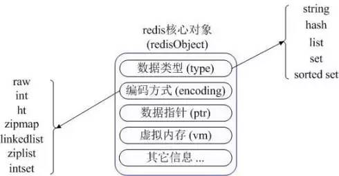
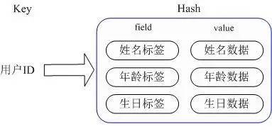
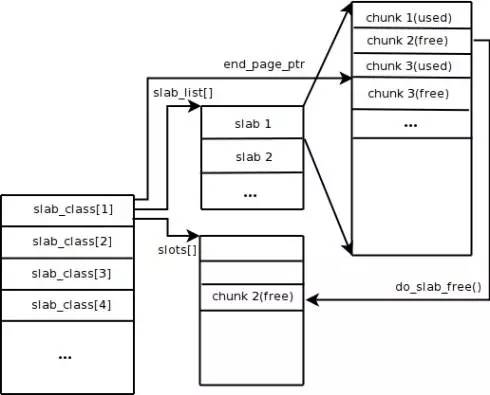
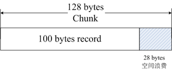
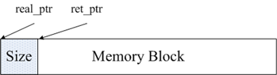
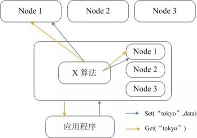
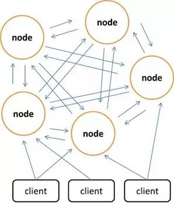
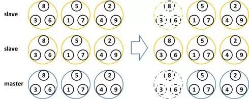

## redis缓存与memcache的区别

---

* 数据结构方面

	redis有更丰富的数据结构，可以满足不同的业务需求。而memcache需要客户端将数据获取再修改再set回去，增加网络io和系统开销。

* 内存使用方面

	使用简单的key-value存储的话，Memcached的内存利用率更高，而如果Redis采用hash结构来做key-value存储，由于其组合式的压缩，其内存利用率会高于Memcached。

* 性能对比

	由于Redis只使用单核，而Memcached可以使用多核，所以平均每一个核上Redis在存储小数据时比Memcached性能更高。而在100k以上的数据中，Memcached性能要高于Redis，虽然Redis最近也在存储大数据的性能上进行优化，但是比起Memcached，还是稍有逊色。

### 数据类型支持不同

Redis支持的数据类型有：String、Hash、List、Set和Sorted Set。Redis内部使用一个redisObject对象来表示所有的key和value。

redisObject最主要的信息如图所示：

type代表一个value对象具体是什么数据类型，encoding表示不同数据类型在redis内部的存储方式，比如：type=String代表value存储的是一个普通字符串，那么对应的encoding可以是raw或者是int，如果是int则代表实际redis内部是按数值类型存储和表示这个字符串的，当然前提是这个字符串本身可以用数值表示，比如:”123″ “456”这样的字符串。只有打开了Redis的虚拟内存功能，vm字段才会真正的分配内存，该功能默认是关闭状态的。

1）String

常用命令：set/get/decr/incr/mget等；

应用场景：String是最常用的一种数据类型，普通的key/value存储都可以归为此类；

实现方式：String在redis内部存储默认就是一个字符串，被redisObject所引用，当遇到incr、decr等操作时会转成数值型进行计算，此时redisObject的encoding字段为int。

2）Hash

常用命令：hget/hset/hgetall等

应用场景：我们要存储一个用户信息对象数据，其中包括用户ID、用户姓名、年龄和生日，通过用户ID我们希望获取该用户的姓名或者年龄或者生日；

实现方式：Redis的Hash实际是内部存储的Value为一个HashMap，并提供了直接存取这个Map成员的接口。如图所示，Key是用户ID, value是一个Map。这个Map的key是成员的属性名，value是属性值。这样对数据的修改和存取都可以直接通过其内部Map的Key(Redis里称内部Map的key为field), 也就是通过 key(用户ID) + field(属性标签) 就可以操作对应属性数据。当前HashMap的实现有两种方式：当HashMap的成员比较少时Redis为了节省内存会采用类似一维数组的方式来紧凑存储，而不会采用真正的HashMap结构，这时对应的value的redisObject的encoding为zipmap，当成员数量增大时会自动转成真正的HashMap,此时encoding为ht。

3）List

常用命令：lpush/rpush/lpop/rpop/lrange等；

应用场景：Redis list的应用场景非常多，也是Redis最重要的数据结构之一，比如twitter的关注列表，粉丝列表等都可以用Redis的list结构来实现；

实现方式：Redis list的实现为一个双向链表，即可以支持反向查找和遍历，更方便操作，不过带来了部分额外的内存开销，Redis内部的很多实现，包括发送缓冲队列等也都是用的这个数据结构。

4）Set

常用命令：sadd/spop/smembers/sunion等；

应用场景：Redis set对外提供的功能与list类似是一个列表的功能，特殊之处在于set是可以去重，当你需要存储一个列表数据，又不希望出现重复数据时，set是一个很好的选择，并且set提供了判断某个成员是否在一个set集合内的重要接口，这个也是list所不能提供的；

实现方式：set 的内部实现是一个 value永远为null的HashMap，实际就是通过计算hash的方式来快速去重，这也是set能提供判断一个成员是否在集合内的原因。

5）Sorted Set

常用命令：zadd/zrange/zrem/zcard等；

应用场景：Redis sorted set的使用场景与set类似，区别是set不是自动有序的，而sorted set可以通过用户额外提供一个优先级(score)的参数来为成员排序，并且是插入有序的，即自动排序。当你需要一个有序的并且不重复的集合列表，那么可以选择sorted set数据结构，比如twitter 的public timeline可以以发表时间作为score来存储，这样获取时就是自动按时间排好序的。

实现方式：Redis sorted set的内部使用HashMap和跳跃表(SkipList)来保证数据的存储和有序，HashMap里放的是成员到score的映射，而跳跃表里存放的是所有的成员，排序依据是HashMap里存的score,使用跳跃表的结构可以获得比较高的查找效率，并且在实现上比较简单。

### 内存管理机制不同

对于像Redis和Memcached这种基于内存的数据库系统来说，内存管理的效率高低是影响系统性能的关键因素。传统C语言中的malloc/free函数是最常用的分配和释放内存的方法，但是这种方法存在着很大的缺陷：首先，对于开发人员来说不匹配的malloc和free容易造成内存泄露；其次频繁调用会造成大量内存碎片无法回收重新利用，降低内存利用率；最后作为系统调用，其系统开销远远大于一般函数调用。所以，为了提高内存的管理效率，高效的内存管理方案都不会直接使用malloc/free调用。Redis和Memcached均使用了自身设计的内存管理机制，但是实现方法存在很大的差异，下面将会对两者的内存管理机制分别进行介绍。

Memcached默认使用Slab Allocation机制管理内存，其主要思想是按照预先规定的大小，将分配的内存分割成特定长度的块以存储相应长度的key-value数据记录，以完全解决内存碎片问题。Slab Allocation机制只为存储外部数据而设计，也就是说所有的key-value数据都存储在Slab Allocation系统里，而Memcached的其它内存请求则通过普通的malloc/free来申请，因为这些请求的数量和频率决定了它们不会对整个系统的性能造成影响Slab Allocation的原理相当简单。 如图所示，它首先从操作系统申请一大块内存，并将其分割成各种尺寸的块Chunk，并把尺寸相同的块分成组Slab Class。其中，Chunk就是用来存储key-value数据的最小单位。每个Slab Class的大小，可以在Memcached启动的时候通过制定Growth Factor来控制。假定图中Growth Factor的取值为1.25，如果第一组Chunk的大小为88个字节，第二组Chunk的大小就为112个字节，依此类推。

当Memcached接收到客户端发送过来的数据时首先会根据收到数据的大小选择一个最合适的Slab Class，然后通过查询Memcached保存着的该Slab Class内空闲Chunk的列表就可以找到一个可用于存储数据的Chunk。当一条数据库过期或者丢弃时，该记录所占用的Chunk就可以回收，重新添加到空闲列表中。从以上过程我们可以看出Memcached的内存管理制效率高，而且不会造成内存碎片，但是它最大的缺点就是会导致空间浪费。如下图所示，将100个字节的数据存到128个字节的Chunk中，剩余的28个字节就浪费掉了。

Redis的内存管理主要通过源码中zmalloc.h和zmalloc.c两个文件来实现的。Redis为了方便内存的管理，在分配一块内存之后，会将这块内存的大小存入内存块的头部。如图所示，real_ptr是redis调用malloc后返回的指针。redis将内存块的大小size存入头部，size所占据的内存大小是已知的，为size_t类型的长度，然后返回ret_ptr。当需要释放内存的时候，ret_ptr被传给内存管理程序。通过ret_ptr，程序可以很容易的算出real_ptr的值，然后将real_ptr传给free释放内存。

Redis通过定义一个数组来记录所有的内存分配情况，这个数组的长度为ZMALLOC_MAX_ALLOC_STAT。数组的每一个元素代表当前程序所分配的内存块的个数，且内存块的大小为该元素的下标。在源码中，这个数组为zmalloc_allocations。zmalloc_allocations[16]代表已经分配的长度为16bytes的内存块的个数。zmalloc.c中有一个静态变量used_memory用来记录当前分配的内存总大小。所以，总的来看，Redis采用的是包装的mallc/free，相较于Memcached的内存管理方法来说，要简单很多。

### 数据持久化支持

Redis提供两种持久化策略：RDB快照和AOF日志。而memcached不支持数据持久化。

1）RDB快照

Redis支持将当前数据的快照存成一个数据文件的持久化机制，即RDB快照。但是一个持续写入的数据库如何生成快照呢？RDB在保存RDB文件时父进程唯一需要做的就是fork出一个子进程,接下来的工作全部由子进程来做，父进程不需要再做其他IO操作。在生成快照时，将当前进程fork出一个子进程，然后在子进程中循环所有的数据，将数据写成为RDB文件。

可以通过Redis的save指令来配置RDB快照生成的时机，比如配置10分钟就生成快照，也可以配置有1000次写入就生成快照，也可以多个规则一起实施。这些规则的定义就在Redis的配置文件中，你也可以通过Redis的CONFIG SET命令在Redis运行时设置规则，不需要重启Redis。

Redis的RDB文件不会坏掉，因为其写操作是在一个新进程中进行的，当生成一个新的RDB文件时，Redis生成的子进程会先将数据写到一个临时文件中，然后通过原子性rename系统调用将临时文件重命名为RDB文件，这样在任何时候出现故障，Redis的RDB文件都总是可用的。RDB的缺点，就是一旦数据库出现问题，我们的RDB文件中保存的数据并不是全新的，从上次RDB文件生成到Redis停机这段时间的数据全部丢失。

2）AOF日志

**AOF 优点：**

使用AOF 会让你的Redis更加耐久: 你可以使用不同的fsync策略：无fsync,每秒fsync,每次写的时候fsync.使用默认的每秒fsync策略,Redis的性能依然很好(fsync是由后台线程进行处理的,主线程会尽力处理客户端请求),一旦出现故障，你最多丢失1秒的数据。

AOF文件是一个只进行追加的日志文件,所以不需要写入seek,即使由于某些原因(磁盘空间已满，写的过程中宕机等等)未执行完整的写入命令,你也也可使用redis-check-aof工具修复这些问题。

Redis 可以在 AOF 文件体积变得过大时，自动地在后台对 AOF 进行重写： 重写后的新 AOF 文件包含了恢复当前数据集所需的最小命令集合。 整个重写操作是绝对安全的，因为 Redis 在创建新 AOF 文件的过程中，会继续将命令追加到现有的 AOF 文件里面，即使重写过程中发生停机，现有的 AOF 文件也不会丢失。 而一旦新 AOF 文件创建完毕，Redis 就会从旧 AOF 文件切换到新 AOF 文件，并开始对新 AOF 文件进行追加操作。

AOF 文件有序地保存了对数据库执行的所有写入操作， 这些写入操作以 Redis 协议的格式保存， 因此 AOF 文件的内容非常容易被人读懂， 对文件进行分析（parse）也很轻松。 导出（export） AOF 文件也非常简单： 举个例子， 如果你不小心执行了 FLUSHALL 命令， 但只要 AOF 文件未被重写， 那么只要停止服务器， 移除 AOF 文件末尾的 FLUSHALL 命令， 并重启 Redis ， 就可以将数据集恢复到 FLUSHALL 执行之前的状态。

**AOF 缺点**

对于相同的数据集来说，AOF文件的体积通常要大于RDB文件的体积。

根据所使用的 fsync 策略，AOF 的速度可能会慢于 RDB 。 在一般情况下， 每秒 fsync 的性能依然非常高， 而关闭 fsync 可以让 AOF 的速度和 RDB 一样快， 即使在高负荷之下也是如此。 不过在处理巨大的写入载入时，RDB 可以提供更有保证的最大延迟时间（latency）。

### 集群管理的不同

Memcached是全内存的数据缓冲系统，Redis虽然支持数据的持久化，但是全内存毕竟才是其高性能的本质。作为基于内存的存储系统来说，机器物理内存的大小就是系统能够容纳的最大数据量。如果需要处理的数据量超过了单台机器的物理内存大小，就需要构建分布式集群来扩展存储能力。

Memcached本身并不支持分布式，因此只能在客户端通过像一致性哈希这样的分布式算法来实现Memcached的分布式存储。下图给出了Memcached的分布式存储实现架构。当客户端向Memcached集群发送数据之前，首先会通过内置的分布式算法计算出该条数据的目标节点，然后数据会直接发送到该节点上存储。但客户端查询数据时，同样要计算出查询数据所在的节点，然后直接向该节点发送查询请求以获取数据。

相较于Memcached只能采用客户端实现分布式存储，Redis更偏向于在服务器端构建分布式存储。最新版本的Redis已经支持了分布式存储功能。Redis Cluster是一个实现了分布式且允许单点故障的Redis高级版本，它没有中心节点，具有线性可伸缩的功能。下图给出Redis Cluster的分布式存储架构，其中节点与节点之间通过二进制协议进行通信，节点与客户端之间通过ascii协议进行通信。在数据的放置策略上，Redis Cluster将整个key的数值域分成4096个哈希槽，每个节点上可以存储一个或多个哈希槽，也就是说当前Redis Cluster支持的最大节点数就是4096。Redis Cluster使用的分布式算法也很简单：crc16( key ) % HASH_SLOTS_NUMBER。

为了保证单点故障下的数据可用性，Redis Cluster引入了Master节点和Slave节点。在Redis Cluster中，每个Master节点都会有对应的两个冗余的Slave节点。这样在整个集群中，任意两个节点的宕机都不会导致数据的不可用。当Master节点退出后，集群会自动选择一个Slave节点成为新的Master节点。

