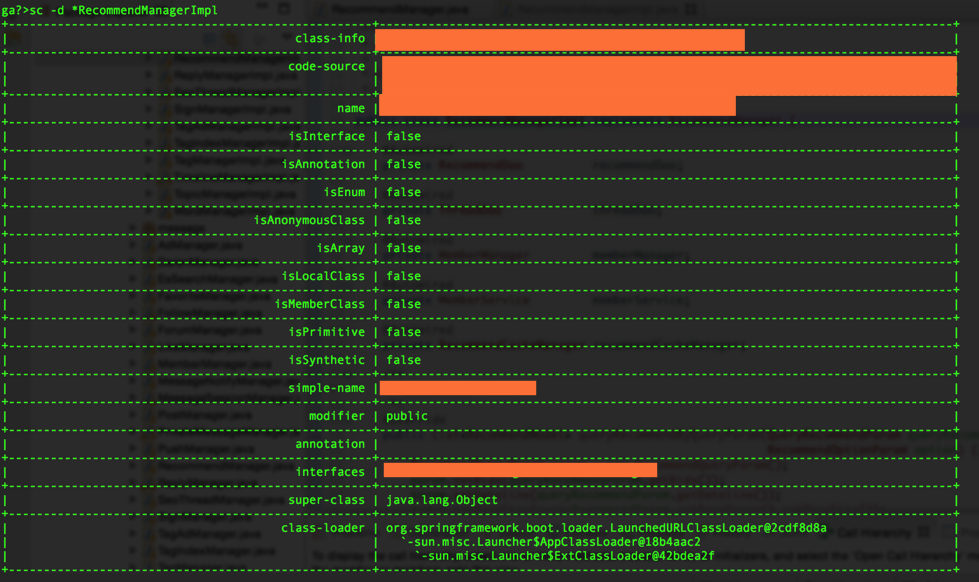

anatomy
---
#### 简介

anatomy 是阿里同学开发的一款用于JVM进程执行过程中的异常诊断工具，可以在不中断程序执行的情况下轻松完成问题排查工作。

* 纯Java实现的开源项目
* 安装使用便捷
* 方法级问题诊断
* Groovy表达式展开变对象，方便你观察入参、出参、异常、当前对象的各种属性细节

#### 接下来结合线上应用，列举常用的几个排查问题命令如何使用

1、安装：

```
curl -sLk http://ompc.oss.aliyuncs.com/greys/install.sh|sh
```

2、启动

```
greys.sh  <PID>

注：PID：目标Java进程ID
```

3、help

```
help  

注：所有命令

help watch

注：help命令同时也支持对其他命令的一个解释说明，比如我们键入help watch，包含（用途说明、参数列表、实际例子）

```

4、sc 搜索所有已经加载到JVM中的Class信息。

```
sc -d *RecommendManagerImpl
```
**使用场景：**

主要是用于排查一个应用可能存在同一个jar包的多个版本，而不同版本的类的方法可能会有实现上的差异，可以通过这种方式确认JVM中加载的是哪一个jar下的类。




5、monitor 方法层面的性能监控，非实时返回的命令，则是不断的等待目标Java进程返回信息，直到用户输入Ctrl+D为止

```
monitor -c 5  *TimelineReadServiceImpl getEditorRecPost

注：-c : 统计周期，默认值为120秒
```

**使用场景：**

线上反馈某个接口突然响应较慢，但又缺乏全链路维度节点的监控，可以通过该命令能定位到具体哪个方法耗时较长，有效缩小排查范围。


6、trace 统计整个调用链路上的所有性能开销和追踪调用链路。

```
trace -n 2 *TimelineReadServiceImpl queryRecPageTimeLine
```


**使用场景：**

定位查找某一接口响应较慢，主要是损耗在哪一个环节。

另外也可以做为性能优化的参考标准，了解一个接口下面每个环节的消耗时间，从而判断是否合理，有没有优化的空间

7、watch 观察到指定方法的调用情况

能观察到的范围：入参、返回值、抛出异常，通过编写groovy表达式进行对应变量的查看。详细使用手册可以通过命令help watch

```
watch -b  *TimelineReadServiceImpl queryRecPageTimeLine  params[0]

注：打印完整的入参信息

watch -b  *TimelineReadServiceImpl queryRecPageTimeLine  params[0] 'params[0].uid>2894731' 

注：带上groovy表达式，uid>2894731

watch -s  *TimelineReadServiceImpl queryRecPageTimeLine  params[0]+returnObj 'params[0].uid==3680667'

注：当请求的uid为3680667时，打印入参和返回结果
```

8、 jvm

查看当前JVM的信息，无参数


### 参考资料

https://github.com/oldmanpushcart/greys-anatomy/wiki/Commands#help

