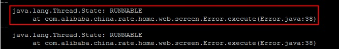
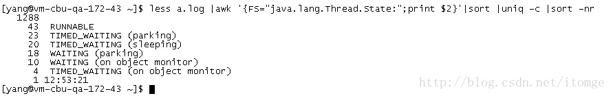

Load 是指对计算机干活多少的度量（WikiPedia：the system load is a measure of the amount of work that a computer system is doing），简单的说是进程队列的长度。Load Average 就是一段时间 (1 分钟、5分钟、15分钟) 内平均 Load 

**通过uptime命令可以查看当前的load，如果值很高。一般情况是java某些线程长期占用资源、死锁、死循环等导致某个进程占用的CPU资源过高。大致可以从以下几个角度来排查：**
<br><br>

1.首先通过jps命令，查看当前进程id，如id为 28174

2.查看该进程下的线程资源使用情况

```
top -p 28174 –H  
```

```
32694 root      20   0 3249m 2.0g  11m S    2  6.4   3:31.12 java                      
28175 root      20   0 3249m 2.0g  11m S    0  6.4   0:00.06 java                   
28176 root      20   0 3249m 2.0g  11m S    0  6.4   1:40.79 java                   
28177 root      20   0 3249m 2.0g  11m S    0  6.4   1:41.12 java                   
28178 root      20   0 3249m 2.0g  11m S    0  6.4   1:41.11 java                   
28179 root      20   0 3249m 2.0g  11m S    0  6.4   1:41.33 java                   
28180 root      20   0 3249m 2.0g  11m S    0  6.4   1:41.58 java                   
28181 root      20   0 3249m 2.0g  11m S    0  6.4   1:40.36 java                   
28182 root      20   0 3249m 2.0g  11m S    0  6.4   1:41.02 java                   
28183 root      20   0 3249m 2.0g  11m S    0  6.4   1:40.96 java                   
28184 root      20   0 3249m 2.0g  11m S    0  6.4   4:38.30 java                   
28185 root      20   0 3249m 2.0g  11m S    0  6.4   0:00.46 java                   
28186 root      20   0 3249m 2.0g  11m S    0  6.4   0:01.83 java                   
28187 root      20   0 3249m 2.0g  11m S    0  6.4   0:00.00 java                   
28189 root      20   0 3249m 2.0g  11m S    0  6.4   0:00.01 java                   
28190 root      20   0 3249m 2.0g  11m S    0  6.4   0:49.01 java      

```

3.打印JAVA进程28174的堆栈信息

```
jstack 28174 >> stack.log 
```


4.将cpu消耗高的线程的pid换算为16进制

```
printf 0x%x 32694
```

转换后的16进制为 0x7fb6

5.从刚才的栈日志中查找该线程正在运行的方法

```
grep 0x7fb6  stack.log -a3
```   

```
"MSXMLProcessorThread" prio=10 tid=0x00002b469923a800 [color=darkred]nid=0x7fb6[/color] sleeping[0x00002b46b0200000]    
   java.lang.Thread.State: TIMED_WAITING (sleeping)    
        at java.lang.Thread.sleep(Native Method)    
        at com.adventnet.management.xml.MSXmlProcessor.listen(MSXmlProcessor.java:279)    
        at com.adventnet.management.xml.MSXmlProcessor.run(MSXmlProcessor.java:264)    
        at java.lang.Thread.run(Thread.java:619)    
```

6.另外也可以查找正在运行的线程，及线程处于运行状态的位置，从这些线程中来查找资源消耗过高的代码。

```
grep RUNNABLE stack.log  -a1   
```


```
less a.log |awk '{FS="java.lang.Thread.State:";print $2}'|sort |uniq -c |sort -nr  
```

