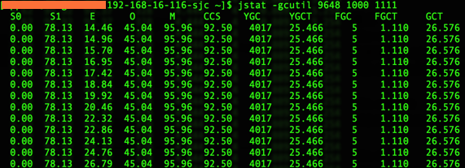
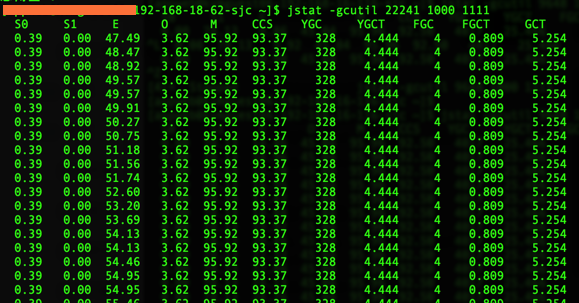

### jvm堆参数调整


----

偶然发现线上通过obelisk发布的应用默认没有配置堆大小等jvm参数

下面是社区的一个线上dubbo应用的jvm参数：

```
-XX:CICompilerCount=3 -XX:InitialHeapSize=130023424 -XX:+ManagementServer -XX:MaxHeapSize=2063597568 -XX:MaxNewSize=687865856 -XX:MinHeapDeltaBytes=524288 -XX:NewSize=42991616 -XX:OldSize=87031808 -XX:+PrintGC -XX:+PrintGCDateStamps -XX:+PrintGCDetails -XX:+PrintGCTimeStamps -XX:+UseCompressedClassPointers -XX:+UseCompressedOops -XX:+UseParallelGC 

注：考虑安全性，部分数据删除
```

采用默认值，新生代只有600多M，堆区总大小也只有2个G

**社区这边的线上机器基本都是标配4核8G，上面的配置太浪费，如果活动期间有较高并发量，估计新生代会不足，挤压老年代，持续gc，很容易雪崩。**

线上jvm参数调整

```
-Xms5020m -Xmx5020m -Xmn2500m -XX:PermSize=96m -XX:MaxPermSize=256m -XX:ParallelGCThreads=4  -XX:+UseConcMarkSweepGC -XX:+UseCMSCompactAtFullCollection -XX:CMSMaxAbortablePrecleanTime=5000 -XX:+CMSClassUnloadingEnabled -XX:+UseCMSInitiatingOccupancyOnly -XX:CMSInitiatingOccupancyFraction=80
```
========================

用了两台线上机做测试，配置一样

```
192.168.16.116（参数未调整）
192.168.18.62 （参数调整）
```
发布上线后，beta了一天，对比结果如下：






192.168.16.116（未调整参数），一天发生了YGC4000多次，整个gc时间26s

192.168.18.62 （参数调整），一天YGC只有300多次，整个gc时间只有5s

如果并发量大的情况下，估计这个差异会更大，支持的最大QPS应该会有很大提升，如果要准确数据的话可以性能压测对比下
