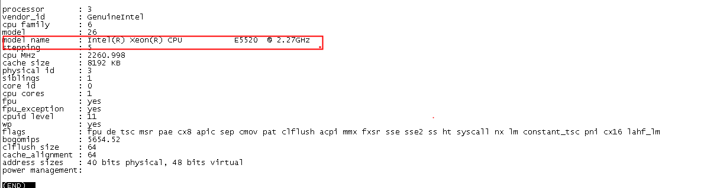
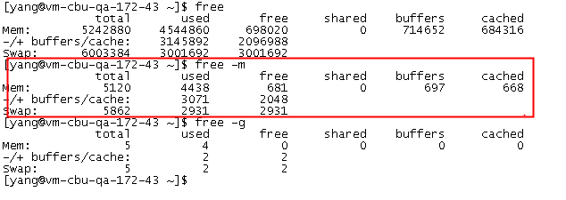
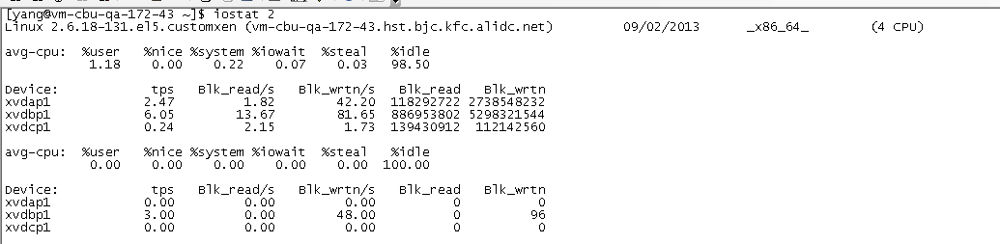
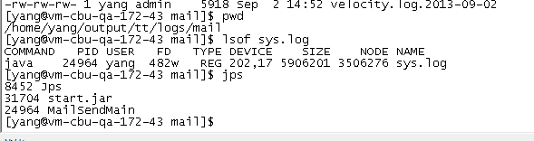
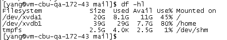
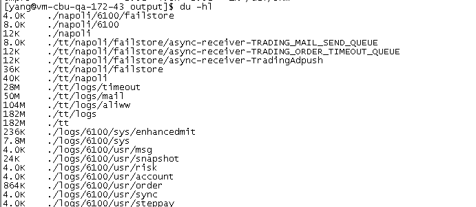
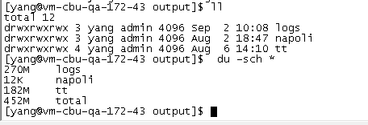

## linux常用命令

---


### 一、CPU相关、进程

1、 查看cpu硬件配置

```
less /proc/cpuinfo 
```



```
uname -a                查看内核/操作系统/CPU信息
head -n 1 /etc/issue    查看操作系统版本
less /proc/cpuinfo      查看CPU信息
hostname                查看计算机名
```

2、 top  命令

实时显示各种系统资源使用情况及进程状态

```
详细命令参数：
h: 显示帮助
c：显示详细的命令参数
M：按照占用内存大小（%MEM 列）对进程排序；
P：按照 CPU 使用率( %CPU 列）对进程排序；
u：显示指定用户的进程。默认显示所有进程；
T：根据累计运行时间排序
```


```
第一行：当前时间：系统已运行时间：751天，目前4个用户，1、5、15分钟内的load分别是0.07、0.02 、0.00
第二行：进程情况：总共148个，正在运行的有2个，休眠有139个，僵尸进程1个
第三行：cpu的使用情况（按数字1显示所有cpu）
第四行：内存情况（buffers表示用作内核缓存的内存量）
第五行：虚拟内存情况（系统的物理内存不够用的时候，把硬盘空间中的一部分空间释放出来，以供当前运行的程序使用）
第六行：进程id，虚拟内存，驻留内存使用，cpu，内存使用百分比，运行时间,命令参数等。
VIRT表示进程可以使用的内存总大小，VIRT=SWAP+RES，包括这个进程真实使用的内存, 映射过的文件, 和别的进程共享的内存等。 
RES表示这个进程真实占用内存的大小，一般这个值和JVM的参数配置有关，如果%MEM使用过高则需要关注
SHR表示可以和别的进程共享的内存和库大小。

```

* 某一个进程下的线程资源使用情况：

```
top -p {pid} -H  
```

* 查看系统load、cpu资源的其它命令

```
 mpstat 1 （汇总的）
 mpstat -P ALL 1  （汇总的+每个cpu的）
 w
 uptime
 top -H 和 ps -efL/ -Tel  显示 线程
```

3、统计一个进程下的线程数


```
cat /proc/${pid}/status

返回：
...省略
Threads:	74
....省略

其它命令：
top -bH -d 3 -p {pid}
```


* pstree （以树状图的方式展现进程之间的派生关系）
[Linux命令大全](http://man.linuxde.net/pstree)

```
pstree -p
pstree -p {pid} | wc -l
```

* pstack （显示每个进程的栈跟踪），也可以查看一个进程下的线程总数

```
pstack {pid} 
// 输出第一行
pstack {pid} | head -1
```

4、查看所有进程

```
ps -ef
ps -ef|grep java
```

5、对于Java应用从操作系统层面观察，就只有进程和线程两个指标，任何东西在操作系统层面都是以文件的形式存储的，进程也不例外。Linux上部署一个Tomcat程序产生一个进程，这个进程所有的东西都在这个目录下

ll /proc/{pid}/

```
## 可以查看所有的socket连接
ll /proc/{pid}/fd | grep socket   
```    

5、ulimit -a （显示当前的各种用户进程限制）
[linux修改max user processes limits](http://blog.csdn.net/bbaiggey/article/details/51004817)    

```
ulimit -a

core file size (blocks, -c) 100
data seg size (kbytes, -d) unlimited
file size (blocks, -f) unlimited
pending signals (-i) 15237
max locked memory (kbytes, -l) 64
max memory size (kbytes, -m) unlimited
open files (-n) 1024
pipe size (512 bytes, -p) 8
POSIX message queues (bytes, -q) 819200
stack size (kbytes, -s) 8192
cpu time (seconds, -t) unlimited
max user processes (-u) 15237
virtual memory (kbytes, -v) unlimited
file locks (-x) unlimited
```    
```
输出的每一行由资源名字、（单位，ulimit命令的参数）、软限制组成。详细解释：
参数 描述
core file size core文件的最大值为100 blocks，
data seg size 进程的数据段可以任意大
file size 文件可以任意大
pending signals 最多有15237个待处理的信号
max locked memory 一个任务锁住的物理内存的最大值为64kB
max memory size 一个任务的常驻物理内存的最大值
open files 一个任务最多可以同时打开1024的文件
pipe size 管道的最大空间为4096字节
POSIX message queues POSIX的消息队列的最大值为819200字节
stack size 进程的栈的最大值为8192字节
cpu time 进程使用的CPU时间
max user processes 当前用户同时打开的进程(包括线程)的最大个数为15237
virtual memory 没有限制进程的最大地址空间
file locks 所能锁住的文件的最大个数没有限制
```

### 二、内存相关 

1、vmstat

Virtual Memory Statistics，统计进程、内存、io、cpu等的活动信息。对于多CPU系统，vmstat打印的是所有CPU的平均输出



```
procs
r: 运行队列中进程数量
b: 等待IO的进程数量
memory
swpd: 使用虚拟内存大小
free: 可用内存大小
buff: 用作缓冲的内存大小
cache: 用作缓存的内存大小
swap
si: 每秒从交换区写到内存的大小
so: 每秒从内存写入交换区的大小
io
bi: 每秒读取的块数（现在的Linux版本块的大小为1024bytes）
bo: 每秒写入的块数
system
in: 每秒中断数，包括时钟中断
cs: 每秒上下文切换数
cpu（以百分比表示）
us: 用户进程执行时间(user time)
sy: 系统进程执行时间(system time)
id: 空闲时间(包括IO等待时间)
wa: 等待IO时间
```
**注意：排查问题时，要特别关注r的值，如果长时间超过cpu核数2倍，说明系统的负载很重，cpu已经无法及时处理堆积任务。**

2、sar -r

3、cat /proc/meminfo 

4、free -m

```
-m ：表示单位是MB
```



### 三、IO及网络

1、 tsar --traffic：显示网络带宽

2、 netstat 

一般用于检验本机各端口的网络连接情况。netstat是在内核中访问网络及相关信息的程序，它能提供TCP连接，TCP和UDP监听，进程内存管理的相关报告。


**命令参数：**

```
-a或–all 显示所有连线中的Socket。
-A<网络类型>或–<网络类型> 列出该网络类型连线中的相关地址。
-c或–continuous 持续列出网络状态。
-C或–cache 显示路由器配置的快取信息。
-e或–extend 显示网络其他相关信息。
-F或–fib 显示FIB。
-g或–groups 显示多重广播功能群组组员名单。
-h或–help 在线帮助。
-i或–interfaces 显示网络界面信息表单。
-l或–listening 显示监控中的服务器的Socket。
-M或–masquerade 显示伪装的网络连线。
-n或–numeric 直接使用IP地址，而不通过域名服务器。
-N或–netlink或–symbolic 显示网络硬件外围设备的符号连接名称。
-o或–timers 显示计时器。
-p或–programs 显示正在使用Socket的程序识别码和程序名称。
-r或–route 显示Routing Table。
-s或–statistice 显示网络工作信息统计表。
-t或–tcp 显示TCP传输协议的连线状况。
-u或–udp 显示UDP传输协议的连线状况。
-v或–verbose 显示指令执行过程。
-V或–version 显示版本信息。
-w或–raw 显示RAW传输协议的连线状况。
-x或–unix 此参数的效果和指定”-A unix”参数相同。
–ip或–inet 此参数的效果和指定”-A inet”参数相同。
```

**输出结果：**


```
一个是Active Internet connections，称为有源TCP连接，其中"Recv-Q"和"Send-Q"指的是接收队列和发送队列。这些数字一般都应该是0。如果不是则表示软件包正在队列中堆积。这种情况只能在非常少的情况见到。

另一个是Active UNIX domain sockets，称为有源Unix域套接口(和网络套接字一样，但是只能用于本机通信，性能可以提高一倍)。

Proto显示连接使用的协议,RefCnt表示连接到本套接口上的进程号,Types显示套接口的类型,State显示套接口当前的状态,Path表示连接到套接口的其它进程使用的路径名。

状态说明：
LISTEN：侦听来自远方的TCP端口的连接请求
SYN-SENT：再发送连接请求后等待匹配的连接请求（如果有大量这样的状态包，检查是否中招了）
SYN-RECEIVED：再收到和发送一个连接请求后等待对方对连接请求的确认（如有大量此状态，估计被flood攻击了）
ESTABLISHED：代表一个打开的连接
FIN-WAIT-1：等待远程TCP连接中断请求，或先前的连接中断请求的确认
FIN-WAIT-2：从远程TCP等待连接中断请求
CLOSE-WAIT：等待从本地用户发来的连接中断请求
CLOSING：等待远程TCP对连接中断的确认
LAST-ACK：等待原来的发向远程TCP的连接中断请求的确认（不是什么好东西，此项出现，检查是否被攻击）
TIME-WAIT：等待足够的时间以确保远程TCP接收到连接中断请求的确认
CLOSED：没有任何连接状态

```

* 找出运行在指定端口的进程

```
netstat -anpt | grep ':20130'
netstat -nat | grep "172.16.49.161:20130"
```

*  其它使用场景

```
netstat -nat |awk '{print $6}'|sort|uniq -c    不同网络状态结果统计
netstat -anop | grep 6379     应用连接Redis情况
netstat -pt             输出中显示 PID 和进程名称
netstat -s              查看网络统计信息
netstat -nu             显示当前UDP连接状况
netstat -nt             显示当前TCP连接状况
netstat -i              显示网卡列表
```


3、 iostat

iostat是I/O statistics（输入/输出统计）的缩写，主要的功能是对系统的磁盘I/O操作进行监视。它的输出主要显示磁盘读写操作的统计信息，同时也会给出CPU使用情况。同vmstat一样，iostat也不能对某个进程进行深入分析，仅对系统的整体情况进行分析。

**命令参数：**

```
-c 显示CPU使用情况
-d 显示磁盘使用情况
-k 以 KB 为单位显示
-m 以 M 为单位显示
-N 显示磁盘阵列(LVM) 信息
-n 显示NFS 使用情况
-p[磁盘] 显示磁盘和分区的情况
-t 显示终端和CPU的信息
-x 显示详细信息
-V 显示版本信息
```


**输出结果：**

```
cpu属性值说明：

%user：CPU处在用户模式下的时间百分比。
%nice：CPU处在带NICE值的用户模式下的时间百分比。
%system：CPU处在系统模式下的时间百分比。
%iowait：CPU等待输入输出完成时间的百分比。
%steal：管理程序维护另一个虚拟处理器时，虚拟CPU的无意识等待时间百分比。
%idle：CPU空闲时间百分比。

备注：如果%iowait的值过高，表示硬盘存在I/O瓶颈，%idle值高，表示CPU较空闲，如果%idle值高但系统响应慢时，有可能是CPU等待分配内存，此时应加大内存容量。%idle值如果持续低于10，那么系统的CPU处理能力相对较低，表明系统中最需要解决的资源是CPU。


disk属性值说明：（iostat -x）

rrqm/s:  每秒进行 merge 的读操作数目。即 rmerge/s
wrqm/s:  每秒进行 merge 的写操作数目。即 wmerge/s
r/s:  每秒完成的读 I/O 设备次数。即 rio/s
w/s:  每秒完成的写 I/O 设备次数。即 wio/s
rsec/s:  每秒读扇区数。即 rsect/s
wsec/s:  每秒写扇区数。即 wsect/s
rkB/s:  每秒读K字节数。是 rsect/s 的一半，因为每扇区大小为512字节。
wkB/s:  每秒写K字节数。是 wsect/s 的一半。
avgrq-sz:  平均每次设备I/O操作的数据大小 (扇区)。
avgqu-sz:  平均I/O队列长度。
await:  平均每次设备I/O操作的等待时间 (毫秒)。
svctm: 平均每次设备I/O操作的服务时间 (毫秒)。
%util:  一秒中有百分之多少的时间用于 I/O 操作，即被io消耗的cpu百分比

备注：如果 %util 接近 100%，说明产生的I/O请求太多，I/O系统已经满负荷，该磁盘可能存在瓶颈。如果 svctm 比较接近 await，说明 I/O 几乎没有等待时间；如果 await 远大于 svctm，说明I/O 队列太长，io响应太慢，则需要进行必要优化。如果avgqu-sz比较大，也表示有当量io在等待。
```
* 定时显示所有信息（每隔 2秒刷新显示，且显示3次）

```
iostat 2 3
```
* 以kB为单位显示所有信息

```
iostat -k 3
```

4、sar -b：磁盘状态历史记录


### 四、文件

1、 lsof (一切皆文件)
[命令详情](http://man.linuxde.net/lsof)

查看你进程开打的文件，打开文件的进程，进程打开的端口(TCP、UDP)


```
// 查看sys.log文件被哪个进程打开
lsof sys.log 
```

```
// 查看端口被哪个进程占用
lsof  -i：端口号         
```



```
// 查看各个进程打开的文件数量
lsof -n |awk '{print $2} " " $3'|sort|uniq -c |sort -nr|more
```


2、 df

```
df -hl
磁盘的使用情况
```


3、 du

```
du -hl
当前目录下的最叶子目录的大小
```


```
du -sch * 
当前目录下的各目录的大小
```


4、 find

文件查找

```
find . -name sys.log  
当前目录下查找sys.log文件

find . -name "sy*log"
查找文件支持通配符

find . -size +20M
查找当前目录下大小超过20M的文件  

find . -size +20M | xargs ls -lh
查找当前目录下大小超过20M的文件，并计算文件大小

find -type f -printf '%s %p\n' |sort -nr | head  
查找占用空间最大的10个文件
```

5、 tail

从指定点开始将文件标准输出

* 显示文件最后5行内容

```
tail -n 5 test.log
```
* 实时显示文件内容

```
tail -f test.log
```
```
ping baidu.com > 1.txt &
后台以守护进程的方式，将ping命令的返回结果写入 1.txt
```

#### 五、用户

```
w                       查看活动用户
id <用户名>              查看指定用户信息
last                    查看用户登录日志
cut -d: -f1 /etc/passwd    查看系统所有用户
cut -d: -f1 /etc/group     查看系统所有组
crontab -l              查看当前用户的计划任务
```

### 六、其它

1、查看所有安装的软件包

```
rpm -qa                 
```

2、查看环境变量

```
env                     
```

3、Mac 删除git文件夹，删除svn文件夹

```
cd到该文件夹

//删除文件夹下的所有 .svn 文件
find . -name ".svn" | xargs rm -Rf

//删除文件夹下的所有 .git 文件
find . -name ".git" | xargs rm -Rf
```



---

### 更多资料：

https://app.yinxiang.com/Home.action#n=b0fcd794-072a-4fab-9ac6-012b7b0ad147&ses=4&sh=2&sds=5&

