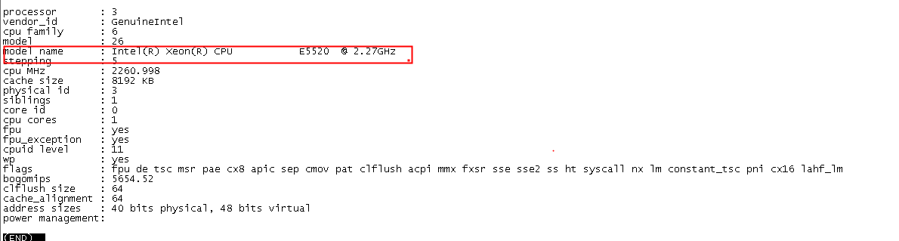
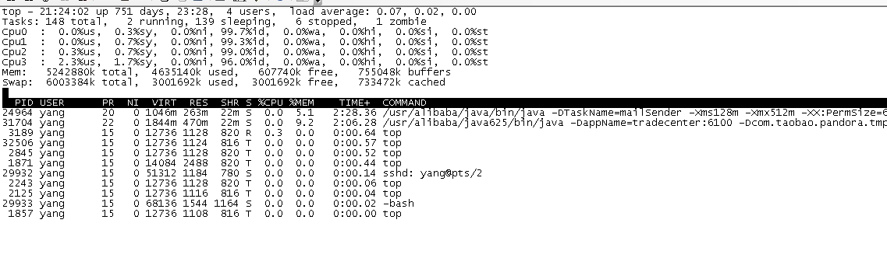
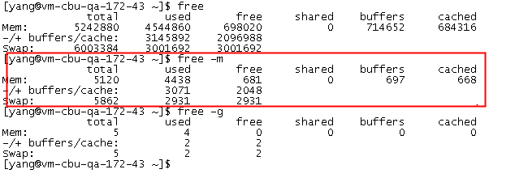
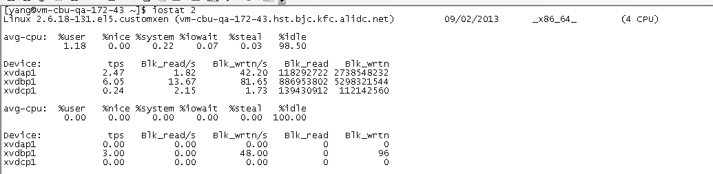
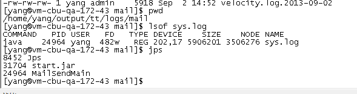
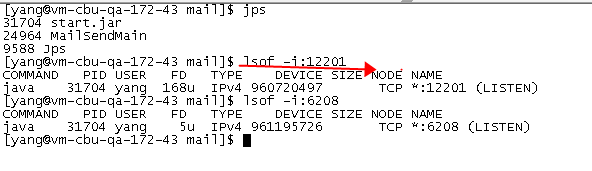
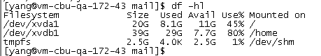
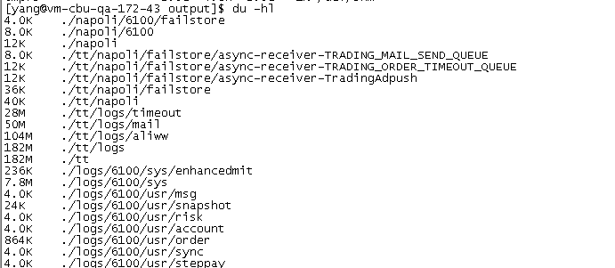
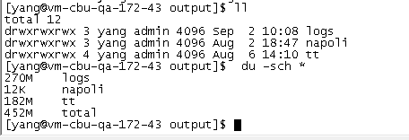

### linux常用命令

---


#### 一、CPU相关信息

1、 查看cpu硬件配置

```
less /proc/cpuinfo 
```


2、 top


```
第一行：当前时间：系统已运行时间：751天，目前4个用户，1、5、15分钟内的load分别是0.07、0.02 、0.00
第二行：进程情况：总共148个，正在运行的有2个，休眠有139个，僵尸进程1个
第三行：cpu的使用情况（按数字1显示所有cpu）
第四行：内存情况
第5行：虚拟内存情况
然后：进程id，虚拟内存，驻留内存使用，cpu，内存使用百分比，运行时间,命令参数等。
VIRT表示进程可以使用的内存总大小, 包括这个进程真实使用的内存, 映射过的文件, 和别的进程共享的内存等。 RES表示这个进程真实占用内存的大小。 SHR表示可以和别的进程共享的内存和库大小.
```
```
备注：
h: 显示帮助
c：显示详细的命令参数
M：按照占用内存大小（%MEM 列）对进程排序；
P：按照 CPU 使用率( %CPU 列）对进程排序；
u：显示指定用户的进程。默认显示所有进程；
T：根据累计运行时间排序
```
如果要查看具体某一个进程下的线程资源占用情况：

```
top -p 进程id -H  
```


* mpstat 1 / mpstat -P ALL 1
* sar/sar-f /var/log/sa/saXX
* w
* uptime
* top -H和ps -efL/-Tel  显示线程



#### 二、内存相关信息 

1、vmstat

Virtual Memory Statistics，统计进程、内存、io、cpu等的活动信息。对于多CPU系统，vmstat打印的是所有CPU的平均输出



```
procs
r: 运行队列中进程数量
b: 等待IO的进程数量
memory
swpd: 使用虚拟内存大小
free: 可用内存大小
buff: 用作缓冲的内存大小
cache: 用作缓存的内存大小
swap
si: 每秒从交换区写到内存的大小
so: 每秒从内存写入交换区的大小
io
bi: 每秒读取的块数（现在的Linux版本块的大小为1024bytes）
bo: 每秒写入的块数
system
in: 每秒中断数，包括时钟中断
cs: 每秒上下文切换数
cpu（以百分比表示）
us: 用户进程执行时间(user time)
sy: 系统进程执行时间(system time)
id: 空闲时间(包括IO等待时间)
wa: 等待IO时间
```
**注意：排查问题时，要特别关注r的值，如果长时间超过cpu核数2倍，说明系统的负载很重，cpu已经无法及时处理堆积任务。**

2、sar -r

3、cat /proc/meminfo 

4、free -m

```
-m ：表示单位是MB
```



#### 三、IO相关信息

1、 tsar --traffic：显示网络带宽

2、 netstat 

一般用于检验本机各端口的网络连接情况。netstat是在内核中访问网络及相关信息的程序，它能提供TCP连接，TCP和UDP监听，进程内存管理的相关报告。


**命令参数：**

```
-a或–all 显示所有连线中的Socket。
-A<网络类型>或–<网络类型> 列出该网络类型连线中的相关地址。
-c或–continuous 持续列出网络状态。
-C或–cache 显示路由器配置的快取信息。
-e或–extend 显示网络其他相关信息。
-F或–fib 显示FIB。
-g或–groups 显示多重广播功能群组组员名单。
-h或–help 在线帮助。
-i或–interfaces 显示网络界面信息表单。
-l或–listening 显示监控中的服务器的Socket。
-M或–masquerade 显示伪装的网络连线。
-n或–numeric 直接使用IP地址，而不通过域名服务器。
-N或–netlink或–symbolic 显示网络硬件外围设备的符号连接名称。
-o或–timers 显示计时器。
-p或–programs 显示正在使用Socket的程序识别码和程序名称。
-r或–route 显示Routing Table。
-s或–statistice 显示网络工作信息统计表。
-t或–tcp 显示TCP传输协议的连线状况。
-u或–udp 显示UDP传输协议的连线状况。
-v或–verbose 显示指令执行过程。
-V或–version 显示版本信息。
-w或–raw 显示RAW传输协议的连线状况。
-x或–unix 此参数的效果和指定”-A unix”参数相同。
–ip或–inet 此参数的效果和指定”-A inet”参数相同。
```

**输出结果：**


```
一个是Active Internet connections，称为有源TCP连接，其中"Recv-Q"和"Send-Q"指的是接收队列和发送队列。这些数字一般都应该是0。如果不是则表示软件包正在队列中堆积。这种情况只能在非常少的情况见到。

另一个是Active UNIX domain sockets，称为有源Unix域套接口(和网络套接字一样，但是只能用于本机通信，性能可以提高一倍)。

Proto显示连接使用的协议,RefCnt表示连接到本套接口上的进程号,Types显示套接口的类型,State显示套接口当前的状态,Path表示连接到套接口的其它进程使用的路径名。

状态说明：
LISTEN：侦听来自远方的TCP端口的连接请求
SYN-SENT：再发送连接请求后等待匹配的连接请求（如果有大量这样的状态包，检查是否中招了）
SYN-RECEIVED：再收到和发送一个连接请求后等待对方对连接请求的确认（如有大量此状态，估计被flood攻击了）
ESTABLISHED：代表一个打开的连接
FIN-WAIT-1：等待远程TCP连接中断请求，或先前的连接中断请求的确认
FIN-WAIT-2：从远程TCP等待连接中断请求
CLOSE-WAIT：等待从本地用户发来的连接中断请求
CLOSING：等待远程TCP对连接中断的确认
LAST-ACK：等待原来的发向远程TCP的连接中断请求的确认（不是什么好东西，此项出现，检查是否被攻击）
TIME-WAIT：等待足够的时间以确保远程TCP接收到连接中断请求的确认
CLOSED：没有任何连接状态

```

* 找出运行在指定端口的进程

```
netstat -anpt | grep ':20130'
netstat -nat | grep "172.16.49.161:20130"
```

* 在 netstat 输出中显示 PID 和进程名称

```
netstat -pt
```

* 显示当前UDP连接状况

```
netstat -nu
```
* 显示当前TCP连接状况

```
netstat -nt
```

* 显示网卡列表

```
netstat -i
```
* 不同网络状态的数量统计

```
netstat -nat |awk '{print $6}'|sort|uniq -c
```


3、 iostat

iostat是I/O statistics（输入/输出统计）的缩写，主要的功能是对系统的磁盘I/O操作进行监视。它的输出主要显示磁盘读写操作的统计信息，同时也会给出CPU使用情况。同vmstat一样，iostat也不能对某个进程进行深入分析，仅对系统的整体情况进行分析。

**命令参数：**

```
-c 显示CPU使用情况
-d 显示磁盘使用情况
-k 以 KB 为单位显示
-m 以 M 为单位显示
-N 显示磁盘阵列(LVM) 信息
-n 显示NFS 使用情况
-p[磁盘] 显示磁盘和分区的情况
-t 显示终端和CPU的信息
-x 显示详细信息
-V 显示版本信息
```


**输出结果：**

```
cpu属性值说明：

%user：CPU处在用户模式下的时间百分比。
%nice：CPU处在带NICE值的用户模式下的时间百分比。
%system：CPU处在系统模式下的时间百分比。
%iowait：CPU等待输入输出完成时间的百分比。
%steal：管理程序维护另一个虚拟处理器时，虚拟CPU的无意识等待时间百分比。
%idle：CPU空闲时间百分比。

备注：如果%iowait的值过高，表示硬盘存在I/O瓶颈，%idle值高，表示CPU较空闲，如果%idle值高但系统响应慢时，有可能是CPU等待分配内存，此时应加大内存容量。%idle值如果持续低于10，那么系统的CPU处理能力相对较低，表明系统中最需要解决的资源是CPU。


disk属性值说明：（iostat -x）

rrqm/s:  每秒进行 merge 的读操作数目。即 rmerge/s
wrqm/s:  每秒进行 merge 的写操作数目。即 wmerge/s
r/s:  每秒完成的读 I/O 设备次数。即 rio/s
w/s:  每秒完成的写 I/O 设备次数。即 wio/s
rsec/s:  每秒读扇区数。即 rsect/s
wsec/s:  每秒写扇区数。即 wsect/s
rkB/s:  每秒读K字节数。是 rsect/s 的一半，因为每扇区大小为512字节。
wkB/s:  每秒写K字节数。是 wsect/s 的一半。
avgrq-sz:  平均每次设备I/O操作的数据大小 (扇区)。
avgqu-sz:  平均I/O队列长度。
await:  平均每次设备I/O操作的等待时间 (毫秒)。
svctm: 平均每次设备I/O操作的服务时间 (毫秒)。
%util:  一秒中有百分之多少的时间用于 I/O 操作，即被io消耗的cpu百分比

备注：如果 %util 接近 100%，说明产生的I/O请求太多，I/O系统已经满负荷，该磁盘可能存在瓶颈。如果 svctm 比较接近 await，说明 I/O 几乎没有等待时间；如果 await 远大于 svctm，说明I/O 队列太长，io响应太慢，则需要进行必要优化。如果avgqu-sz比较大，也表示有当量io在等待。
```
* 定时显示所有信息（每隔 2秒刷新显示，且显示3次）

```
iostat 2 3
```
* 以kB为单位显示所有信息

```
iostat -k 3
```

4、sar -b：磁盘状态历史记录


#### 四、其它

1、 lsof

可以列出当前系统进程与文件的关系

```
lsof sys.log 
查看sys.log文件被哪个进程打开
```

```
lsof  -i：端口号         
查看端口被哪个进程占用
```


```
lsof -n |awk '{print $2} " " $3'|sort|uniq -c |sort -nr|more
查看各个进程打开的文件数据量

````


2、 df

```
df -hl
磁盘的使用情况
```


3、 du

```
du -hl
当前目录下的最叶子目录的大小
```


```
du -sch * 
当前目录下的各目录的大小
```


4、 find

文件查找

```
find . -name sys.log  
当前目录下查找sys.log文件

find . -name "sy*log"
查找文件支持通配符

find . -size +20M
查找当前目录下大小超过20M的文件  

find . -size +20M | xargs ls -lh
查找当前目录下大小超过20M的文件，并计算文件大小

find -type f -printf '%s %p\n' |sort -nr | head  
查找占用空间最大的10个文件
```


---

#### 更多资料：

https://app.yinxiang.com/Home.action#n=b0fcd794-072a-4fab-9ac6-012b7b0ad147&ses=4&sh=2&sds=5&

