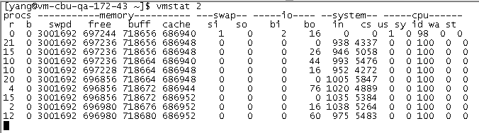

### linux常用命令

---


#### 一、CPU相关信息

* 查看cpu硬件配置

```
less /proc/cpuinfo 
```


* top


```
第一行：当前时间：系统已运行时间：751天，目前4个用户，1、5、15分钟内的load分别是0.07、0.02 、0.00
第二行：进程情况：总共148个，正在运行的有2个，休眠有139个，僵尸进程1个
第三行：cpu的使用情况（按数字1显示所有cpu）
第四行：内存情况
第5行：虚拟内存情况
然后：进程id，虚拟内存，驻留内存使用，cpu，内存使用百分比，运行时间,命令参数等。
VIRT表示进程可以使用的内存总大小, 包括这个进程真实使用的内存, 映射过的文件, 和别的进程共享的内存等。 RES表示这个进程真实占用内存的大小。 SHR表示可以和别的进程共享的内存和库大小.
```
```
备注：
h: 显示帮助
c：显示详细的命令参数
M：按照占用内存大小（%MEM 列）对进程排序；
P：按照 CPU 使用率( %CPU 列）对进程排序；
u：显示指定用户的进程。默认显示所有进程；
T：根据累计运行时间排序
```
如果要查看具体某一个进程下的线程资源占用情况：

```
top -p 进程id -H  
```


* mpstat 1 / mpstat -P ALL 1
* sar/sar-f /var/log/sa/saXX
* w
* uptime
* top -H和ps -efL/-Tel  显示线程



#### 二、内存相关信息 

* vmstat

Virtual Memory Statistics，统计进程、内存、io、cpu等的活动信息。对于多CPU系统，vmstat打印的是所有CPU的平均输出



```
procs
r: 运行队列中进程数量
b: 等待IO的进程数量
memory
swpd: 使用虚拟内存大小
free: 可用内存大小
buff: 用作缓冲的内存大小
cache: 用作缓存的内存大小
swap
si: 每秒从交换区写到内存的大小
so: 每秒从内存写入交换区的大小
io
bi: 每秒读取的块数（现在的Linux版本块的大小为1024bytes）
bo: 每秒写入的块数
system
in: 每秒中断数，包括时钟中断
cs: 每秒上下文切换数
cpu（以百分比表示）
us: 用户进程执行时间(user time)
sy: 系统进程执行时间(system time)
id: 空闲时间(包括IO等待时间)
wa: 等待IO时间
```
**注意：排查问题时，要特别关注r的值，如果长时间超过cpu核数2倍，说明系统的负载很重，cpu已经无法及时处理堆积任务。**

* sar -r
* cat /proc/meminfo 
* free -m

```
-m ：表示单位是MB
```


#### 三、IO相关信息

* tsar --traffic：显示网络带宽
* netstat -an：显示连接(-n参数不反向解析域名) 
* iostat

iostat是I/O statistics（输入/输出统计）的缩写，主要的功能是对系统的磁盘I/O操作进行监视。它的输出主要显示磁盘读写操作的统计信息，同时也会给出CPU使用情况。同vmstat一样，iostat也不能对某个进程进行深入分析，仅对系统的整体情况进行分析。


* sar -b：磁盘状态历史记录


#### 四、其它

* lsof

可以列出当前系统进程与文件的关系

```
lsof sys.log 
查看sys.log文件被哪个进程打开
```

```
lsof  -i：端口号         
查看端口被哪个进程占用
```


```
lsof -n |awk '{print $2} " " $3'|sort|uniq -c |sort -nr|more
查看各个进程打开的文件数据量

````


* df

```
df -hl
磁盘的使用情况
```


* du

```
du -hl
当前目录下的最叶子目录的大小
```


```
du -sch * 
当前目录下的各目录的大小
```


* find

文件查找

```
find . -name sys.log  
当前目录下查找sys.log文件

find . -name "sy*log"
查找文件支持通配符

find . -size +20M
查找当前目录下大小超过20M的文件  

find . -size +20M | xargs ls -lh
查找当前目录下大小超过20M的文件，并计算文件大小

find -type f -printf '%s %p\n' |sort -nr | head  
查找占用空间最大的10个文件
```