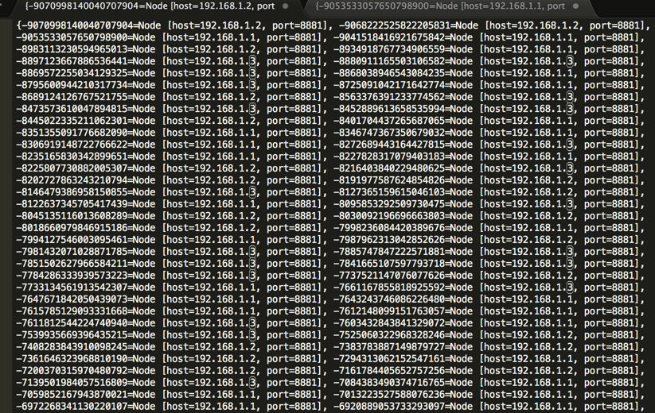

## 一致性hash算法

---

### 简介

一致性hash在缓存方面用的比较多，一般用来寻找路由节点，避免节点扩容导致的大面积数据原节点失效。

1.构造节点，循环，每一个cache节点会将Long类型数字拆成160份。

TreeMap的大小=节点数*160

```
		nodes = new TreeMap<Long, Node>();
		for (int i = 0; i != shards.size(); ++i) {
			final Node shardInfo = shards.get(i);
			for (int n = 0; n < 160 ; n++) {
				nodes.put(MurmurHash.hash("SHARD-" + i + "-NODE-" + n), shardInfo);
		}
	

```
MurmurHash算法：高运算性能，低碰撞率，由Austin Appleby创建于2008年，现已应用到Hadoop、libstdc++、nginx、libmemcached等开源系统。2011年Appleby被Google雇佣，随后Google推出其变种的CityHash算法。 

官方网站：https://sites.google.com/site/murmurhash/ 

MurmurHash算法，自称超级快的hash算法，是FNV的4-5倍。

```

	public static long hash64A(ByteBuffer buf, int seed) {
		ByteOrder byteOrder = buf.order();
		buf.order(ByteOrder.LITTLE_ENDIAN);

		long m = 0xc6a4a7935bd1e995L;
		int r = 47;

		long h = seed ^ (buf.remaining() * m);

		long k;
		while (buf.remaining() >= 8) {
			k = buf.getLong();

			k *= m;
			k ^= k >>> r;
			k *= m;

			h ^= k;
			h *= m;
		}

		if (buf.remaining() > 0) {
			ByteBuffer finish = ByteBuffer.allocate(8).order(ByteOrder.LITTLE_ENDIAN);
			// for big-endian version, do this first:
			// finish.position(8-buf.remaining());
			finish.put(buf).rewind();
			h ^= finish.getLong();
			h *= m;
		}

		h ^= h >>> r;
		h *= m;
		h ^= h >>> r;

		buf.order(byteOrder);
		return h;
	}
```

初始化的TreeMap的内容：



2.根据缓存key找具体的数据节点

```
public Node getNodeByKey(byte[] key) {
		//取大于或等于hash key的列表
		SortedMap<Long, Node> tail = nodes.tailMap(MurmurHash.hash(key));
		if (tail.isEmpty())
			return nodes.get(nodes.firstKey());
		return tail.get(tail.firstKey());
	}

```