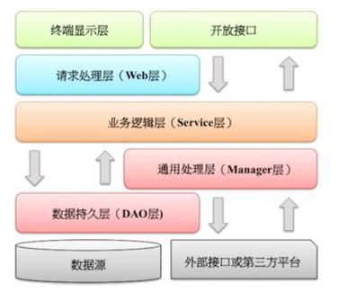

## 代码规范

---

### 前言

[阿里巴巴java开发手册终极版](https://m.aliyun.com/yunqi//articles/215726?from=groupmessage&isappinstalled=0&utm_content=m_23665)

下文是对里面常用的一些案例及规范的抽取。

##### 无规矩不成方圆，无规范不能协作

对软件来说，适当的规范和标准绝不是消灭代码内容的创造性、优雅性，而是限制过度个性化，以一种普遍认可的方式一起做事，降低故障率，提升协作效率。

开发手册详细列举如何开发更加高效，更加容错，更加有协作性，力求知其然，更知其不然，结合正反例，提高代码质量。比如，异常日志处理时的各种不规范行为；集合转换的各种坑；创建线程池出现的等待队列OOM等。

简单，适用的代码规约背后所传递的是技术上的追求卓越、协同合作的精神，是每个技术团队不可缺失的重要利器。
代码是软件工程里面的产品设计、系统架构设计等工作的最后承载体，代码的质量决定了一切工作的成败。

---

### 一、编程规约


1、所有编程相关命名均不能以下划线或美元符号开始,也不能以下划线或美元符号结束。 

```
反例: _name / __name / $Object / name_ / name$ / Object$
```

2、所有编程相关的命名严禁使用拼音与英文混合的方式,更不允许直接使用中文的方式。 

3、类名使用 UpperCamelCase 风格,必须遵从**驼峰形式**,但以下情形例外:(领域模型的相关命名)DO / DTO / VO / DAO 等。

```
正例:MarcoPolo / UserDO / XmlService / TcpUdpDeal / TaPromotion
反例:macroPolo / UserDo / XMLService / TCPUDPDeal / TAPromotion
```

4、方法名、参数名、成员变量、局部变量都统一使用 lowerCamelCase 风格,必须遵从 驼峰形式。

```
正例: localValue / getHttpMessage() / inputUserId

```

5、常量命名全部大写,单词间用下划线隔开,力求语义表达完整清楚,不要嫌名字长。

```
正例: MAX_STOCK_COUNT
反例: MAX_COUNT
```
6、抽象类命名使用 Abstract 或 Base 开头；异常类命名使用 Exception 结尾；测试类命名以它要测试的类的名称开始，以 Test 结尾

7、中括号是数组类型的一部分,数组定义如下:String[] args; 

```
反例:请勿使用 String args[]的方式来定义
```

8、POJO 类中的任何布尔类型的变量,都不要加 is,否则部分框架解析会引起序列化错误。

```
反例：定义为基本数据类型 boolean isSuccess;的属性,它的方法也是 isSuccess(),RPC 框架在反向解析的时候,“以为”对应的属性名称是 success，导致属性获取不到，进而抛出异常。
```

9、包名统一使用小写，点分隔符之间有且仅有一个自然语义的英语单词。包名统一使用
单数形式,但是类名如果有复数含义,类名可以使用复数形式。

```
正例: 应用工具类包名为com.alibaba.mpp.util、类名为MessageUtils(此规则参考spring 的框架结构)
```

10、如果使用到了设计模式，建议在类名中体现出具体模式。 

说明：将设计模式体现在名字中， 有利于阅读者快速理解架构设计思想。 

```
正例:
public class OrderFactory;
public class LoginProxy;
public class ResourceObserver;
```
11、对于 Service 和 DAO 类，基于 SOA 的理念，暴露出来的服务一定是接口，内部
的实现类用 Impl 的后缀与接口区别。 

```
正例:CacheServiceImpl 实现 CacheService 接口。
```

12、枚举类名建议带上 Enum 后缀,枚举成员名称需要全大写,单词间用下划线隔开。 

说明:枚举其实就是特殊的常量类,且构造方法被默认强制是私有。 

```
正例:枚举名字:DealStatusEnum;成员名称:SUCCESS / UNKOWN_REASON。
```

13、各层命名规约

```
Service/DAO 层方法命名规约:
1) 获取单个对象的方法用 get 做前缀。
2) 获取多个对象的方法用 list 做前缀。
3) 获取统计值的方法用 count 做前缀。
4) 插入的方法用 insert 做前缀。 
5) 删除的方法用 delete 做前缀。 
6) 修改的方法用 update 做前缀。

领域模型命名规约:
1) 数据对象:xxxDO,xxx 即为数据表名。
2) 数据传输对象:xxxDTO,xxx 为业务领域相关的名称。 
3) 展示对象:xxxVO,xxx 一般为网页名称。
4) POJO 是 DO/DTO/BO/VO 的统称,禁止命名成 xxxPOJO。

```

14、long 或者 Long 初始赋值时,必须使用大写的 L，不能是小写的 l，小写容易跟数字 1 混淆，造成误解。

说明:Long a = 2l; 写的是数字的 21,还是 Long 型的 2?

15、不要使用一个常量类维护所有常量，应该按常量功能进行归类，分开维护。

如：缓存相关的常量放在类:CacheConsts 下；系统配置相关的常量放在类:ConfigConsts 下。

16、对外暴露的接口签名，原则上不允许修改方法签名，避免对接口调用方产生影响。

接口过时必须加@Deprecated 注解，并清晰地说明采用的新接口或者新服务是什么

17、当一个类有多个构造器方法，或者多个同名方法（重载），这些方法应该按顺序放置在一起，便于阅读。

18、推荐尽量少用 else。if-else 的方式可以改写成:

```
if(condition){ 
	...
	return obj; 
}
// 接着写 else 的业务逻辑代码;

```

说明：如果使用要 if-else if-else 方式表达逻辑，最好不要超过 3 层

19、所有的类都必须添加作者信息。方法前要加注释。

代码修改的同时，注释也要进行相应的修改，尤其是参数、返回值、异常、核心逻辑 等的修改。

```
说明:代码与注释更新不同步,就像路网与导航软件更新不同步一样,如果导航软件严重滞后, 就失去了导航的意义。
```

20、接口返回值不允许使用枚举类型或者包含枚举类型的 POJO 对象（建议用字符串代替）。容易引发反序列化失败。


21、依赖于一个二方库群时，必须定义一个统一版本变量，避免版本号不一致。

说明:依赖 springframework-core、-context、-beans，它们都是同一个版本，可以定义一个变量来保存版本:${spring.version}，定义依赖的时候，引用该版本。

### 二、编码误区

1、Object的equals方法容易抛空指针异常，应使用常量或确定有值的对象来调用equals。 

```
正例: "test".equals(object);
反例: object.equals("test");
说明:推荐使用 java.util.Objects#equals (JDK7 引入的工具类)
```

2、所有的相同类型的包装类对象之间值的比较,全部使用 equals 方法比较。

3、序列化类新增属性时,请不要修改 serialVersionUID 字段,避免反序列失败;如果完全不兼容升级,避免反序列化混乱,那么请修改 serialVersionUID 值。

4、使用索引访问用 String 的 split 方法得到的数组时,需做最后一个分隔符后有无内 容的检查,否则会有抛 IndexOutOfBoundsException 的风险。

```
String str = "a,b,c,,"; 
String[] ary = str.split(",");
//预期大于 3,结果是 3
System.out.println(ary.length);
```

5、字符串的联接方式，使用 StringBuilder 的 append 方法进行扩展。

```
反例:
String str = "start";
for(int i=0; i<100; i++){
    str = str + "hello";
}
说明:反编译出的字节码文件显示每次循环都会 new 出一个 StringBuilder 对象,然后进行 append 操作,最后通过 toString 方法返回 String 对象,造成内存资源浪费。
```

6、final 可提高程序响应效率，声明成 final 的情况：

```
1) 不需要重新赋值的变量,包括类属性、局部变量。 
2) 对象参数前加 final,表示不允许修改引用的指向。 
3) 类方法确定不允许被重写。
4) 类不能被继承
```

7、Map/Set 的 key 为自定义对象时，必须重写 hashCode 和 equals。

```
正例:String 重写了 hashCode 和 equals 方法,所以我们可以非常愉快地使用 String 对象作 为 key 来使用。
```

8、使用集合转数组的方法，必须使用集合的 toArray(T[] array)，传入的是类型完全一样的数组，大小就是 list.size()

```
反例:
直接使用 toArray 无参方法存在问题,此方法返回值只能是 Object[]类,若强转其它类型数组将出现 ClassCastException 错误。

正例:
List<String> list = new ArrayList<String>(2);
list.add("guan");
list.add("bao");
String[] array = new String[list.size()];
array = list.toArray(array);
```
```
注：ArrayList 源码：

 public <T> T[] toArray(T[] a) {
        if (a.length < size)
            // Make a new array of a's runtime type, but my contents:
            return (T[]) Arrays.copyOf(elementData, size, a.getClass());
        System.arraycopy(elementData, 0, a, 0, size);
        if (a.length > size)
            a[size] = null;
        return a;
 }
```

9、使用工具类Arrays.asList()把数组转换成集合时，不能使用其修改集合相关的方法, 它的 add/remove/clear 方法会抛出 UnsupportedOperationException 异常。

```
说明：asList 的返回对象是一个 Arrays 内部类,并没有实现集合的修改方法。Arrays.asList 体现的是适配器模式,只是转换接口,后台的数据仍是数组。

String[] str = new String[] { "a", "b" };
List list = Arrays.asList(str);

第一种情况:list.add("c"); 运行时异常。 
第二种情况:str[0]= "gujin"; 那么 list.get(0)也会随之修改。

```

10、不要在 foreach 循环里进行元素的 remove/add 操作。remove 元素请使用 Iterator 方式,如果并发操作,需要对 Iterator 对象加锁。

```
反例:
List<String> a = new ArrayList<String>();
a.add("1");
a.add("2");
for (String temp : a) {
    if("1".equals(temp)){
       a.remove(temp);
	} 
}

正例:
Iterator<String> it = a.iterator(); 
while(it.hasNext()){
	String temp = it.next(); 
	if(删除元素的条件){
        it.remove();
    }
}

```

11、集合初始化时，尽量指定集合初始值大小。

说明：ArrayList 尽量使用 ArrayList(int initialCapacity) 初始化

12、使用 entrySet 遍历 Map 类集合 KV,而不是 keySet 方式进行遍历。

说明：keySet 其实是遍历了 2 次,一次是转为 Iterator 对象,另一次是从 hashMap 中取出 key 所对应的 value。而 entrySet 只是遍历了一次就把 key 和 value 都放到了 entry 中，效率更高。如果是 JDK8,使用 Map.foreach 方法。

```
正例:
values()返回的是 V 值集合,是一个 list 集合对象;
keySet()返回的是 K 值集合,是 一个 Set 集合对象;
entrySet()返回的是 K-V 值组合集合。
```

13、Map 类集合 K/V 能不能存储 null 值的情况

集合类 | Key | Value |Super|说明
---- | -----|------ | -----|-------
Hashtable|不允许为 null|不允许为 null|Dictionary|线程安全
ConcurrentHashMap|不允许为 null|不允许为 null|AbstractMap|线程局部安全
TreeMap|不允许为 null|允许为 null|AbstractMap|线程不安全
HashMap|允许为 null|允许为 null|AbstractMap|线程不安全

14、利用 Set 元素唯一的特性,可以快速对另一个集合进行去重操作,避免使用 List 的 contains 方法进行遍历去重操作。

15、获取单例对象要线程安全(双重空判断)。在单例对象里面做操作也要保证线程安全。

16、**线程资源必须通过线程池提供**，不允许在应用中自行显式创建线程。
 
```
说明：使用线程池的好处是减少在创建和销毁线程上所花的时间以及系统资源的开销，解决资源不足的问题。如果不使用线程池，有可能造成系统创建大量同类线程而导致消耗完内存或者 “过度切换”的问题。
```

17、多线程并行处理定时任务时，Timer 运行多个 TimeTask 时，只要其中之一没有捕获抛出的异常，其它任务便会自动终止运行，使用 ScheduledExecutorService 则没有这个问题。

```
@param
command the task to execute
delay the time from now to delay execution
unit the time unit of the delay parameter

@method
ScheduledFuture<?> java.util.concurrent.ScheduledExecutorService.schedule(Runnable command, long delay, TimeUnit unit)
```

18、线程池不允许使用 Executors 去创建,而是通过 ThreadPoolExecutor 的方式,这样的处理方式让写的同学更加明确线程池的运行规则,规避资源耗尽的风险。 

```
说明:Executors 各个方法的弊端:

newFixedThreadPool 、newSingleThreadExecutor 和 newScheduledThreadPool:
主要问题是堆积的请求处理队列可能会耗费非常大的内存,甚至 OOM。 

```

19、创建线程或线程池时请指定有意义的线程名称，方便出错时回溯。

```
正例:
public class TimerTaskThread extends Thread {
	public TimerTaskThread(){
		super.setName("TimerTaskThread"); 
	... 
	}
}
```

20、避免 Random 实例被多线程使用,虽然共享该实例是线程安全的,但会因竞争同一 seed 导致的性能下降。

```
说明:Random 实例包括 java.util.Random 的实例或者 Math.random()实例。
正例:在 JDK7 之后,可以直接使用 API ThreadLocalRandom,在 JDK7 之前,可以做到每个线程一个实例。
```

21、volatile 解决多线程内存不可见问题。对于一写多读,是可以解决变量同步问题, 但是如果多写,同样无法解决线程安全问题。

```
如果想取回 count++数据,使用如下类实现: 
AtomicInteger count = new AtomicInteger(); 
count.addAndGet(1); 

count++操作如果是JDK8,推荐使用 LongAdder 对象,比 AtomicLong 性能更好(减少乐观锁的重试次数)。
```

22、在一个 switch 块内,每个 case 要么通过 break/return 来终止,要么注释说明程序 将继续执行到哪一个 case 为止;在一个 switch 块内,都必须包含一个 default 语句并且放在 最后,即使它什么代码也没有。

23、在使用正则表达式时,利用好其预编译功能,可以有效加快正则匹配速度。 

说明:不要在方法体内定义:Pattern pattern = Pattern.compile(规则);

24、获取当前毫秒数:System.currentTimeMillis(); 而不是 new Date().getTime(); 

如果想获取更加精确的纳秒级时间值，用 System.nanoTime。

25、日志输出最好使用占位符的方式

```
logger.debug("Processing trade with id: {} and symbol : {} ", id, symbol);
```

26、避免重复打印日志,浪费磁盘空间,务必在 log4j.xml 中设置 additivity=false。 

```
正例:<logger name="com.taobao.ecrm.member.config" additivity="false">
```

27、输出的 POJO 类必须重写 toString 方法，否则只输出此对象的 hashCode 值(地址值)，没啥
参考意义。




### 三、MYSQL 规约

1、任何字段如果为非负数，必须是 unsigned。

2、表名、字段名必须使用小写字母或数字

```
正例:getter_admin,task_config,level3_name
```

3、禁用保留字,如 desc、range、match、delayed 等,参考官方保留字。

4、唯一索引名为 uk\_字段名；普通索引名则为 idx\_字段名

```
说明:uk_ 即 unique key;idx_ 即 index 的简称。
```
5、如果存储的字符串长度几乎相等，使用 CHAR 定长字符串类型。

varchar 是可变长字符串，不预先分配存储空间,长度不要超过 5000，如果存储长度大于此值，定义字段类型为 TEXT，独立出来一张表，用主键来对应，避免影响其它字段索引效率。

6、表必备三字段：id, gmt_create, gmt_modified

```
说明:其中 id 必为主键,类型为 unsigned bigint、单表时自增、步长为 1;分表时改为从 TDDL Sequence 取值,确保分表之间的全局唯一。
gmt_create, gmt_modified 的类型均为 date_time 类型。

`id` int(10) unsigned NOT NULL AUTO_INCREMENT COMMENT '自增主键',
`created_time` timestamp(3) NOT NULL DEFAULT CURRENT_TIMESTAMP(3) COMMENT '创建时间',
`updated_time` timestamp(3) NOT NULL DEFAULT CURRENT_TIMESTAMP(3) ON UPDATE CURRENT_TIMESTAMP(3) COMMENT '更新时间',
PRIMARY KEY (`id`),

```

7、如果修改字段含义或对字段表示的状态追加时,需要及时更新字段注释。

8、单表行数超过 500 万行或者单表容量超过 2GB，才推荐进行分库分表。 

```
说明:如果预计三年后的数据量根本达不到这个级别,请不要在创建表时就分库分表。 

反例:某业务三年总数据量才 2 万行,却分成 1024 张表。
问:你为什么这么设计?答:分 1024 张表,不是标配吗?

```
9、合适的字符存储长度，不但节约数据库表空间、节约索引存储，更重要的是提升检索速度。

```
正例:

人的年龄用 unsigned tinyint(表示范围 0-255,人的寿命不会超过 255 岁);
海龟就 必须是 smallint,
太阳的年龄,就必须是 int;
所有恒星的年龄都加起来，那么就必须使用 bigint。
```
10、业务上具有唯一特性的字段，即使是组合字段，也必须建成唯一索引

```
说明:不要以为唯一索引影响了 insert 速度,这个速度损耗可以忽略,但提高查找速度是明
显的;另外，即使在应用层做了非常完善的校验和控制,只要没有唯一索引,根据墨菲定律, 必然有脏数据产生。
```

11、严禁多个表间join操作

12、页面搜索严禁左模糊或者全模糊，如果需要请走搜索引擎来解决。

```
说明：索引文件具有 B-Tree 的最左前缀匹配特性,如果左边的值未确定,那么无法使用此索
引。

```

13、如果有 order by 的场景，请注意利用索引的有序性。order by 最后的字段是组合索引的一部分，并且放在索引组合顺序的最后，避免出现 file_sort 的情况，影响查询性能。 

```
正例:
where a=? and b=? order by c; 索引:a_b_c

反例:
索引中有范围查找,那么索引有序性无法利用,如:WHERE a>10 ORDER BY b; 索引 a_b 无法排序。
```
14、建组合索引的时候，区分度最高的在最左边

```
正例:
如果 where a=? and b=? ,a 列的几乎接近于唯一值,那么只需要单建 idx_a 索引即可。

说明:存在非等号和等号混合判断条件时,在建索引时,请把等号条件的列前置。如:where a>?
and b=? 那么即使 a 的区分度更高,也必须把 b 放在索引的最前列。
```

15、创建索引时避免有如下极端误解：

```
1)误认为一个查询就需要建一个索引。 
2)误认为索引会消耗空间、严重拖慢更新和新增速度。 
3)误认为唯一索引一律需要在应用层通过“先查后插”方式解决。
```
16、不得使用外键与级联，一切外键概念必须在应用层解决。 

```
说明:(概念解释)学生表中的 student_id 是主键,那么成绩表中的 student_id 则为外键。 如果更新学生表中的 student_id,同时触发成绩表中的 student_id 更新,则为级联更新。外键与级联更新适用于单机低并发,不适合分布式、高并发集群;级联更新是强阻塞,存在数据库更新风暴的风险;外键影响数据库的插入速度。
```
17、IDB 数据订正时，删除和修改记录时，要先 select，避免出现误删除，确认无误才能提交执行。

18、in 操作能避免则避免，若实在避免不了，需要仔细评估 in 后边的集合元素数量，控制在 1000 个之内

19、所有的字符存储与表示，均以 utf-8 编码，那么字符计数方法注意:

```
说明:
SELECT LENGTH("阿里巴巴"); 返回为 12
SELECT CHARACTER_LENGTH("阿里巴巴"); 返回为 4 
如果要使用表情，那么使用 utfmb4 来进行存储，注意它与 utf-8 编码。
````
20、在表查询中，一律不要使用 * 作为查询的字段列表，需要哪些字段必须明确写明。

```
说明:
1)增加查询分析器解析成本。
2)增减字段容易与 resultMap 配置不一致。
```

21、不要用 resultClass 当返回参数,即使所有类属性名与数据库字段一一对应,也需要定义;反过来,每一个表也必然有一个与之对应。

说明：配置映射关系，使字段与 DO 类解耦，方便维护

22、xml 配置中参数注意使用:#{},#param# 不要使用${} 此种方式容易出现 SQL 注入

23、更新数据表记录时，必须同时更新记录对应的 gmt_modified 字段值为当前时间。

24、不要写一个大而全的数据更新接口,传入为 POJO 类，不管是不是自己的目标更新字段，都进行 update table set c1=value1,c2=value2,c3=value3; 这是不对的。

执行 SQL 时，尽量不要更新无改动的字段，一是易出错；二是效率低；三是 binlog 增加存储。


### 四、工程规约

1、默认上层依赖于下层，箭头关系表示可直接依赖，如:开放接口层可以依赖于 Web 层,也可以直接依赖于 Service 层,依此类推:



* 开放接口层：可直接封装 Service 接口暴露成 RPC 接口；通过 Web 封装成 http 接口；网关控制层等。
* 终端显示层：各个端的模板渲染并执行显示层。当前主要是 velocity 渲染,JS 渲染,JSP 渲 染,移动端展示层等。
* Web 层：主要是对访问控制进行转发,各类基本参数校验,或者不复用的业务简单处理等。
* Service层：相对具体的业务逻辑服务层。
* Manager层：通用业务处理层,它有如下特征:
	* 1) 对第三方平台封装的层,预处理返回结果及转化异常信息;
	* 2) 对 Service 层通用能力的下沉,如缓存方案、中间件通用处理; 
	* 3) 与 DAO 层交互,对 DAO 的业务通用能力的封装。
* DAO 层：数据访问层,与底层 Mysql、Oracle、Hbase 进行数据交互。
* 外部接口或第三方平台：包括其它部门 RPC 开放接口，基础平台，其它公司的 HTTP 接口。

2、分层领域模型规约：

* DO(Data Object)：与数据库表结构一一对应,通过 DAO 层向上传输数据源对象。
* DTO(Data Transfer Object)：数据传输对象,Service 和 Manager 向外传输的对象。
* BO(Business Object)：业务对象。可以由 Service 层输出的封装业务逻辑的对象。
* QUERY：数据查询对象,各层接收上层的查询请求。注:超过 2 个参数的查询封装,禁止使 用 Map 类来传输。
* VO(View Object)：显示层对象，通常是 Web 向模板渲染引擎层传输的对象。


### 五、服务器

1、高并发服务器建议调小 TCP 协议的 time_wait 超时时间。

```
说明：操作系统默认 240 秒后，才会关闭处于 time_wait 状态的连接,在高并发访问下,服务
器端会因为处于 time_wait 的连接数太多,可能无法建立新的连接,所以需要在服务器上调小此等待值。

正例:
在linux 服务器上请通过变更/etc/sysctl.conf 文件去修改该缺省值(秒):
net.ipv4.tcp_fin_timeout = 30
```

2、调大服务器所支持的最大文件句柄数(File Descriptor,简写为 fd)。 

说明：主流操作系统的设计是将 TCP/UDP 连接采用与文件一样的方式去管理，即一个连接对应于一个 fd。主流的 linux 服务器默认所支持最大fd 数量为 1024，当并发连接数很大时很容易因为 fd 不足而出现“open too many files”错误，导致新的连接无法建立。 

建议将linux服务器所支持的最大句柄数调高数倍(与服务器的内存数量相关)。

### 六、性能规范

- 常见OOM预防

- 禁止应用中显示创建线程，避免不可控出现unable to create new native thread；

- 控制select/update/delete/insert的数据级和可变集合的size，避免随着业务增加内存数据量不可控；

- 页面查询不推荐全表查询，查询通过查询条件限制查询条数；

- 页面下载条数和下载次数做限制，避免请求过多导致OOM；
- SQL优化目标必须满足range、ref或者consts，不可以是all类型，避免慢SQL导致连接数耗尽影响业务功能；

- 代码书写中考虑MySQL中共享锁和排它锁场景，预防产生死锁；

- 代码中不建议使用@Transactional，因为一般业务场景中用不到，它影响数据库性能并且多个操作可能在并发下导致数据库死锁；

- 数据库单表达到一定数据量级需要做分库分表或者冷热数据隔离，避免业务增加带来的性能问题；

- 避免系统中出现单点故障，包括中间件和应用程序等所有的节点；

- 能异步处理的别同步处理，异步可以释放线程资源，避免阻塞，提高响应效率；

- 随着业务量的增加，考虑功能拆分和数据库表拆分，除此支付系统建议按照通道拆分，不同的通道指定独立的work线程，分而治之，避免相互之间影响；提高并发的一个思路就是拆分，拆分后通过异步提高并发效率。


### 七、安全规范

- 页面请求参数严格限制或者校验处理，防止SQL注入；

- 页面URL请求做细粒度的权限拦截，防止访问权限过大；

- 部署在公网的应用做好防止XSS攻击的防范措施；

- 和第三方系统交互需要互加白名单确保安全；

- 系统全站提供HTTPS服务；

- 和第三方系统交互报文需要加密传输；

- 用户敏感数据做数据脱敏（如：用户手机号nick）；

- 预防页面被频繁请求，占用系统资源；

- 预防API被频繁请求，占用系统资源；

