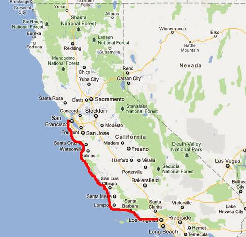
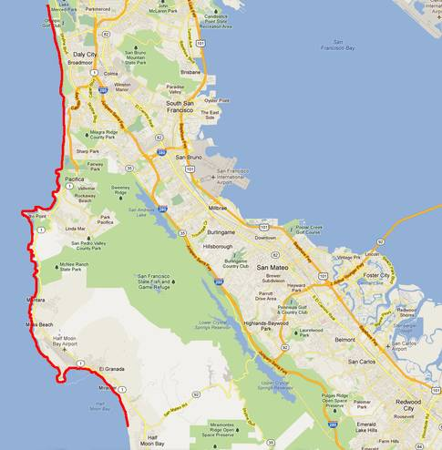
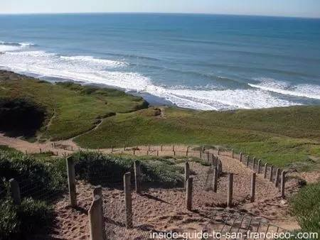
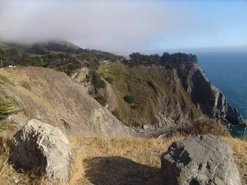
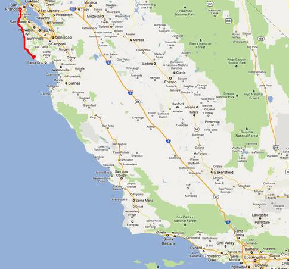

## 论需求调研的重要性

---

有国外开发者在 Quora 提了这个问题：“为什么软件开发周期通常是预期的两三倍？” 并补充问：“这是开发人员的错误？ 是管理失误？ 是因为做事方法不对， 或者说缺乏好的方法？还是说这就是软件开发流程的特点？” Michael Wolfe 在2012年1月28日给的回复，非常经典，截至我们发布时已有8016个赞。以下是译文。

让我们先沿着海岸线，从旧金山（SF）走路去洛杉矶（LA），去拜访我们住在Newport Beach的朋友，我拿出地图在上面画出了行进路线。



全程大约有400英里，如果我们每天走10小时每小时4公里的话，只用10天就可以到达目的地。立刻打电话给我们的朋友预定下周六的晚餐，告诉他们下周六晚上六点我们一定会准时出现，朋友们已经等不及了！

第二天清晨，我们带着准备冒险的兴奋起床，背起行囊，拿出地图，准备计划我们冒险的第一天，看一眼地图，噢，不！

哇，海岸线上有这么多迂回曲折的线路。每天行进40英里的话，10天后只能勉强到达Half Moon Bay（半月湾？）。这趟旅行至少有500英里，而不是400。赶紧打电话给我们的朋友，将晚餐顺延至下下周周二。人还是应该现实一点。朋友们有点失望，不过仍然盼望见到我们，况且花 12 天从 SF 到 LA 也不赖。

把不开心的事丢到一边，准备出发。两小时过后，我们才刚刚走出动物园。出了什么事？我们低头看了一下脚下的路：

天哪，这样走路也太慢了！有沙子、海水、阶梯、溪流，还有海边愤怒的海狮！这样我们只能按每小时2公里的速度前进，只有我们预估一般的速度。要么我们现在每天走20小时，要么再把晚餐推迟一个星期。好吧，让我们各退一步：每天走12个小时，把晚餐安排到下下周的周末。只好再打电话给朋友告诉他们这个情况。朋友们有些不高兴，但还是表示可以，到时候见。

在辛苦走了12小时后，我们准备在 Moss Beach 扎营休息。靠，要把帐篷在风中立起来根本不可能。直到半夜才开始休息。不过没什么大不了：明天在加快点速度就可以了。

第二天早上睡过头了，早上10点才醒，起来浑身酸痛精疲力尽。艹，今天没法走12个小时了，先走10个小时，明天可以走14个小时。收拾东西出发。

再缓慢行进了几个小时之后，我发现伙伴脚有点跛。妈的，是水泡。必须现在解决它，在这些问题开始减慢我们的速度前，必须将它们扼杀在萌芽状态。我慢跑了45分钟到达内陆3英里远的Pescadero，买了一些创可贴再快速跑回去给朋友包扎了一下。我快累坏了，太阳也快下山了，又浪费了一天的时间。到我们准备休息前今天只走了6英里。但是我们确实需要补充一下供给。一切都很好，明天我们就能赶上。

第二天醒来，扎紧脚上的绷带准备出发。转角之后突然发现，靠！这是个啥？

你妹的地图上怎么没标出它！现在我们只能往内陆走3英里，绕过这些被联邦政府用栅栏保护起来的区域，中途迷路了两次，在中午前才好不容易又回到了海岸线。今天的时间过了一大半，而我们才前进了差不多1英里。好吧，不过我们不会再打电话给朋友推迟了，今天我们会一直走到午夜试着赶上进度。

晚上在大雾里断断续续地睡了一夜。一大早被我的伙伴叫醒，他一阵阵的头疼，还有点发烧，我问他能不能坚持一下。“你在想什么呢，混蛋，我已经连续三天在这么冷的雾中赶路，没有休息过了。“好吧，今天看来只能黄了，只能在原地好好恢复了。现在我们已经有经验了，今天好好休息明天再走14个小时，还有几天的时间，我们一定能够做到！

第二天我们昏昏沉沉地起来了。我看了一眼随身的地图：

天啊！我们已经走了10天旅程里的第5天还没有离开海湾区域！太荒唐了！我们要重新估计一下准确的时间再打给朋友，搞不好会被骂，但至少得找一个现实一点的目标。

同伴说，我们在四天里走了40英里，这趟旅程至少又600英里，那就至少要60天，安全一点的说法说不定要70天，“没门…是，以前我是没走路从SF去过LA，但肯定不会要70天的时间，如果告诉他们我们要到复活节才能到，那要被他们笑死的“，我说。

我接着说，“如果你能保证每天走16个小时，我们就能把落下的时间补回来！我知道很困难，但现在是最关键的时刻，别抱怨了！”伙伴对我吼道 “一开始又不是我告诉别人下周日我们就能到的！因为你犯的这个错差点要我的命！”

两个人就这样不说话了。我还是没打出电话，等我的伙伴明天冷静一点我再决定，我也愿意做一些更合理的承诺。

第二天上午，我们一直待在各自的帐篷中直到一场暴风雨袭来。我们赶紧收拾好东西直到10点才摆脱危险。浑身酸痛，又长了好多新水泡。之前发生的事谁也没提，直到发现我那愚蠢的伙伴把水壶落下了，又被我指责了一顿，我们不得不再花30分钟回去取它。

我心里记得我们的厕纸已经快用完了，下次到一个小镇的时候应该囤一点。在我们又转个弯后，才发现一条湍急的河流挡住了去路，这时我突然感到肚子一阵难受……