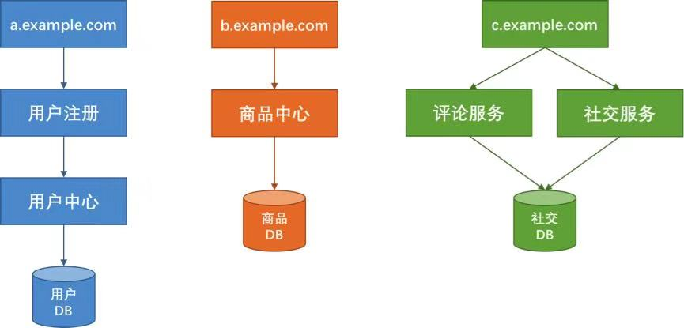
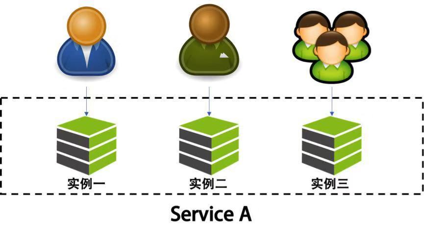

## 隔离设计
---

### 常见方式

1、服务的种类来做分离

2、用户维度做分离

### 服务种类分离

以微服务形式，将业务拆分为用户中心，商品中心，评论中心，各自采用独立的服务器集群部署，独立的数据库。达到物理层面的隔离。

### 用户维度分离

将用户分成不同的组，并把后端的同一个服务根据这些不同的组分成不同的实例。同一个服务对于不同的用户进行冗余和隔离。这样一个服务实例挂掉，只会影响一部分用户。

“多租户”模式。针对一些大的客户，专用集群。

* 特点：

增加设计的复杂度，资源上存在浪费。

* 多租户模式分为三种：

1、完全独立。每个租户有自己完全独立的服务和数据。

2、独立的数据分区，服务共享。（较推荐方式）

3、共享服务，共享数据分区。

### 设计要点

* 定义好隔离业务的大小和粒度。过大、过小都不好。需要结合具体业务来看。

* 考虑系统的复杂度、成本、性能、资源使用的问题。找到合适的均衡方案。

* 配置一些高可用、重试、异步、消息中间件、流控、熔断等框架

* 自动化运维工具，象容器或虚拟化技术帮助我们更方便的管理

* 非常完善的监控系统