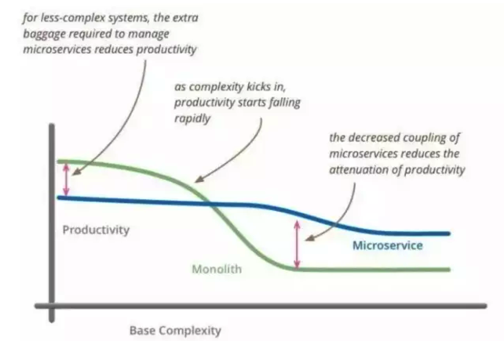

## 微服务介绍

---

#### 什么是微服务架构？

形像一点来说，微服务架构就像搭积木，每个微服务都是一个零件，并使用这些零件组装出不同的形状。通俗来说，微服务架构就是把一个大系统按业务功能分解成多个职责单一的小系统，并利用简单的方法使多个小系统相互协作，组合成一个大系统。
如果学科派一点，微服务架构就是把因相同原因而变化的功能聚合到一起，而把因不同原因而变化的功能分离开，并利用轻量化机制（通常为 HTTP RESTful API）实现通信。

微服务架构是一种架构模式，它提倡将单一应用程序划分成一组小的服务，服务之间互相协调、互相配合，为用户提供最终价值。每个服务运行在其独立的进程中，服务与服务间采用轻量级的通信机制互相协作（通常是基于 HTTP 协议的 RESTful API）。每个服务都围绕着具体业务进行构建，并且能够被独立的部署到生产环境、类生产环境等。另外，对具体的服务而言，应根据业务上下文，选择合适的语言、工具对其进行构建  。（摘自王磊先生的《微服务架构与实践》）

对于我个人，我更喜欢一种延续性的解释，微服务架构 ≈ 模块化开发 + 分布式计算。不管微服务架构的定义怎么样，都是在描述一个核心思想：把大系统拆分成小型系统，把大事化小，以降低系统的复杂性，从而大幅降低系统建设、升级、运维的风险和成本。

 > “微服务” 与 “微服务架构” 是有本质区别的。“微服务”强调的是服务的大小，它关注的是某一个点。而“微服务架构”则是一种架构思想，需要从整体上对软件系统进行通盘的考虑。
 
#### 常见的微服务组件及概念
 
* 服务注册，服务提供方将自己调用地址注册到服务注册中心，让服务调用方能够方便地找到自己。
* 服务发现，服务调用方从服务注册中心找到自己需要调用的服务的地址。
* 负载均衡，服务提供方一般以多实例的形式提供服务，负载均衡功能能够让服务调用方连接到合适的服务节点。并且，节点选择的工作对服务调用方来说是透明的。
* 服务网关，服务网关是服务调用的唯一入口，可以在这个组件是实现用户鉴权、动态路由、灰度发布、A/B 测试、负载限流等功能。
* 配置中心，将本地化的配置信息（properties, xml, yaml 等）注册到配置中心，实现程序包在开发、测试、生产环境的无差别性，方便程序包的迁移。
* API 管理，以方便的形式编写及更新 API 文档，并以方便的形式供调用者查看和测试。
* 集成框架，微服务组件都以职责单一的程序包对外提供服务，集成框架以配置的形式将所有微服务组件（特别是管理端组件）集成到统一的界面框架下，让用户能够在统一的界面中使用系统。
* 分布式事务，对于重要的业务，需要通过分布式事务技术（TCC、高可用消息服务、最大努力通知）保证数据的一致性。
* 调用链，记录完成一个业务逻辑时调用到的微服务，并将这种串行或并行的调用关系展示出来。在系统出错时，可以方便地找到出错点。
* 支撑平台，系统微服务化后，系统变得更加碎片化，系统的部署、运维、监控等都比单体架构更加复杂，那么，就需要将大部分的工作自动化。现在，可以通过 Docker 等工具来中和这些微服务架构带来的弊端。 例如持续集成、蓝绿发布、健康检查、性能健康等等。严重点，以我们两年的实践经验，可以这么说，如果没有合适的支撑平台或工具，就不要使用微服务架构。
 
#### 什么场景需要用微服务架构？

软件研发是一个系统工程，它没有银弹，不能够一招鲜吃遍天。正如当年的 CMMI 和敏捷方法一样，敏捷虽好，但它不一定能适用于所有的场景，它对组织环境、团队氛围、沟通方式、技术能力这些都是有一些要求的，如果用不好，反而会带来一些负面影响。

我们什么时候需要采用微服务呢？从我个人的经验来看，我认为有三种场景可以考虑使用微服务。

* 规模大（团队超过 10 人）
* 业务复杂度高（系统超过 5 个子模块）
* 需要长期演进（项目开发和维护周期超过半年）

横轴是复杂度，纵轴是生产效率。从生产效率的角度来讲，在两条曲线的交叉点之前，单体架构是占优势的，过了交叉点之后，单体架构的生产效率将大幅度下降。

摘自[《重识微服务架构》](https://mp.weixin.qq.com/s/mR73cZ7eoS1Bj-sMetccpQ)

