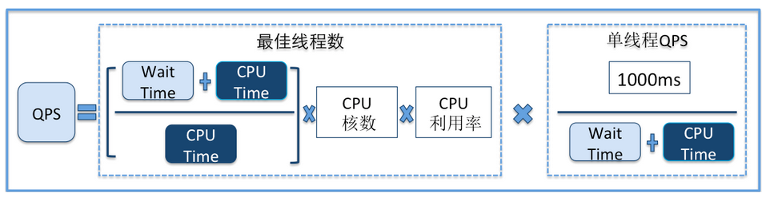
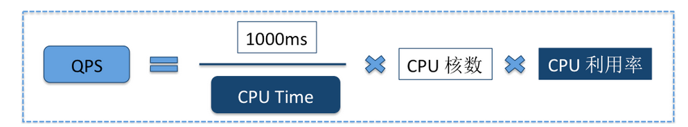

## 性能优化之Qps

---

* QPS受到编程语言影响
* QPS主要是受到编程模型的影响，比如说是不是NIO啊，有没有阻塞啊。
* QPS主要是你的业务逻辑决定的，业务逻辑越复杂，QPS越低
* QPS是受到数据结构和算法的影响
* QPS是受到线程数的影响
* QPS是受到系统瓶颈的影响（cpu核数）
* QPS和RT关系非常紧密

RT = Thread CPU Time + Thread Wait Time

最佳线程数=(RT/CPU Time) * CPU cores * CPU利用率

cpu核数由硬件决定，而cpu time和利用率则由我们的代码决定。