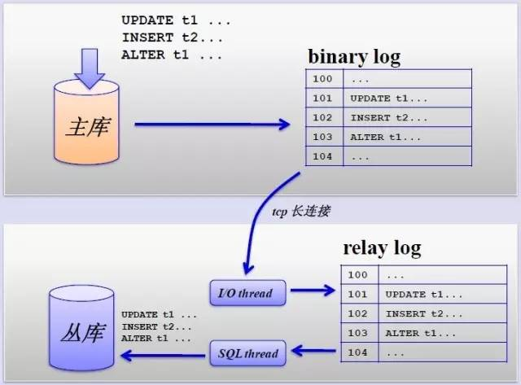
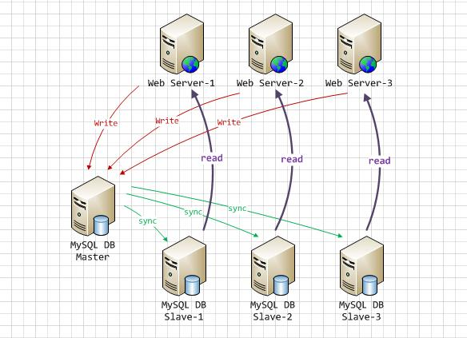
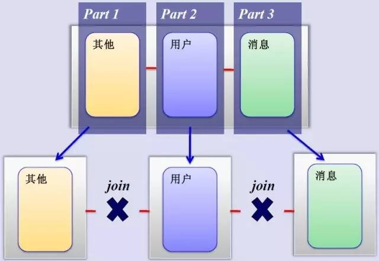

## 数据库架构

---

### 主要会经历以下几个步骤：

* 早期的单台MySQL服务器（Just Running）
* 主从复制
* 读写分离
* SSD优化
* 按业务垂直分库
* 水平sharding分库（物理层面），逻辑上还是一张表

#### MySQL主从复制

传统单库很容易出现单点问题，所以会增加备库，利用主从复制，将写数据实时同步到备库里，同时主备库间增加心跳检测，一旦检测到主库不可用时，自动切换到备库。大大提高了系统的可用性。

主从复制也带来其他一系列性能瓶颈问题：

* 写入无法扩展

* 复制延时

#### MySQL读写分离

原理是让master数据库处理写操作，slave数据库处理读操作。master将写操作的变更同步到各个slave节点。

提高系统性能的原因在于：

* 物理服务器增加，机器处理能力提升。拿硬件换性能。
* 主从只负责各自的读和写，极大程度缓解X锁和S锁争用。
* slave可以配置myiasm引擎，提升查询性能以及节约系统开销。
* master直接写是并发的，slave通过主库发送来的binlog恢复数据是异步。
* slave可以单独设置一些参数来提升其读的性能。
* 增加冗余，提高可用性。

MySQL官方提供的数据库代理层产品MySQLProxy搭建读写分离。

MySQLProxy实际上是在客户端请求与MySQLServer之间建立了一个连接池。所有客户端请求都是发向MySQLProxy，然后经由MySQLProxy进行相应的分析，判断出是读操作还是写操作，分发至对应的MySQLServer上。对于多节点Slave集群，也可以起做到负载均衡的效果。

#### MySQL垂直分区

如果把业务切割得足够独立，那把不同业务的数据放到不同的数据库服务器将是一个不错的方案，而且万一其中一个业务崩溃了也不会影响其他业务的正常进行，并且也起到了负载分流的作用，大大提升了数据库的吞吐能力。经过垂直分区后的数据库架构图如下：

尽管业务之间已经足够独立了，但是有些业务之间或多或少总会有点联系，如用户，基本上都会和每个业务相关联，况且这种分区方式，也不能解决单张表数据量暴涨的问题。

#### MySQL水平分片（Sharding）

这是一个非常好的思路，将用户按一定规则（按id哈希）分组，并把该组用户的数据存储到一个数据库分片中，即一个sharding，这样随着用户数量的增加，只要简单地配置一台服务器即可，原理图如下：

