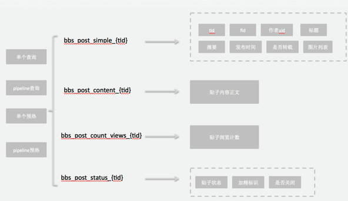
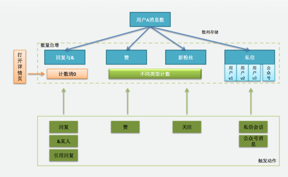
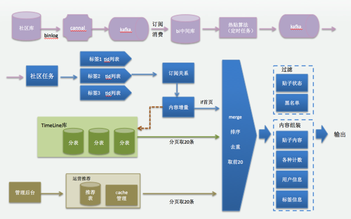
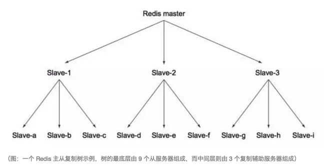

## 新浪微博与理财社区cache对比分析

---

###前言：

社交平台由于内容成本较低，重度依赖用户关系，实时互动、动态浏览。对系统性要求较高。新浪微博由于较大的市场占用率，用户量大，在这一领域有很多经验，目前笔者在做的理财社区业务与其有很多相似的地方，可以借鉴。下面会做一些比较分析。

#### 1. 缓存模型设计

* 已发表微博

可以使用 Redis 的 hash 来保存已发表微博。

一条微博通常包括多个字段，比如发表时间、发表用户、正文内容等，通常使用微博 id 作为 key 将多个键值对作为 hash 保存在 Redis 中。


理财社区不象微博有字数限制，所以message字段可能比较大，目前限制最大字符10W，而且该字段的使用场景是在贴子详情页。而推荐页或版块列表页只是展示一些摘要信息。所以内容正文拆成两个维度，根据业务场景各取所需，避免每次大字段传来传去，浪费网络带宽。



计数模型会采用Hash散列的形式，以tid为key，赞数、回复数、浏览数作为field，下图是消息提醒不同子类型业务的计数方式。贴子也是类似设计。




* 信息流

当一个用户访问它的首页信息流时候，他可以看到他所有关注用户最新的信息。key 是当前用户的 uid, 信息流的内容以 id --> timestamp 的形式保存在 zset 中，timestamp 用于排序，以便返回的列表是按照时间顺序排列。微博的 id 用于业务下一步获取微博的相关信息。

理财社区由于业务的特殊性，动态流有两部分来源：人工推荐+订阅的版块热门。

但每一块的存储结构采用zset，通过时间戳来排序，有一点区别是里面的field，采用字符串，由“tid|uid”组成，方便后面可以并行取贴子和用户信息。




* 关注与粉丝

我们可以把关注及粉丝库也存在 zset 中，依旧使用 timestamp 来排序。key 是当前用户 uid。

了解上述结构之后，我们继续来看如何使用 Redis 来扩展整个系统，具备处理亿级用户的能力。

我们首先要做的，就是在 Redis 能够存储所有数据并且能够正常地处理写查询的情况下，让 Redis 的读查询处理能力超过单台 Redis 服务器所能提供的读查询处理能力。


#### 2. 扩展读性能

假定我们用 Redis 构建一个与微博或 Twitter 具有相同特性和功能的社交网站，网站的其中一个特性就是允许用户查看他们自己的 profile 页和个人首页信息流，每当用户访问时，程序就会从信息流里面获取大约 30 条内容。

因为一台专门负责获取信息流的 Redis 服务器每秒至少可以同时为 3,000 ～ 10,000 个用户获取信息流消息，所以这一操作对于规模较小的社交网站来说并不会造成什么问题。

但是对于规模更大的社交网站来说，程序每秒需要获取的信息流消息数量将远远超过单台 Redis 服务器所能处理的上限，因此我们必须想办法提升 Redis 每秒能够获取的信息流消息数量。

下面我们将会讨论如何使用只读的从服务器提升系统处理读查询的性能，使得系统的整体读性能能够超过单台 Redis 服务器所能提供的读查询性能上限。

**在对读查询的性能进行扩展，并将额外的服务器用作从服务器以提高系统处理读查询的性能之前，让我们先来回顾一下 Redis 提高性能的几个途径。**

* 在使用短结构时，请确保压缩列表的最大长度不会太大以至于影响性能。

* 根据程序需要执行的查询的类型，选择能够为这种查询提供最好性能的结构。比如说，不要把 LIST 当作 SET 使用；也不要获取整个 HASH 然后在客户端里面对其进行排序，而是应该直接使用 ZSET；诸如此类。

* 在将大体积的对象缓存到 Redis 之前，考虑对它进行压缩以减少读取和写入对象时所需的网络带宽。对比压缩算法 lz4、gzip 和 bzip2，看看哪个算法能够对被存储的数据提供最好的压缩效果和最好的性能。

* 使用 pipeline（pipeline 是否启用事务性质由具体的程序决定）以及连接池。

在做好了能确保读查询和写查询能够快速执行的一切准备之后，接下来要考虑的就是如何实际解决“怎样才能处理更多读请求”这个正题。

**提升 Redis 读取能力的最简单方法，就是添加提供读能力的从服务器。**

用户可以运行一些额外的服务器，让它们与主服务器进行连接，然后接受主服务器发送的数据副本并通过网络进行准实时的更新（具体的更新速度取决于网络带宽）。通过将读请求分散到不同的从服务器上面进行处理，用户可以从新添加的从服务器上获得额外的读查询处理能力。

**记住：只对主服务器进行写入**

在使用只读从服务器的时候，请务必记得只对 Redis 主服务器进行写入。在默认情况下，尝试对一个被配置为从服务器的 Redis 服务器进行写入将引发一个错误（就算这个从服务器是其他从服务器的主服务器，也是如此）。

简单来说，要将一个 Redis 服务器变为从服务器，我们只需要在 Redis 的配置文件里面，加上一条 slaveof host port 语句，并将 host 和 port 两个参数的值分别替换为主服务器的 IP 地址和端口号就可以了。除此之外，我们还可以通过对一个正在运行的 Redis 服务器发送 SLAVEOF host port 命令来把它配置为从服务器。需要注意的一点是，当一个从服务器连接至主服务器的时候，从服务器原本存储的所有数据将被清空。最后，通过向从服务器发送 SLAVEOF no one 命令，我们可以让这个从服务器断开与主服务器的连接。

使用多个 Redis 从服务器处理读查询时可能会遇到的最棘手的问题，就是主服务器临时下线或者永久下线。每当有从服务器尝试与主服务器建立连接的时候，主服务器就会为从服务器创建一个快照，如果在快照创建完毕之前，有多个从服务器都尝试与主服务器进行连接，那么这些从服务器将接收到同一个快照。从效率的角度来看，这种做法非常好，因为它可以避免创建多个快照。

但是，同时向多个从服务器发送快照的多个副本，可能会将主服务器可用的大部分带宽消耗殆尽。使主服务器的延迟变高，甚至导致主服务器已经建立了连接的从服务器断开。

解决从服务器重同步（resync）问题的其中一个方法，就是减少主服务器需要传送给从服务器的数据数量，这可以通过构建树状复制中间层来完成。
 



从服务器树非常有用，在对不同数据中心（data center）进行复制的时候，这种从服务器树甚至是必需的：通过缓慢的广域网（WAN）连接进行重同步是一件相当耗费资源的工作，这种工作应该交给位于中间层的从服务器去做，而不必劳烦最顶层的主服务器。但是另一方面，构建从服务器树也会带来复杂的网络拓扑结构（topology），这增加了手动和自动处理故障转移的难度。

除了构建树状的从服务器群组之外，解决从服务器重同步问题的另一个方法就是对网络连接进行压缩，从而减少需要传送的数据量。一些 Redis 用户就发现使用带压缩的 SSH 隧道（tunnel）进行连接可以明显地降低带宽占用，比如某个公司就曾经使用这种方法，将复制单个从服务器所需的带宽从原来的 21Mbit 降低为 1.8Mbit（http://mng.bz/2ivv）。如果读者也打算使用这个方法的话，那么请记得使用 SSH 提供的选项来让 SSH 连接在断线后自动重连。

**加密和压缩开销**

一般来说，使用 SSH 隧道带来的加密开销并不会给服务器造成大的负担，因为2.6 GHz 主频的英特尔酷睿 2 单核处理器在只使用单个处理核心的情况下，每秒能够使用 AES-128 算法加密 180MB 数据，而在使用 RC4 算法的情况下，每秒则可以加密大约 350MB 数据。在处理器足够强劲并且拥有千兆网络连接的情况下，程序即使在加密的情况下也能够充分地使用整个网络连接。

唯一可能会出问题的地方是压缩—因为 SSH 默认使用的是 gzip 压缩算法。SSH 提供了配置选项，可以让用户选择指定的压缩级别（具体信息可以参考SSH的文档），它的 1 级压缩在使用之前提到的 2.6GHz 处理器的情况下，可以在复制的初始时候，以每秒 24～52MB 的速度对 Redis 的 RDB 文件进行压缩；并在复制进入持续更新阶段之后，以每秒 60～80MB 的速度对 Redis 的 AOF 文件进行压缩。


#### 3.扩展复杂的业务场景

*	对信息流列表进行分片

标题所说的“对信息流进行分片”实际上有些词不达意，因为首页信息流和分组列表信息流通常都比较短（最大通常只有 1,000 条，实际的数量由 zset-max-ziplist-size 选项的值决定），因此实际上并不需要对信息流的内容进行分片；我们真正要做的是根据键名，把不同的信息流分别存储到不同的分片上面。

另一方面，社交网站每个用户 profile 信息流通常无限增长的。尽管绝大多数用户每天最多只会发布几条微博，但也有话痨用户以明显高于这一频率的速度发布大量信息。以 Twitter 为例，该网站上发布信息最多的 1,000 个用户，每人都发布了超过 150,000 条推文，而其中发布最多的 15 个用户，每人都发布了上百万条推文。

从实用性的角度来看，**一个合乎情理的做法是限制每个用户的已发表微博最多只能存储大约 20,000 条信息，并将最旧的信息删除或者隐藏**，这种做法足以处理 99.999% 的 Twitter 用户，而我们也会使用这一方案来对社交网站的个人信息流进行扩展。


*	通过分片对关注及粉丝列表扩展

虽然对信息流进行扩展的方法相当直观易懂，但是对关注和粉丝列表这些由有序集合构成的“列表”进行扩展却并不容易。这些有序集合绝大多数都很短（如 Twitter 上 99.99% 的用户的关注者都少于 1,000 人），但是也存在少量用户的列表非常大，他们关注了非常多的人或者拥有数量庞大的粉丝。

从实用性的角度来考虑，一个合理的做法是给用户以及分组可以关注的人数设置一个上限（比如新浪微博普通用户最大允许关注 2,000 用户）。不过这个方法虽然可以控制用户的关注人数，但是仍然解决不了单个用户的粉丝数人数过多的问题。

```
目前理财社区也做了同样的限制，一个用户关注上限2000！
```

为了处理关注和粉丝列表变得非常巨大的情况，我们需要将实现这些列表的有序集合划分到多个分片上面，说得更具体一样，也就是根据分片的数量把用户的粉丝划分为多个部分，存在多个 zset 中。为此，我们需要为 ZADD 命令、ZREM 命令和 ZRANGEBYSCORE 命令实现特定的分片版本。

和信息流分片的区别是，这次分片的对象是数据而不是键。此外，为了减少程序创建和调用连接的数量，把关注和粉丝的数据放置在同一个分片里面将是一种非常有意义的做法。因此这次我们将使用新的方法对数据进行分片。

为了能够在关注及粉丝数据进行分片的时候，把两者数据都存储到同一个分片里面，程序将会把关注者和被关注者双方的 ID 用作查找分片键的其中一个参数。

*	按业务维度来拆分空间

以理财社区为例，目前所有的业务都放在一个cache集群里，后面随着业务的发展、数据量的增大、以及调用的频率不同、各个业务功能重要程度不同，肯定要按更细的维度来拆分。

比如贴子相关的（基本信息、正文、计数）单独在一块；

用户信息（基本信息、uid关系、用户状态等）单独空间；

关注列表、粉丝列表等单独空间；

临时活动放在一块；

扩容或系统故障，也只是影响一小块业务，降低各个业务之间的影响。


**参考资料：**

http://mp.weixin.qq.com/s?__biz=MzAwMDU1MTE1OQ==&mid=2653547053&idx=1&sn=833fddbc83379d9cac8d7f757343412e&scene=1&srcid=0805WKvrSVA1WS4VKoGcR9rK#rd


