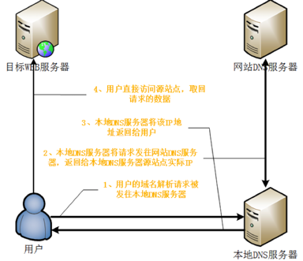
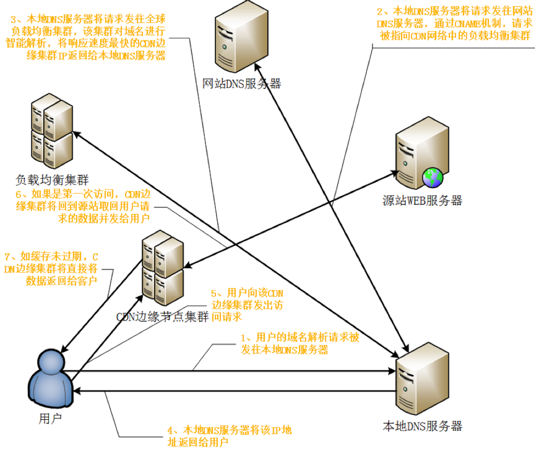

## CDN

---

#### 简介

CDN的全称是Content Delivery Network，即内容分发网络。其基本思路是尽可能避开互联网上**有可能影响数据传输速度和稳定性的瓶颈和环节**，使内容传输的更快、更稳定。通过在网络各处放置节点服务器所构成的在现有的互联网基础之上的一层智能虚拟网络，CDN系统能够实时地根据网络流量和各节点的连接、负载状况以及到用户的距离和响应时间等综合信息将用户的请求重新导向离用户最近的服务节点上。其目的是使用户可就近取得所需内容，解决 Internet网络拥挤的状况，提高用户访问网站的响应速度。

CDN的好处不止是加速，还可以有效地降低源站负载，降低高额的带宽成本(不必按峰值带宽直接向ISP购买带宽)，防止DDOS攻击等。


**通常网络访问中会有"三公里"路程**

* 第一公里为:源站到ISP接入点
* 第二公里为:源站ISP接入点到访问用户的ISP接入点
* 第三公里(最后一公里)为:用户ISP接入点到用户客户端

```
第一公里的耗时取决于源站自身响应能力和出口带宽
第二公里的耗时取决于从源站的接入点到最终用户的接入点之间的传输路径,主要为网络运营商之间的互连瓶颈问题，不同地区骨干网之间的数据交换、传输，会导致传输途中的路由阻塞和延迟
第三公里的耗时取决于最终用户接入Internet的方式,会越来越快,以后不会是瓶颈
```


而CDN网络层主要用来加速第二公里,怎么加速呢?原理并不难,下面简单介绍下

首先看下访问网站的一个普通流程:



 

再看下有CDN层的访问流程



**负载均衡集群**：它是一个CDN网络的神经中枢，主要功能是负责对所有发起服务请求的用户进行访问调度，确定提供给用户的最终实际访问地址(即哪一台边缘Cache机)。

大多数CDN系统的负载均衡系统是分级实现的。一般而言，两级调度体系分为全局负载均衡(GSLB)和本地负载均衡(SLB)。

* 全局负载均衡(GSLB)主要根据用户就近性原则，通过对每个服务节点进行"最优"判断，确定向用户提供服务的Cache的物理位置。最通用的GSLB实现方法是基于DNS解析的方式实现，也有一些系统采用了应用层重定向等方式来解决。
* 本地负载均衡(SLB)主要负责节点内部的设备负载均衡，当用户请求从GSLB调度到SLB时，SLB会根据节点内各Cache设备的实际能力或内容分布等因素对用户进行重定向，常用的本地负载均衡方法有基于4层调度(常用的LVS)、基于7层调度(常用的nginx)、链路负载调度(DNS)等。

**源站WEB服务器内容到CDN边缘节点集群主要用两种内容分发技术**

* PUSH即主动分发，通常由CDN厂商的内容管理系统发起(主动刷新)，将内容从源或者中心资源库分发到各边缘的Cache节点。
* PULL是被动分发，通常由用户请求驱动，当用户请求的内容在本地的边缘Cache上不存在(未命中)时，Cache启动PULL方法从源站或者其他CDN节点即时获取内容。

**业界做的比较好的CDN厂商：**

* [七牛云](http://www.qiniu.com/)
