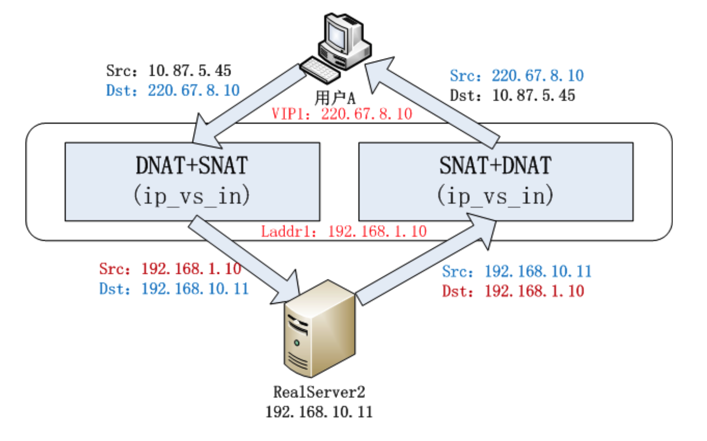

## LVS

---

### 附录

* [LoadBalance软件对比分析和应用场景总结](https://mp.weixin.qq.com/s/NONdqdYMgsXsfE3l0cYpTg)

---

面对互联网的高并发和大流量，为了平摊访问压力，通常会引入负载均衡，作为流量的入口，将请求转发给一台合适的无状态的服务器，处理用户请求，对用户是无感知的。

**软负载均衡有以下几种：**

* 全局负载均衡（pharos）
* 4层负载均衡（lvs）
* 7层负载均衡（haproxy、nginx）
   

常规的互联网架构：


#### LVS的工作模式：

######1.DR

性能最好的一种模式。

前提：要求LVS机器和Real Server绑定同一个VIP。

过程：

* 用户发起一个请求
* lvs接收到，将网络帧的MAC地址修改为某一台Real Server的MAC，数据包就会被转发给相应的RS处理（数据包的源ip和目标ip都没有变，只是服务器的mac变了）
* RS接收到请求，验证ip、mac信息，都验证通过，处理业务
* 将响应的数据包返回给源ip

缺点：

* LVS和RS必须在同一个VLAN；RS上绑vip，风险高

######2.NAT（Netowrk Address Translation）

LVS充当网关的角色，所有的网络报文的进出都要经过LVS

过程：

* 客户端发起请求，数据包到达lvs
* lvs做目标地址转换（DNAT），将目标ip改为RS的ip
* RS进行业务逻辑处理，返回响应数据，源ip是RS的ip，目标ip是客户端的ip
* 数据包经过LVS网关中转，源地址转换（SNAT），将源ip改为LVS的ip
* 客户端无法感知后端RS的存在

######3.Full-NAT

主要是为了解决LVS和RS的跨VLAN的问题，LVS和RS不再存在VLAN的从属关系，做到多个LVS对应多个RS，从而解决水平扩容问题；另外in/out流都经过LVS。

主要思想：
引入local address(内网ip地址)，cip-vip转换为lip->rip，而lip和rip均为IDC内网ip，可以跨vlan通讯;

过程：

* 客户端发起请求，来源为client ip,目标是LVS的vip
* 数据到LVS网关，经过SNAT+ DNAT，客户端ip换成LVS的内网ip，目标是RS的ip
* 内网ip可以经过多个交换机跨VLAN通信
* RS机器接收并处理完业务，响应数据包时，来源是RS的ip，目标是LVS的内网ip，
* LVS接到响应包，经过SNAT+ DNAT，修改地址，来源为LVS的vip，目标是client ip

示例：



```
注：
LVS内部维护着一个session的Hash表，可以通过客户端的一些信息找到对应的RS，避免同一连接的TCP包被转发到不同的RS机器上。
```


