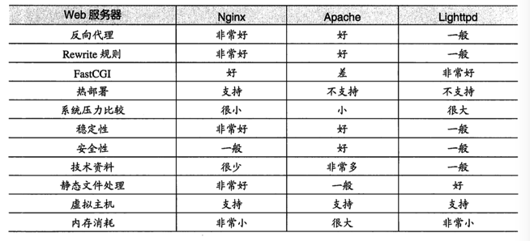
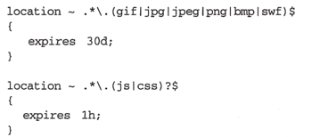
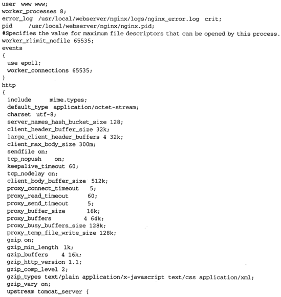
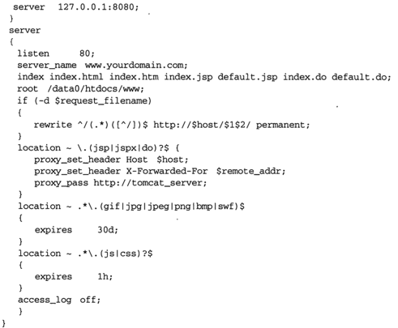

## Nginx

---
### 附录：

* [nginx+lua](http://jinnianshilongnian.iteye.com/blog/2186448)
* [Nginx配置文件及模块](https://mp.weixin.qq.com/s/YrC8aPZHtDlDL2Fqku2fbA)
* [全面了解 Nginx 到底能做什么](https://mp.weixin.qq.com/s/-tbku61HLKWXPoKypXGFHg)

---

Nginx做为一款高性能的HTTP反向代理服务器，有极高的执行效率、简单灵活的配置。

Nginx使用epoll和kqueue网络的I/O模型，而apache使用的是传统的select模型。

**与tomcat的区别：**

* tomcat是根据Servlet和JSP规范执行的。
* tomcat对静态文件、高并发文件的处理比较弱。


**Nginx优势：**

* 配置文件简单
* 支持Rewrite重写规则。能根据域名、URL的不同将HTTP请求分发到不同的后端服务器集群
* 负载均衡（为集群提供服务分发能力）
* 反向代理
* 内置健康检查。如果后端的某台应用服务器挂了，不会影响前端访问
* 节省带宽。支持GZIP压缩。（具体应用服务器上层会挂一台web服务器，做一些压缩处理）
* 支持热部署

**Nginx、Apache、Lighttpd的对比：**



Nginx的主配置文件为nginx.conf，下面是Web Server的完整配置示例。


```
#运行用户
user www-data;    
#启动进程,通常设置成和cpu的数量相等
worker_processes  1;

#全局错误日志及PID文件
error_log  /var/log/nginx/error.log;
pid        /var/run/nginx.pid;

#工作模式及连接数上限
events {
    use   epoll;             #epoll是多路复用IO(I/O Multiplexing)中的一种方式,但是仅用于linux2.6以上内核,可以大大提高nginx的性能
    worker_connections  1024;#单个后台worker process进程的最大并发链接数
    # multi_accept on; 
}

#设定http服务器，利用它的反向代理功能提供负载均衡支持
http {
     #设定mime类型,类型由mime.type文件定义
    include       /etc/nginx/mime.types;
    default_type  application/octet-stream;
    #设定日志格式
    access_log    /var/log/nginx/access.log;

    #sendfile 指令指定 nginx 是否调用 sendfile 函数（zero copy 方式）来输出文件，对于普通应用，
    #必须设为 on,如果用来进行下载等应用磁盘IO重负载应用，可设置为 off，以平衡磁盘与网络I/O处理速度，降低系统的uptime.
    sendfile        on;
    #tcp_nopush     on;

    #连接超时时间
    #keepalive_timeout  0;
    keepalive_timeout  65;
    tcp_nodelay        on;
    
    #开启gzip压缩
    gzip  on;
    gzip_disable "MSIE [1-6]\.(?!.*SV1)";

    #设定请求缓冲
    client_header_buffer_size    1k;
    large_client_header_buffers  4 4k;

    include /etc/nginx/conf.d/*.conf;
    include /etc/nginx/sites-enabled/*;

    #设定负载均衡的服务器列表
     upstream mysvr {
    #weigth参数表示权值，权值越高被分配到的几率越大
    #本机上的Squid开启3128端口
    server 192.168.8.1:3128 weight=5;
    server 192.168.8.2:80  weight=1;
    server 192.168.8.3:80  weight=6;
    }


   server {
    #侦听80端口
        listen       80;
        #定义使用www.xx.com访问
        server_name  www.xx.com;

        #设定本虚拟主机的访问日志
        access_log  logs/www.xx.com.access.log  main;

    #默认请求
    location / {
          root   /root;      #定义服务器的默认网站根目录位置
          index index.php index.html index.htm;   #定义首页索引文件的名称

          fastcgi_pass  www.xx.com;
         fastcgi_param  SCRIPT_FILENAME  $document_root/$fastcgi_script_name; 
          include /etc/nginx/fastcgi_params;
        }

    # 定义错误提示页面
    error_page   500 502 503 504 /50x.html;  
        location = /50x.html {
        root   /root;
    }

    #静态文件，nginx自己处理
    location ~ ^/(images|javascript|js|css|flash|media|static)/ {
        root /var/www/virtual/htdocs;
        #过期30天，静态文件不怎么更新，过期可以设大一点，如果频繁更新，则可以设置得小一点。
        expires 30d;
    }
    #PHP 脚本请求全部转发到 FastCGI处理. 使用FastCGI默认配置.
    location ~ \.php$ {
        root /root;
        fastcgi_pass 127.0.0.1:9000;
        fastcgi_index index.php;
        fastcgi_param SCRIPT_FILENAME /home/www/www$fastcgi_script_name;
        include fastcgi_params;
    }
    #设定查看Nginx状态的地址
    location /NginxStatus {
        stub_status            on;
        access_log              on;
        auth_basic              "NginxStatus";
        auth_basic_user_file  conf/htpasswd;
    }
    #禁止访问 .htxxx 文件
    location ~ /\.ht {
        deny all;
    }
     
     }
}
```
如果要使用负载均衡的话,可以修改配置http节点如下：

```
#设定http服务器，利用它的反向代理功能提供负载均衡支持
http {
     #设定mime类型,类型由mime.type文件定义
    include       /etc/nginx/mime.types;
    default_type  application/octet-stream;
    #设定日志格式
    access_log    /var/log/nginx/access.log;

    #省略上文有的一些配置节点

    #。。。。。。。。。。

    #设定负载均衡的服务器列表
     upstream mysvr {
    #weigth参数表示权值，权值越高被分配到的几率越大
    server 192.168.8.1x:3128 weight=5;#本机上的Squid开启3128端口
    server 192.168.8.2x:80  weight=1;
    server 192.168.8.3x:80  weight=6;
    }

   upstream mysvr2 {
    #weigth参数表示权值，权值越高被分配到的几率越大

    server 192.168.8.x:80  weight=1;
    server 192.168.8.x:80  weight=6;
    }

   #第一个虚拟服务器
   server {
    #侦听192.168.8.x的80端口
        listen       80;
        server_name  192.168.8.x;

      #对aspx后缀的进行负载均衡请求
    location ~ .*\.aspx$ {

         root   /root;      #定义服务器的默认网站根目录位置
          index index.php index.html index.htm;   #定义首页索引文件的名称

          proxy_pass  http://mysvr ;#请求转向mysvr 定义的服务器列表

          #以下是一些反向代理的配置可删除.

          proxy_redirect off;

          #后端的Web服务器可以通过X-Forwarded-For获取用户真实IP
          proxy_set_header Host $host;
          proxy_set_header X-Real-IP $remote_addr;
          proxy_set_header X-Forwarded-For $proxy_add_x_forwarded_for;
          client_max_body_size 10m;    #允许客户端请求的最大单文件字节数
          client_body_buffer_size 128k;  #缓冲区代理缓冲用户端请求的最大字节数，
          proxy_connect_timeout 90;  #nginx跟后端服务器连接超时时间(代理连接超时)
          proxy_send_timeout 90;        #后端服务器数据回传时间(代理发送超时)
          proxy_read_timeout 90;         #连接成功后，后端服务器响应时间(代理接收超时)
          proxy_buffer_size 4k;             #设置代理服务器（nginx）保存用户头信息的缓冲区大小
          proxy_buffers 4 32k;               #proxy_buffers缓冲区，网页平均在32k以下的话，这样设置
          proxy_busy_buffers_size 64k;    #高负荷下缓冲大小（proxy_buffers*2）
          proxy_temp_file_write_size 64k;  #设定缓存文件夹大小，大于这个值，将从upstream服务器传

       }

     }
}
```

**利用虚拟主机，不用为每个要运行的网站提供一台单独的Nginx服务器或单独运行一组Nginx进程。虚拟主机提供了在同一台服务器、同一组nginx进程上运行多个网站的功能。**

* 基于IP的虚拟主机
* 基于域名的虚拟主机

gzip（GNU—ZIP）是一种压缩技术，可以将页面大小压缩到原来的30%或更小。


Nginx的浏览器本地缓存设置。当用户再次请求这个页面时，浏览器可以从本地磁盘显示文件，节约了网络的资源，提高了网络的效率。

对图片文件缓存30天，对js、css文件缓存1小时。




**FastCGI的工作原理是：**

* FastCGI进程管理器自身初始化，启动多个CGI解释器进程 (在任务管理器中可见多个php-cgi.exe)并等待来自Web Server的连接。启动php-cgi FastCGI进程时，可以配置以TCP和UNIX套接字(socket)两种方式启动。
* 当客户端请求到达Web Server（Nginx）时，Web Server（Nginx）将请求采用TCP协议或socket方式转发到FastCGI主进程，FastCGI主进程选择并连接到一个CGI解释器(子进程php-cgi.exe)。Web server将CGI环境变量和标准输入发送到FastCGI子进程php-cgi.exe。
* FastCGI子进程php-cgi.ex完成处理后将标准输出和错误信息从同一连接返回Web Server。当FastCGI子进程关闭连接时，请求便告处理完成。FastCGI子进程接着等待并处理来自FastCGI进程管理器（运行在 WebServer中）的下一个连接。 而在CGI中，php-cgi子进程在此便被退出了。


**Nginx与Tomcat的配置：**




**反向代理：**

代理服务器接受来自Internet的连接请求，然后将请求转发给内部网络上的服务器，并从服务器上得到的结果返回给Internet上请求连接的客户端。

反向代理服务器只是一层代理，所以受到攻击并不会使网页信息遭到破坏，增强了web服务器的安全性。


**参考资料：**

https://www.zybuluo.com/happyfans/note/161734

《实战Nginx 取代Apache的高性能Web服务器》