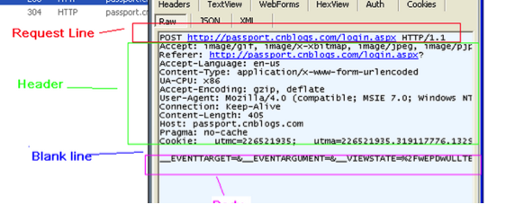
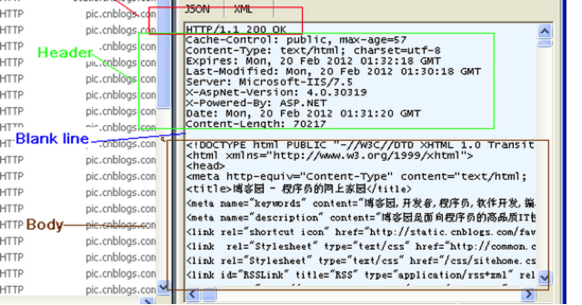

## HTTP 协议

---
### 资料

* [HTTP/2到底是什么？](https://mp.weixin.qq.com/s/MNbjdnSeoeSlTwuXokaXMQ)
* [彻底弄懂 HTTP 缓存机制及原理](https://mp.weixin.qq.com/s/qnBExJ0sjVmhk8UTxAPK1Q)
* [Http中Content-Type的详解](https://blog.csdn.net/danielzhou888/article/details/72861097)


---
HTTP协议是指计算机通信网络中两台计算机之间进行通信所必须共同遵守的规定或规则，超文本传输协议(HTTP)是一种通信协议，它允许将超文本标记语言(HTML)文档从Web服务器传送到客户端的浏览器。

原理：浏览器给Web服务器发送了一个Request, Web服务器接到Request后进行处理，生成相应的Response，然后发送给浏览器， 浏览器解析Response中的HTML,这样我们就看到了网页。有时中间可能会经过一个代理服务器。

**HTTP本身是无状态的，同一个客户端请求，这次和上次没有关联，服务器并不知道两次请求会来自同一个客户端，所以会引入cookie机制。**（典型场景就是登录，如果没有这种机制，永远无法知道用户是否登录）
交互方法：GET,POST,PUT,DELETE。对应资源的查、改、增、删。

Get将数据放在url后面，安全性差，且对提交的数据长度有限制。而post提交没有限制。

---
### Web组件化
浏览器分析Response中的 HTML，发现其中引用了很多其他文件，比如图片，CSS文件，JS文件。浏览器会自动发起请求下载相关文件，等所有文件下载结束，整个页面也就渲染完成。


###数据结构
request：Request 消息分为3部分，第一部分叫Request line, 第二部分叫Request header, 第三部分是body。header和body之间有个空行



Response消息的结构, 和Request消息的结构基本一样。 同样也分为三部分,第一部分叫Response line, 第二部分叫Response header，第三部分是body。header和body之间也有个空行。




###	状态码

HTTP/1.1中定义了5类状态码， 状态码由三位数字组成，第一个数字定义了响应的类别

```
1XX  提示信息 - 表示请求已被成功接收，继续处理
2XX  成功 - 表示请求已被成功接收，理解，接受
3XX  重定向 - 要完成请求必须进行更进一步的处理
4XX  客户端错误 -  请求有语法错误或请求无法实现
5XX  服务器端错误 -   服务器未能实现合法的请求
302：外部重定向，新的URL会在response 中的Location中返回，浏览器将会自动使用新的URL发出新的Request。移除是临时的。
实现方式： response.sendRedirect("http://www.brainysoftware.com")。client浏览器的url会有变化。
补充一点：内部重定向。重定向到一个新的页面并附加一些参数。服务器内部逻辑。Client浏览器的url不会变化。
实现方式：request. getRequestDispatcher().forward(request,response);通过request.setAttribute()可以补充信息。
301：Moved Permanently（永久移除）。请求的URL已移走。Response中应该包含一个Location URL, 说明资源现在所处的位置
304 ：Not Modified，采用本地缓存。
案例：之前B2B有次发布失败，后端java代码和js都回滚了，但客户那边依然是样式错乱，后来是因为访问过新页面，加载了新的js，但是回滚后的js的最后修改时间依然是旧的，这样客户那边实际是旧的页面、新的js。解决方案，旧js重新打包，最后修改时间变了。
400 Bad Request  客户端请求语法错误，不能被服务器所理解
403 Forbidden 服务器收到请求，但是拒绝提供服务
404 Not Found 文件资源不存在
500 Internal Server Error 服务器发生了不可预期的错误
503 Server Unavailable 服务器当前不能处理客户端的请求，一段时间后可能恢复正常
```
### Request相关（协议参数）

* 	URL：

URL(Uniform Resource Locator) 地址用于描述一个网络上的资源,  基本格式如下

```
schema://host[:port#]/path/.../[?query-string][#anchor]
scheme               指定低层使用的协议(例如：http, https, ftp)
host                   HTTP服务器的IP地址或者域名
port#                 HTTP服务器的默认端口是80，这种情况下端口号可以省略。如果使用了别的端口，必须指明，例如 http://www.cnblogs.com:8080/
path                   访问资源的路径
query-string       发送给http服务器的数据
anchor-             锚
URL 的一个例子
http://www.mywebsite.com/sj/test/test.aspx?name=sviergn&x=true#stuff
Schema:                 http
host:                   www.mywebsite.com
path:                   /sj/test/test.aspx
Query String:           name=sviergn&x=true
Anchor:                 stuff
```


*	Accept

作用： 浏览器端可以接受的媒体类型,

```
例如：  Accept: text/html  代表浏览器可以接受服务器回发的类型为 text/html  也就是我们常说的html文档,

如果服务器无法返回text/html类型的数据,服务器应该返回一个406错误(non acceptable)

通配符 * 代表任意类型

例如  Accept: */*  代表浏览器可以处理所有类型,(一般浏览器发给服务器都是发这个)
```

*	Referer

作用： 提供了Request的上下文信息的服务器，告诉服务器我是从哪个链接过来的，比如从我主页上链接到一个朋友那里，他的服务器就能够从HTTP Referer中统计出每天有多少用户点击我主页上的链接访问他的网站。

```
例如: Referer: http://translate.google.cn/?hl=zh-cn&tab=wT
```

*	Accept-Language

作用： 浏览器申明自己接收的语言。

语言跟字符集的区别：中文是语言，中文有多种字符集，比如big5，gb2312，gbk等等；

```
例如： Accept-Language: en-us
```

*	Content-Type

作用：

```
例如：Content-Type: application/x-www-form-urlencoded
```

*	Accept-Encoding：

作用： 浏览器申明自己接收的编码方法，通常指定压缩方法，是否支持压缩，支持什么压缩方法（gzip，deflate），（注意：这不是只字符编码）;

```
例如： Accept-Encoding: gzip, deflate
```

*	User-Agent

作用：告诉HTTP服务器， 客户端使用的操作系统和浏览器的名称和版本.
我们上网登陆论坛的时候，往往会看到一些欢迎信息，其中列出了你的操作系统的名称和版本，你所使用的浏览器的名称和版本，这往往让很多人感到很神奇，实际上，服务器应用程序就是从User-Agent这个请求报头域中获取到这些信息User-Agent请求报头域允许客户端将它的操作系统、浏览器和其它属性告诉服务器。

```
例如： User-Agent: Mozilla/4.0 (compatible; MSIE 8.0; Windows NT 5.1; Trident/4.0; CIBA; .NET CLR 2.0.50727; .NET CLR 3.0.4506.2152; .NET CLR 3.5.30729; .NET4.0C; InfoPath.2; .NET4.0E)
```

*	Connection

```
例如：　Connection: keep-alive   当一个网页打开完成后，客户端和服务器之间用于传输HTTP数据的TCP连接不会关闭，如果客户端再次访问这个服务器上的网页，会继续使用这一条已经建立的连接

例如：  Connection: close  代表一个Request完成后，客户端和服务器之间用于传输HTTP数据的TCP连接会关闭， 当客户端再次发送Request，需要重新建立TCP连接。
```

*	Content-Length

作用：发送给HTTP服务器数据的长度

```
例如： Content-Length: 38
```

*	Pragma

作用： 防止页面被缓存， 在HTTP/1.1版本中，它和Cache-Control:no-cache作用一模一样
Pargma只有一个用法， 例如： Pragma: no-cache
注意: 在HTTP/1.0版本中，只实现了Pragema:no-cache, 没有实现Cache-Control


*	Cookie:

作用： 最重要的header, 将cookie的值发送给HTTP 服务器

*	Accept-Charset

作用：浏览器申明自己接收的字符集，如gb2312，utf-8（通常我们说Charset包括了相应的字符编码方案）；

*	If-Modified-Since

作用： 把浏览器端缓存页面的最后修改时间发送到服务器去，服务器会把这个时间与服务器上实际文件的最后修改时间进行对比。如果时间一致，那么返回304，客户端就直接使用本地缓存文件。如果时间不一致，就会返回200和新的文件内容。客户端接到之后，会丢弃旧文件，把新文件缓存起来，并显示在浏览器中.
例如：If-Modified-Since: Thu, 09 Feb 2012 09:07:57 GMT

*	If-None-Match

作用: If-None-Match和ETag一起工作，工作原理是在HTTP Response中添加ETag信息。 当用户再次请求该资源时，将在HTTP Request 中加入If-None-Match信息(ETag的值)。如果服务器验证资源的ETag没有改变（该资源没有更新），将返回一个304状态告诉客户端使用本地缓存文件。否则将返回200状态和新的资源和Etag。使用这样的机制将提高网站的性能。
例如: If-None-Match: "03f2b33c0bfcc1:0"

---

### Response相关（协议参数）

*	Cache-Control

作用: 这个是非常重要的规则。 这个用来指定Response-Request遵循的缓存机制。各个指令含义如下

```
Cache-Control:Public   响应被缓存，并且在多用户间共享
Cache-Control:Private     响应只能作为私有缓存，不能在用户之间共享
Cache-Control:no-cache  提醒浏览器要从服务器提取文档进行验证
Cache-Control:no-store	 绝对禁止缓存（用于机密，敏感文件）
Cache-Control: max-age=60	60秒之后缓存过期（相对时间）
```

*	Content-Type

作用：WEB服务器告诉浏览器自己响应的对象的类型和字符集,

```
Content-Type: text/html; charset=utf-8
Content-Type:text/html;charset=GB2312
Content-Type: image/jpeg
```

*	Expires

作用: 浏览器会在指定过期时间内使用本地缓存

```
Expires: Tue, 08 Feb 2022 11:35:14 GMT
```


*	Last-Modified:

作用： 表示资源最后修改时间

```
例如: Last-Modified: Wed, 21 Dec 2011 09:09:10 GMT
```

* Etag

主要为了解决Last-Modified无法解决的一些问题，它比Last_Modified更加精确的知道文件是否被修改过。如果一个文件修改非常频繁，比如1秒内修改了10次，If-Modified-Since只能检查到秒级别的修改。

*	Server:

作用：指明HTTP服务器的软件信息

```
例如:Server: Microsoft-IIS/7.5
```

*	Connection

```
例如：　Connection: keep-alive   当一个网页打开完成后，客户端和服务器之间用于传输HTTP数据的TCP连接不会关闭，如果客户端再次访问这个服务器上的网页，会继续使用这一条已经建立的连接

例如：  Connection: close  代表一个Request完成后，客户端和服务器之间用于传输HTTP数据的TCP连接会关闭， 当客户端再次发送Request，需要重新建立TCP连接。
```

*	Content-Length

指明实体正文的长度，以字节方式存储的十进制数字来表示。在数据下行的过程中，Content-Length的方式要预先在服务器中缓存所有数据，然后所有数据再一股脑儿地发给客户端。

```
例如: Content-Length: 19847
```

###压缩过程

* 浏览器发送Http request 给Web服务器,  request 中有Accept-Encoding: gzip, deflate。 (告诉服务器， 浏览器支持gzip压缩)
* Web服务器接到request后， 生成原始的Response, 其中有原始的Content-Type和Content-Length。 
* Web服务器通过Gzip，来对Response进行编码， 编码后header中有Content-Type和Content-Length(压缩后的大小)， 并且增加了Content-Encoding:gzip.  然后把Response发送给浏览器。
* 浏览器接到Response后，根据Content-Encoding:gzip来对Response 进行解码。 获取到原始response后， 然后显示出网页。
压缩可以将大小缩小为原来的40%，减少60%的数据传输，节省网络流量。

```
Content-Encoding值：
gzip　　表明实体采用GNU zip编码
compress 表明实体采用Unix的文件压缩程序
deflate　　表明实体是用zlib的格式压缩的
identity　　表明没有对实体进行编码。当没有Content-Encoding header时， 就默认为这种情况

gzip, compress, 以及deflate编码都是无损压缩算法，用于减少传输报文的大小，不会导致信息损失。 其中gzip通常效率最高， 使用最为广泛。
Gzip压缩原理：Gzip压缩是在一个文本文件中找出类似的字符串，并临时替换他们，使整个文件变小。这种形式的压缩对Web来说非常适合，因为HTML和css文件通常包含大量的重复的字符串,例如空格，标签。

```
